# BIO2092 Practical 1: Bioinformatics resources on the WWW

## Introduction

A huge volume and range of biological data are available via the World
Wide Web (WWW). In this course, we are mainly concerned with
macromolecular sequence data, in other words: **nucleotide sequences** of genomic DNA,
transcripts and **amino acid sequences** of proteins. These data are the
product of decades of research and countless millions of £s of investment;
this represents an invaluable yet freely available resource for
clinicians, biotechnologists, academic researchers and even
undergraduate students to make novel discoveries.

One of the things you will do today is **to discover and characterise a novel gene!**
You will use some basic bioinformatics resources such as the BLAST software and
sequence databases to make your novel discovery. You can work
individually or in small groups, if you prefer. Try to answer the
questions in the boxes below (don't worry! This will not be assessed).

## The data

A good place to access DNA sequence data is the NCBI Nucleotide database
(https://www.ncbi.nlm.nih.gov/nuccore/). You can do simple (as well as quite
sophisticated) searches for sequence data here. But perhaps the most
useful way to access sequence data is via a BLAST search. You might
already be familiar with BLAST from previous modules.

> “The Basic Local Alignment Search Tool (BLAST) finds regions of local
> similarity between sequences. The program compares nucleotide or protein
> sequences to sequence databases and calculates the statistical
> significance of matches. BLAST can be used to infer functional and
> evolutionary relationships between sequences as well as help identify
>members of gene families.”

https://blast.ncbi.nlm.nih.gov/Blast.cgi

## Discover a previously unknown gene

The data in this Nucleotide database include complete chromosomes,
individual genes, expressed sequence tags (ESTs) and various other
DNA/RNA molecules and fragments of molecules. Some of these DNA
sequences have been very well described and annotated, *e.g*. sequences
of human chromosomes. However, many DNA sequences in the database have
hardly been studied at all and present an opportunity for us to discover
something new. Examples include some microbial genome sequences and a
wealth of metagenomics sequences. These are a good place to go ‘fishing’
for new genes. In fact there is a name for this: ‘bioprospecting’.

A genome (or metagenome) sequence typically contains segments called
*genes* that encode a *protein* (or a functional RNA), separated by
*intergenic regions*. Generally, the genes evolve relatively slowly, so
they will share sequence similarity with genes from other organisms,
even if that similarity is limited. On the other hand, intergenic
regions often evolve relatively quickly and may share little or no
sequence similarity with any other organisms. So, we are going to look
for **islands of relatively conserved sequence** to help identify new genes.

### Choose a previously uncharacterised DNA sequence

The first step towards discovering a new gene is to choose a DNA
sequence from the public databases that has not already undergone
extensive study and gene prediction. A good source of such sequences are
the various metagenomics studies of microbiomes. Try searching for a
suitable example at the NCBI Nucleotide web portal:
https://www.ncbi.nlm.nih.gov/nucleotide/

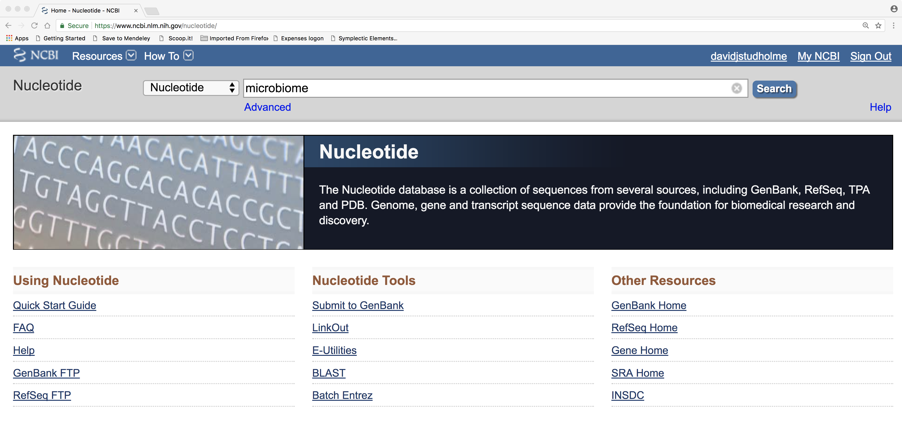

At the NCBI website you could simply search for ‘metagenome’ or something more specific like
‘coral metagenome’, ‘alkali sediment metagenome’; use your imagination!
Then choose a specific DNA sequence from this metagenome/genome to work on,
from among those returned by the search. You might need to use some
trial and error to navigate around the NCBI website, clicking on a few
links before you get to a specific sequence. Do spend some time trying
to figure out the logic of how the data are organised in these web
pages.

Do you know what a **metagenome** is? If not, then "Google" it and/or ask!

See an example of a candidate DNA sequence for analysis in the image
below:

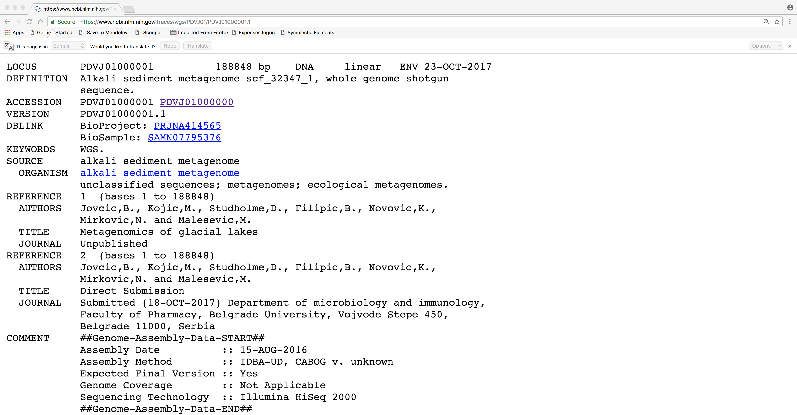

*I recommend that you work through this using the illustrated example before choosing your own sequence.*

The example used in the remainder of this document comes from a metagenome. However, instead you could use an unanotated genome. 
This would be a good idea; analysis of an unannonated microbial genome fits well with subsequent Computer Practical sessions
and the coursework assignment. 
Here are some good examples that you could use:

* [Genome of *Candida fabianii*](https://www.ncbi.nlm.nih.gov/nuccore/SETG01000004.1)

* [That one](https://www.ncbi.nlm.nih.gov/nuccore?LinkName=assembly_nuccore_insdc&from_uid=560381)

Choose one specific sequence from among the sets of sequences included in these genomes.

For the DNA sequence that you have chosen to study, can you find the
following information?

Question | Please write you answer in this space (it may be useful for your coursework)
-------- | --------------------------------------
Where did this DNA sample come from? |                                
What method was used to sequence the DNA?   |                         
Accession number |                                                    
How long is this DNA sequence?  |                                    
Do we know what organism this DNA came from?  |                      
Are there any research papers associated with this DNA sequence?  |  
Who generated the data?    |                                        

Now, we are going to try to discover a new protein-coding gene on this
DNA sequence. In other words, we are going to *annotate* the naked DNA sequence
with the positions of a gene. The underlying principle is that the protein encoded by this gene
shares some sequence similarity with already-known proteins. So we are going to search for patches
of sequence similarity between our naked DNA sequence and a database of amino-acid sequences from
known proteins.

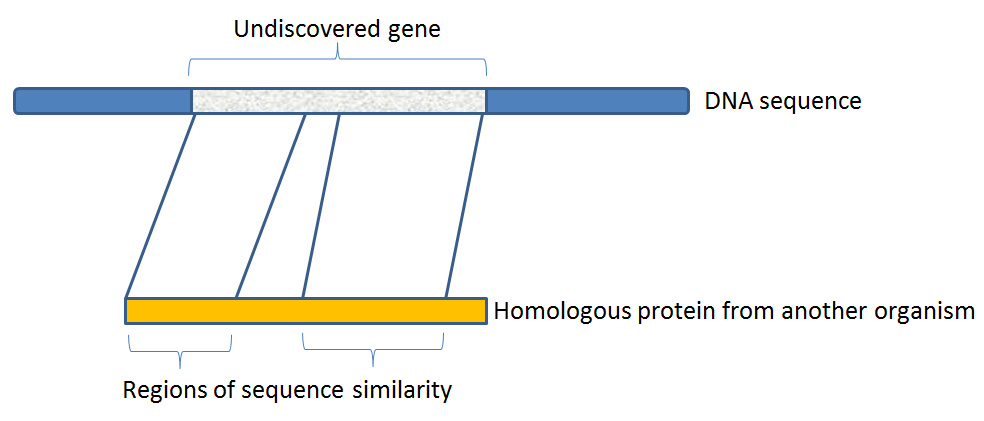

To acheive this, we will perform a BLAST search using your
chosen DNA sequence as the query against the databases of protein amino
acid sequences at the NCBI. Remember, there are several flavours of
BLAST (BLASTN, BLASTP, TBLASTN, BLASTX, TBLASTX); which one should you
use and why? (Clue: BLASTX takes a DNA query sequence and searches against a database of proteins).
You can perform your BLAST search at
https://blast.ncbi.nlm.nih.gov/Blast.cgi as in the example in the
image below.

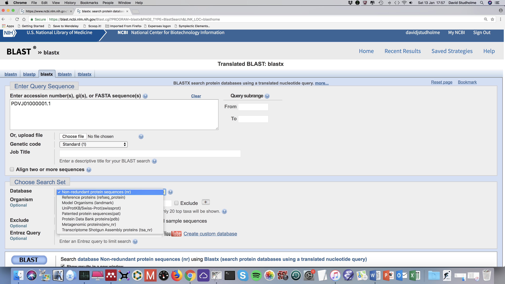

Notice that for the query you can insert either the actual DNA
sequence or just the accession number. When you are ready, hit the
“BLAST” button and wait for the results. By the way, if your patience is
limited, you might wish to search against the [Swiss-Prot](https://www.ncbi.nlm.nih.gov/pubmed/8594581)
database rather than the default database because searching this smaller database will be a bit
quicker than searching the much larger one. On the other hand, searching
against the smaller, less-comprehensive database might yield less
information. So, you could try both simultaneously (in different tabs in your browser).

In the example BLAST result below, we can see four regions of the DNA
sequence that show clear similarity. This strongly suggests there is homology [homology](https://www.ncbi.nlm.nih.gov/pubmed/3621342)
between the product of our query sequence and 
previously described proteins in
the SwissProt database. Since these previously-known proteins are homologous to our query protein, it is likely that they share similar structure and function.

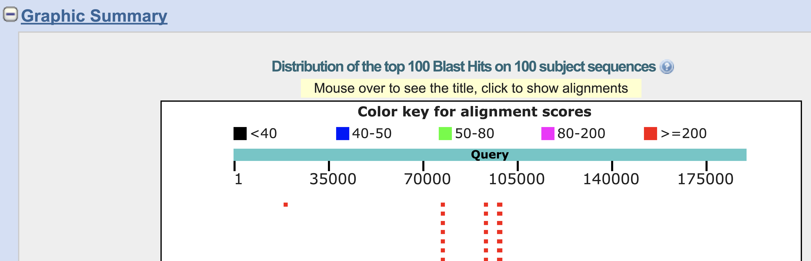

Let’s choose one of these for further investigation:

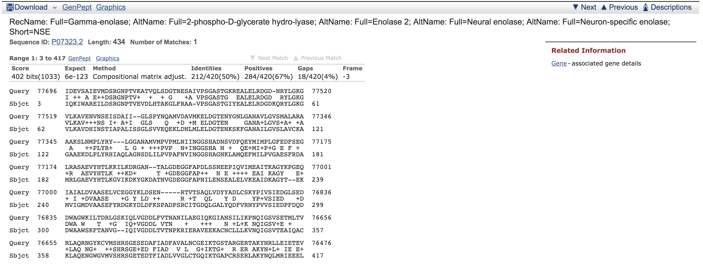

We are now going to perform a series of steps in order to extract the DNA
sequence of our newly discovered gene. Note that this gene sequence is a
substring of the original DNA sequence that we started with. In the
example above, our gene lies around positions 76,476 and 77,696 in the
original 188,848-bp sequence. We could try to manually copy and paste this substring
onto the clipboard. However, the steps below are probably easier and less error-prone.

In the example above, we know that protein accession P07323.2 is
homologous with our new gene. So, let’s use TBLASTN to get the sequence
of our new gene by aligning the protein against the DNA sequence.
This time we will use the “Align two or more sequences”
option and we will use previously described protein P07323.2 as the
query and metagenomic DNA sequence accession PDVJ01000001.1 as the
‘subject sequence’ against which we will search the query:

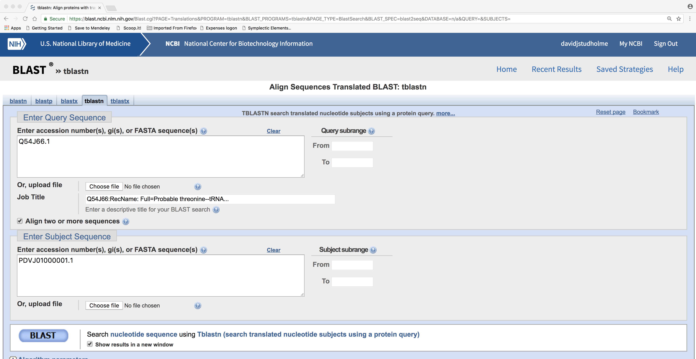

The result of this example looks like this:

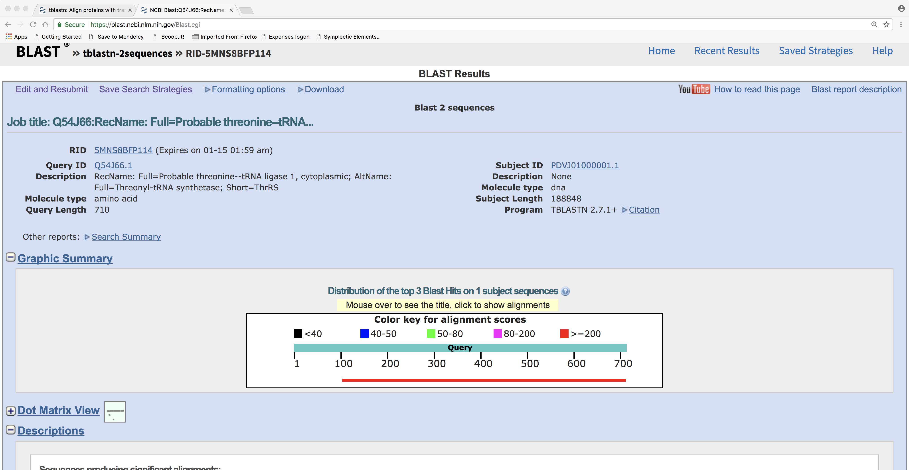

This clearly shows that about 85% of the query protein’s length has
detectable sequence similarity with the metagenomics DNA sequence. Now if we scroll down we
can see the sequence alignment:

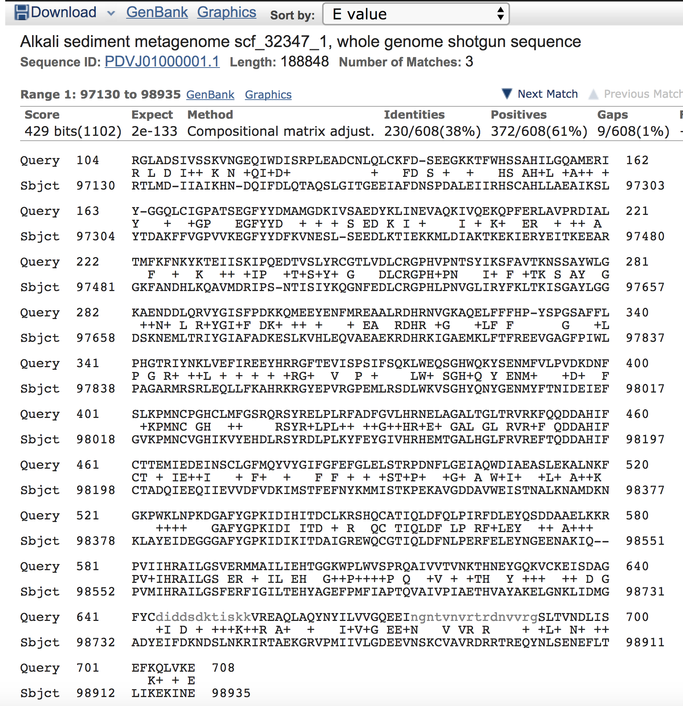

Note the “Download” icon (in the figure above). This allows us to obtain
the sequence of our new gene:

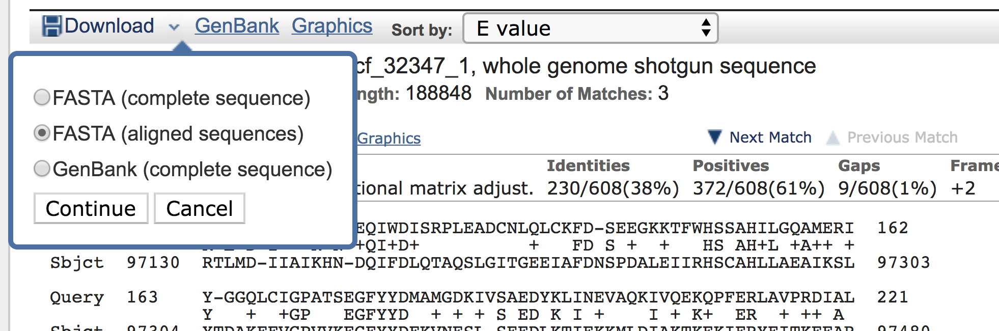

Here is the resulting nucleotide sequence of our new gene:

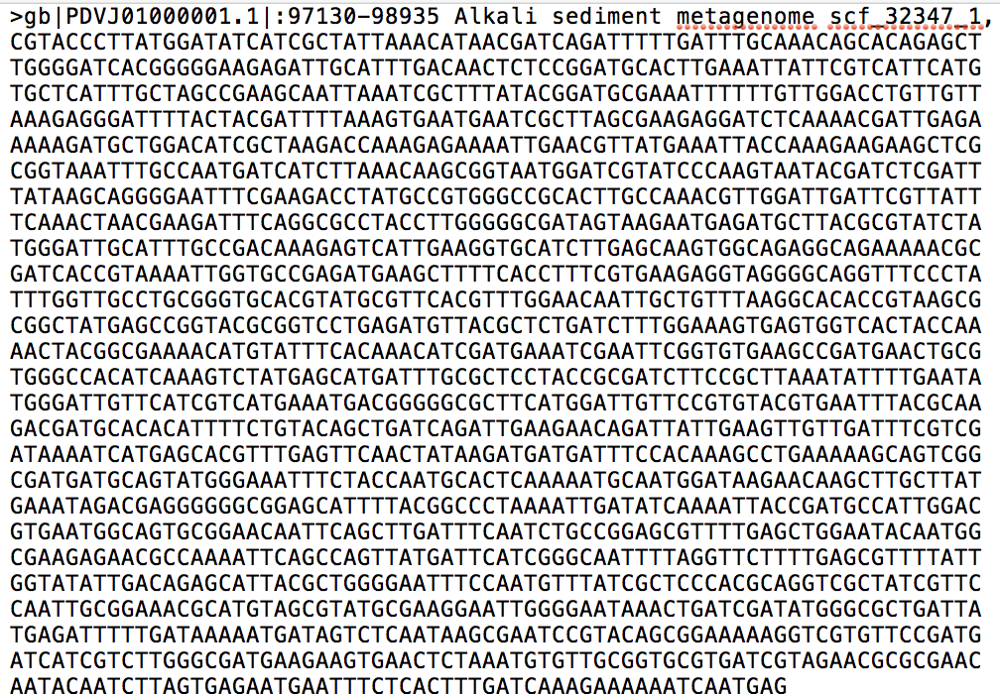

Notice that this contains just the sequence of the actual gene and we have discarded the non-coding DNA sequence 
from usptream and downstream of the gene. We can now perform analyses on this gene without confusing or confounding
results arising from the up- and downstream flanking sequences.

We can now try to gain insights into the structure, function and
evolution of this gene by pasting its sequence, or the amino-acid
sequence of its encoded protein, into various publicly available
webservers …

Once you have extracted the sequence of the gene that you have
discovered, try to answer the following questions about it. Some hints
are given below about online tools that you could use to address these
questions. BLAST searches will help to answer many of these. The most
useful thing to do first is to *translate from DNA to protein*. Experiment
with the tools mentioned below, copying and pasting your new protein
sequence. They are all reasonably easy to use; but please ask for help if you get stuck.
Discuss your findings with other students, the demonstrators
and lecturer.

Question | Please write you answer in this space  (it may be useful for your coursework)
-------- | --------------------------------------
  What is the predicted function? |
  Does it have any significance in pathogenesis, biotechnology, fundamental biological processes? Hint: PubMed database might be helpful. | 
  Can we predict the structure of the protein?  |   
  Does it contain any structural domains?  |                         
  Is the gene part of an operon or cluster of functionally related genes?  |                                   
  Do homologues occur in only closely related organisms or do they occur more widely across all domains of life?  |      
  Can you generate a multiple sequence alignment for your protein and its homologues?    | 
  From the alignment, can you build a phylogenetic tree?   |      
  What organism (taxonomic group) does your protein come from? The phylogenetic tree might help you to answer this.  |    

Suggested online analysis tools (additional information about some of
these is provided below):

Suggested tool | Web address 
-------------- | --------------
  Translate DNA to protein          |               https://web.expasy.org/translate/
  STRING (see mini-tutorial below)  |              https://string-db.org/
  Pfam                              |              http://pfam.xfam.org/
  Find open reading frames in your gene sequence |  http://www.ncbi.nlm.nih.gov/gorf/gorf.html

## Generating a sequence alignment and phylogenetic tree
Placing a novel protein/gene into a phylogenetic tree can reveal insights into its evolutionary origins and possibly its function.
Please see the following series of screenshots illustrating how to use
BLAST to gather homologues of our query sequence, align them and
generate a phylogenetic tree.

Here is the BLASTP search form:

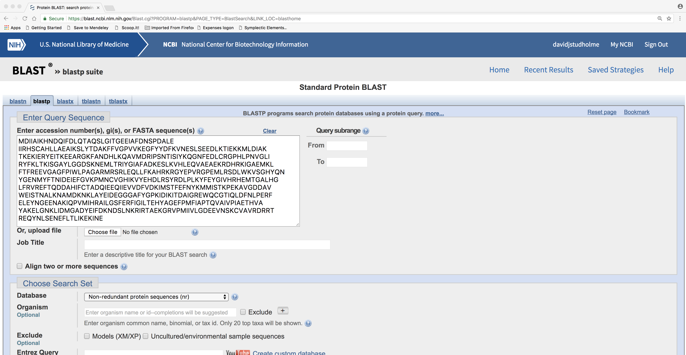

Here is the BLASTP result page. Note the graphical representation of
domain structure. Also note hyperlinks to “Multiple alignment” and
“Distance tree of results”:

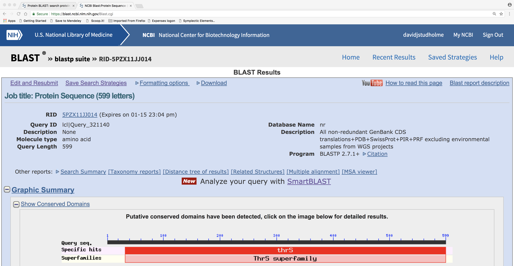

Here is the distance tree showing the relationships between our query
protein sequence and the BLASTP hits. This tree approximates to the
phylogenetic relationships. Note that our query protein seems to cluster
with a protein from the epsilon-proteobacterial order Campylobacterales
and , more distantly, to other epsiolon-proteobacteria such as
*Sulfuricurvum* spp.; this strongly suggests that this metagenomics
sequence originates from a bacterium of that group. Can you think of a
way to investigate or check this further, using BLAST searches?

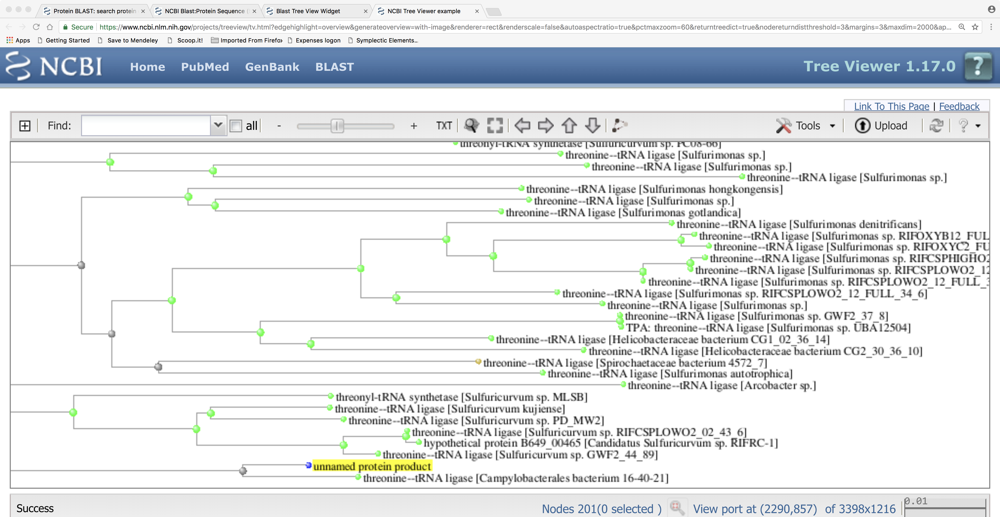

Here we can see the details of the amino-acid sequence alignment of our
query sequence against the BLASTP hits:

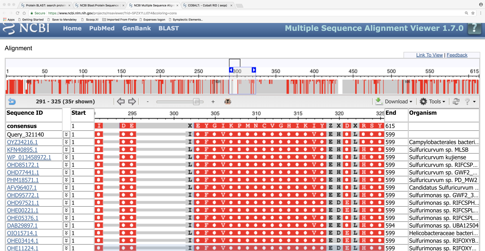

## Predicting protein function with the STRING database (http://string.embl.de/)

Many microbial genomics databases are available that, rather than just
presenting raw data, have some “added value”, such as tools for
predicting the function of genes. One such example is the [STRING
database](https://www.ncbi.nlm.nih.gov/pubmed/25352553).
This database aims to provide
clues about the functions of poorly characterised genes by identifying
associations with genes of better-understood function. These
associations can be physical proximity of genes in the genome or they
can be correlations in patterns of presence/absence. Other associations
are gleaned from mining text of published papers or looking at
correlation in transcriptomics expression data. In any case, the
detection of such associations depends on the interrogation of a large
number of genome sequences (or transciptome and/or textual data). Let’s
try it out using as an example the *E. coli* *otsA* gene, involved in
trehalose biosynthesis; this example is borrowed from a previously
published genomics tutorial (Strong *et al.*, 2004). You should also try
it with your newly discovered gene/protein.

First, enter the terms into the search box and press the “Search”
button:

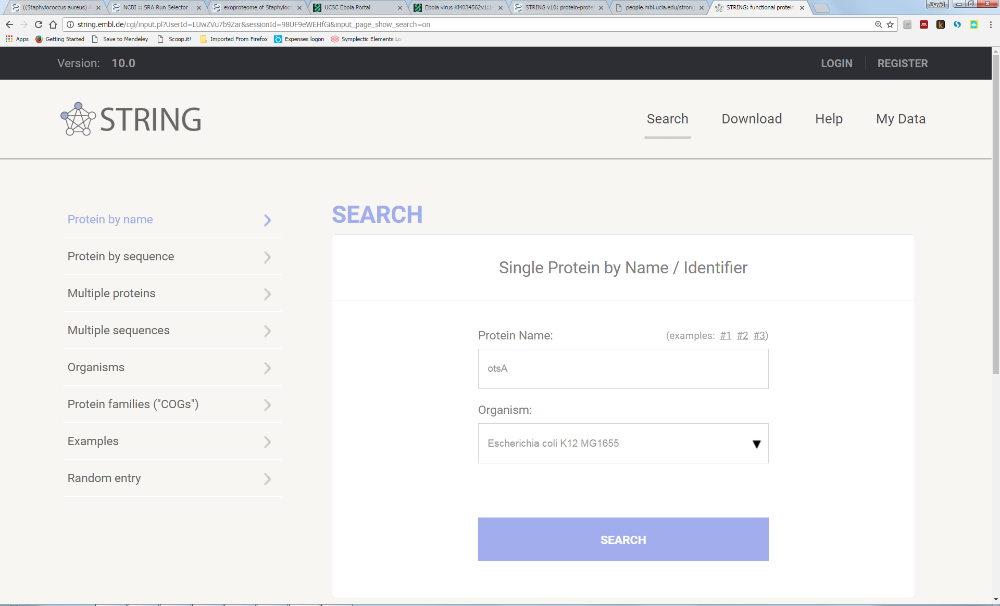

(Note that you can also search “by sequence” rather than “by name”;
therefore, you could paste-in the sequence of your newly discovered
protein.)

This yields a network of interactions, inferred from genome sequence
data, between the *otsA* gene and some others:

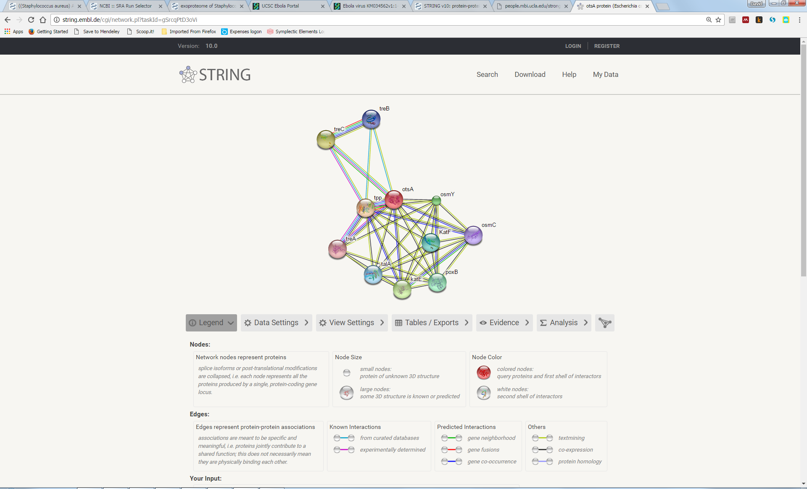

Note that this network is represented as a ‘graph’ consisting of nodes
(*a.k.a.* ‘vertices’) and connections (‘edges’). We will encounter
graphs again in other contexts of bioinformatics, especially in
*de-novo* sequence assembly later in the course.

Note that some of these genes, associated via genome sequence data, also
happen to have related functions (trehalose biosynthesis):

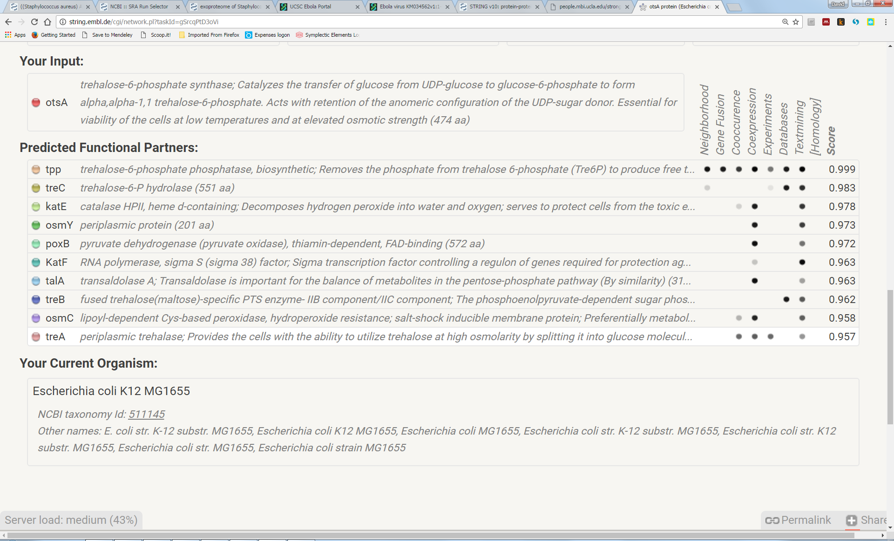

Try to understand the meaning of the realtionships that link the genes
in this network. Here we can see that *otsA* and *tpp* are adjacent to
each other in many genomes, suggesting a functional link
(“Neighbourhood”). In a few genomes, the two proteins are actually fused
into a single protein (“Gene Fusion”). Furthemore, most genomes either
contain both genes or neither gene (“Cooccurrence”):

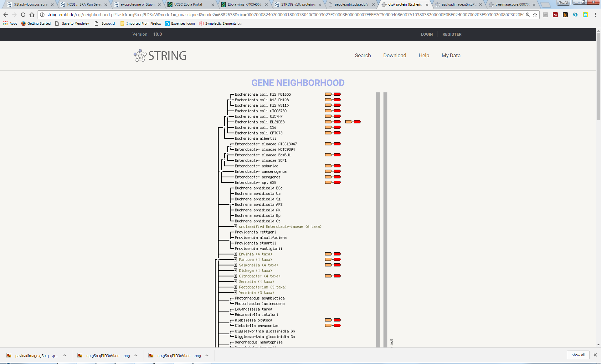
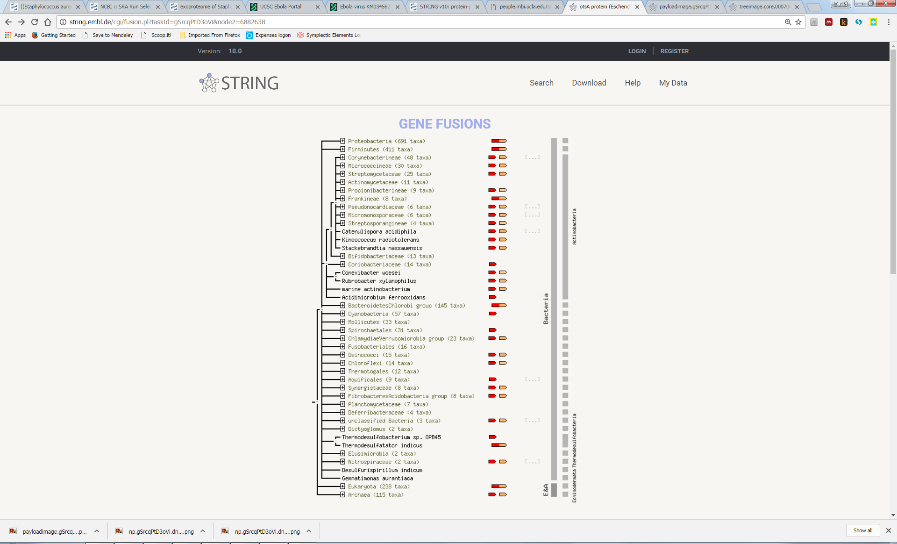
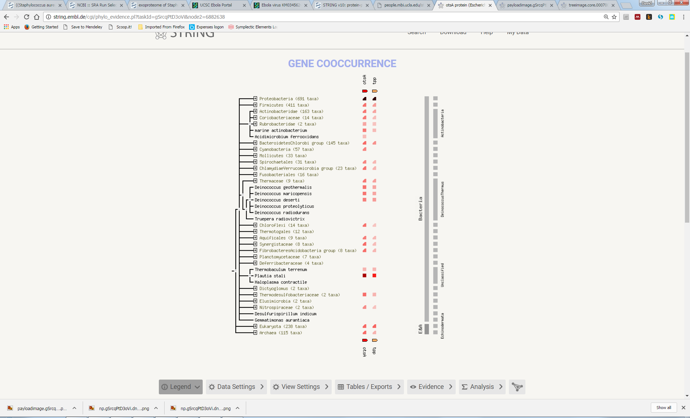

Now, explore some of the other associations, some of which are less
obvious, such as the link with *katF* or *osmY*.

## Finding and displaying open reading frames (ORFs)

A double-stranded DNA sequence has six different reading frames (three
forward and three reverse). An open reading frame (ORF) is the part of a
reading frame that has the potential to code for a protein or peptide.
An ORF is a continuous stretch of DNA beginning with a start codon
usually methionine (ATG) and ending with a stop codon (TAA, TAG or TGA
in most genomes).

For this task, you will use the NCBI ORF Finder at http://www.ncbi.nlm.nih.gov/gorf/gorf.html

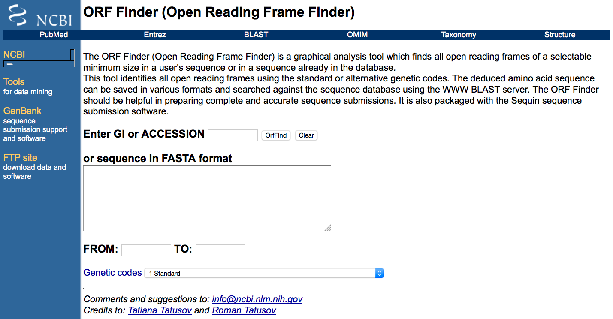

Exercise: Use this tool to find the ORfs in the human opsin-5 transcript
sequence (accession number NM\_181744) or in your newly discovered gene.

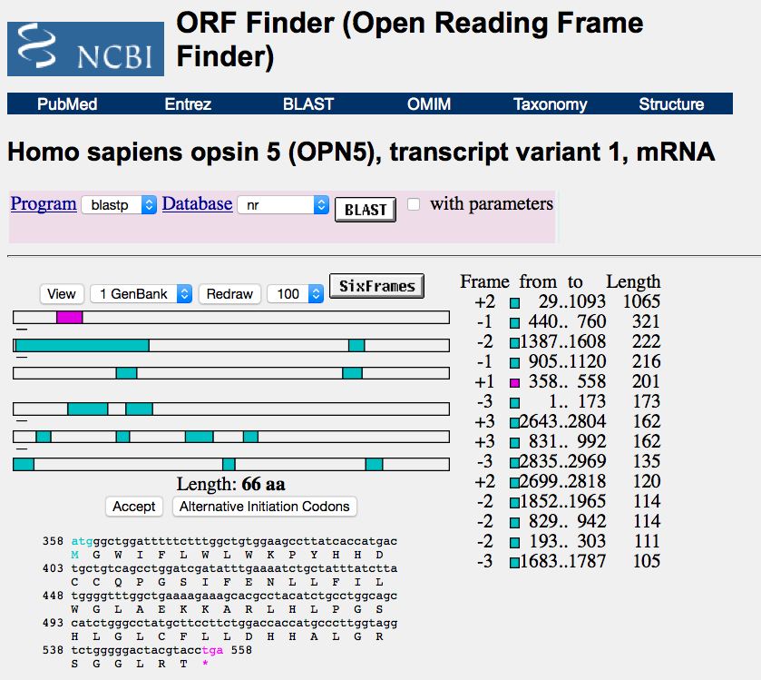

Exercise: Can you find which ORF encodes the protein product of this
transcript? Hint: the predicted amino acid sequence of opsin-5
(accession number NP\_859528.1) is:

``>gi|38678524|ref|NP\_859528.1| opsin-5 \[Homo sapiens\]
MALNHTALPQDERLPHYLRDGDPFASKLSWEADLVAGFYLTIIGILSTFGNGYVLYMSSRRKKKLRPAEIMTINLAVCDLGISVVGKPFTIISCFCHRWVFGWIGCRWYGWAGFFFGCGSLITMTAVSLDRYLKICYLSYGVWLKRKHAYICLAAIWAYASFWTTMPLVGLGDYVPEPFGTSCTLDWWLAQASVGGQVFILNILFFCLLLPTAVIVFSYVKIIAKVKSSSKEVAHFDSRIHSSHVLEMKLTKVAMLICAGFLIAWIPYAVVSVWSAFGRPDSIPIQLSVVPTLLAKSAAMYNPIIYQVIDYKFACCQTGGLKATKKKSLEGFRLHTVTTVRKSSAVLEIHEEWE``

So, in your newly discovered gene, can you find a single ORF that
encodes the newly discovered protein? If so, then in which reading frame
does the ORF fall? If not, then why not? (You may wish to draw a diagram
here)

By now, I hope that you are now convinced that it is possible to make
new discoveries in biology fairly easily by exploring freely available
data and using freely available analysis tools.
This can lead to insights that are worthy of publication in a quality peer reviewed scientific journal.
As an example, [here is a research paper](https://www.ncbi.nlm.nih.gov/pubmed/14641908) 
that is based entirely on a systematic, yet
quite simple, analysis of publicly available DNA and protein sequence
data.  It didn’t require any expensive
equipment or specialised laboratory, just a computer with an internet
connection!

:+1:

Well done! You have reached the end. If you still have time, then you
may wish to search for and discover another new gene. You are very much
encouraged to speak to the lecturer about your findings during this
session.

