  
   
# Introduction to handling “next-generation” sequencing data

## Introduction
During the first few lectures on this course, you have heard a lot about
so-called “next-generation” sequencing (NGS) methods such as Illumina.
These methods have been available since around 2006 and in the last
decade or so have hugely expanded the limits of what is achievable in
all kinds of fields of biological and biomedical research. You have also
heard about the Sanger method, which has been available since the 1970s.
In this practical session, you will consolidate your understanding of
the data generated by these methods and some of the approaches to
analysing such data. We will continue to discuss this in the next
lectures.

## Laboratory simulation of NGS 

  
* If you have not done so already, please work through this Labster simulation. This will take approximately 30 - 50 minutes.   
 
 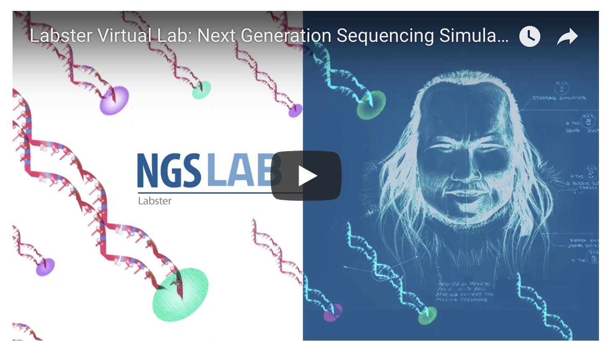
                                                                                                                                            It is based on a real published research study involving the sequencing of ancient DNA from remains of a man who lived about 4000 years ago (Rasmussen *et al.*, 2010).   
                                                                                                                                           You can access this simulation via the link on the Labster section of the BIO2092 ELE page: http://vle.exeter.ac.uk/course/view.php?id=4041#section-7                  
                                                                                                                                                                                
## Accessing the sequence data from study of a 4000-year-old man

All the sequencing data from this study are available through the public
repositories. Specifically, the raw sequence reads are available from
either the Sequence Read Archive (SRA) in the USA or the European
Sequence Archive (ENA) in Europe (Leinonen, Akhtar, *et al.*, 2011;
Leinonen, Sugawara, *et al.*, 2011; Kodama *et al.*, 2012; Silvester *et
al.*, 2018).

Navigate to the research paper at <https://www.ncbi.nlm.nih.gov/pubmed/?term=20148029> and try to find a hyperlink to the sequence data. Alternatively, if you look at the text of the paper in *Nature*, you will read that “Sequences have been deposited to the short read archive with accession number SRA010102”.   

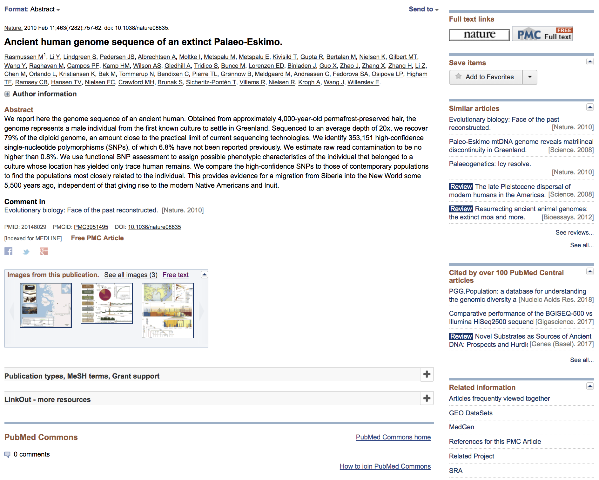
   

If you follow the hyperlink or search the NCBI portal for this accession
number, you will arrive a page like this, describing the data from this
study that is held in the SRA:

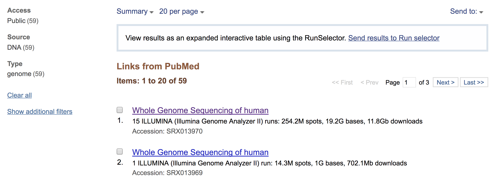

This is telling us that there are 59 datasets associated with this
project. Click on the link to the Run Selector to explore these in a bit
more detail:

  
  -   Note that sequence data are organised into BioProjects and each sequence dataset is linked to a BioSample.   
  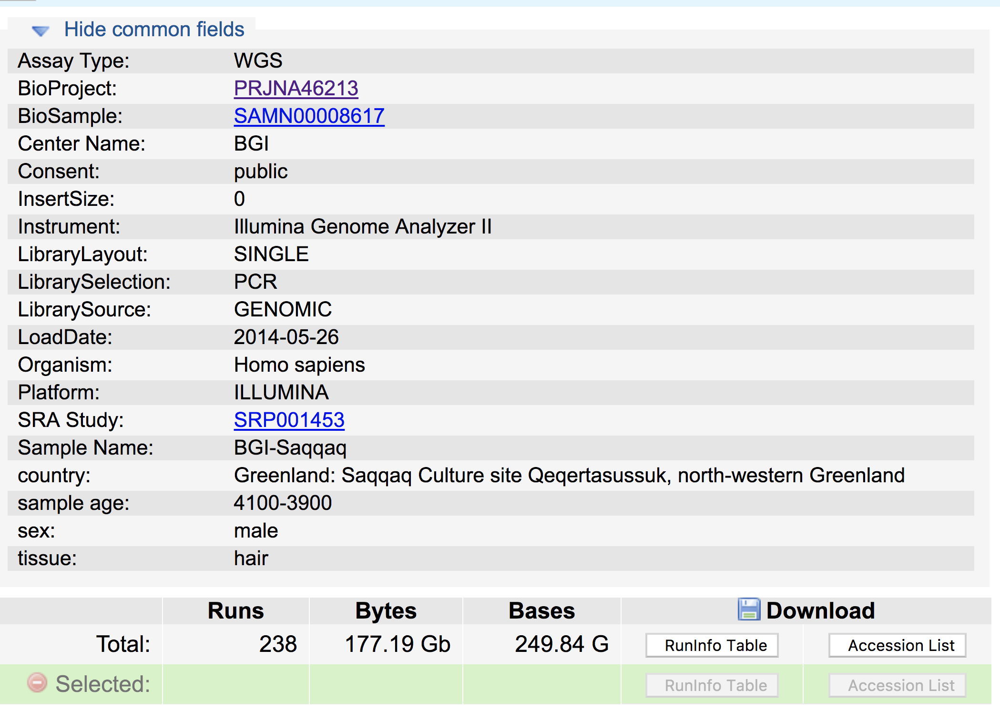
                                                                                                                   
  -   In this case the project contains only one sample.                                                           
                                                                                                                   
  -   Click on the links to find out more about the BioProject and the BioSample and answer the questions below.   
                                                                                                                   
                                                                                                                   
  ---------------------------------------------------------------------------------------------------------------- ------------------------------------------------------------------------------------
  -----------------------------------------------------------------------------------------------------------------------------------------------------------------------------------------------------

  How many base-pairs of data, in total, were generated in this research project?   
  --------------------------------------------------------------------------------- --
  Which DNA sequencing method(s) did the researcher use?                            
  What information can you find about the geographic location of the sample?        
  From which tissue was the DNA extracted?                                          

  ------------------------------------------------------------------------------------------------------------------------------------------------------------------------------------------------------------------------------------------------------------------------------------------------------------------------------------------------------------------------------------------------------------------------------------------------------------------------------------------------------------------------------------------------------------------------------------------------------------------------------------------------------------------------------------------------------------
  Now we are going to take a look at the actual sequence data. Within a sequencing project, the sequencing data are organised into “**experiments**” and “**runs**”. One study can contain multiple experiments and one experiment can contain multiple runs. A “run” essentially means one set of data, generated by running the sequencing machine once. However, in practice, we often sequence several different samples simultaneously (to keep costs down). For example, we could run 8 separate samples on a single Illumina HiSeq flowcell, such that each sample occupies only one of the 8 available lanes.   {width="1.5277777777777777in" height="1.1388888888888888in"}
                                                                                                                                                                                                                                                                                                                                                                                                                                                                                                                                                                                                                        
                                                                                                                                                                                                                                                                                                                                                                                                                                                                                                                                                                                                                        An Illumina flowcell, with 8 lanes
  --------------------------------------------------------------------------------------------------------------------------------------------------------------------------------------------------------------------------------------------------------------------------------------------------------------------------------------------------------------------------------------------------------------------------------------------------------------------------------------------------------------------------------------------------------------------------------------------------------------------- --------------------------------------------------------------------------------------
  -   This diagram might be helpful for understanding how BioProjects, BioSamples, experiments and runs are related to each other.                                                                                                                                                                                                                                                                                                                                                                                                                                                                                      {width="1.9500754593175853in" height="1.2606846019247595in"}
                                                                                                                                                                                                                                                                                                                                                                                                                                                                                                                                                                                                                        
  -   It comes from the DDBJ Sequence Read Archive Handbook (<http://trace.ddbj.nig.ac.jp/book/sra_e.html>).                                                                                                                                                                                                                                                                                                                                                                                                                                                                                                            
                                                                                                                                                                                                                                                                                                                                                                                                                                                                                                                                                                                                                        
                                                                                                                                                                                                                                                                                                                                                                                                                                                                                                                                                                                                                        
  ------------------------------------------------------------------------------------------------------------------------------------------------------------------------------------------------------------------------------------------------------------------------------------------------------------------------------------------------------------------------------------------------------------------------------------------------------------------------------------------------------------------------------------------------------------------------------------------------------------------------------------------------------------------------------------------------------------

Click on one of the links to an “experiment” and then click on a link to
a “run”:

  -----------------------------------------------------------------------------------------------------------------------------------------------------------------------------------------------------------------------------------------------------------------
  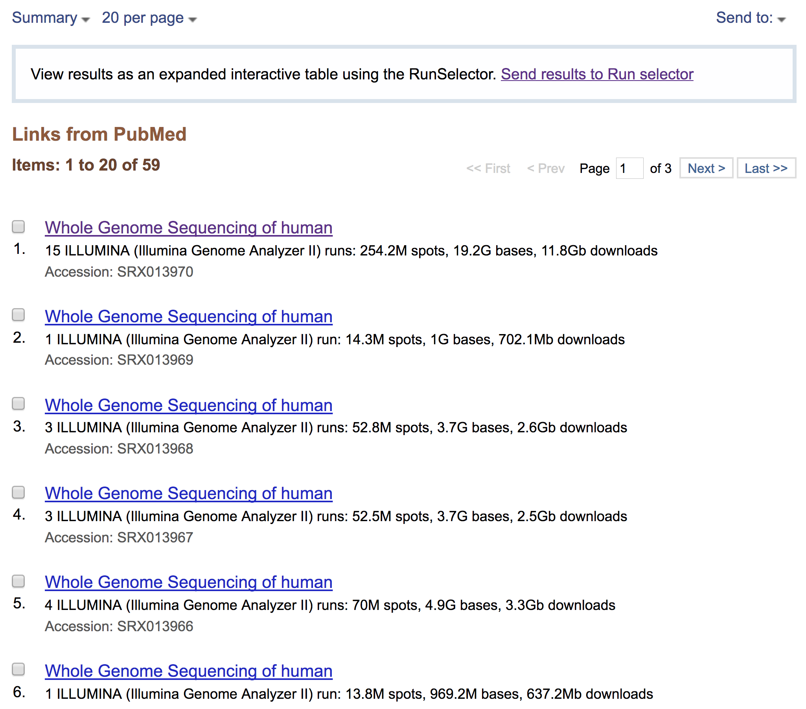{width="1.539501312335958in" height="1.354701443569554in"}   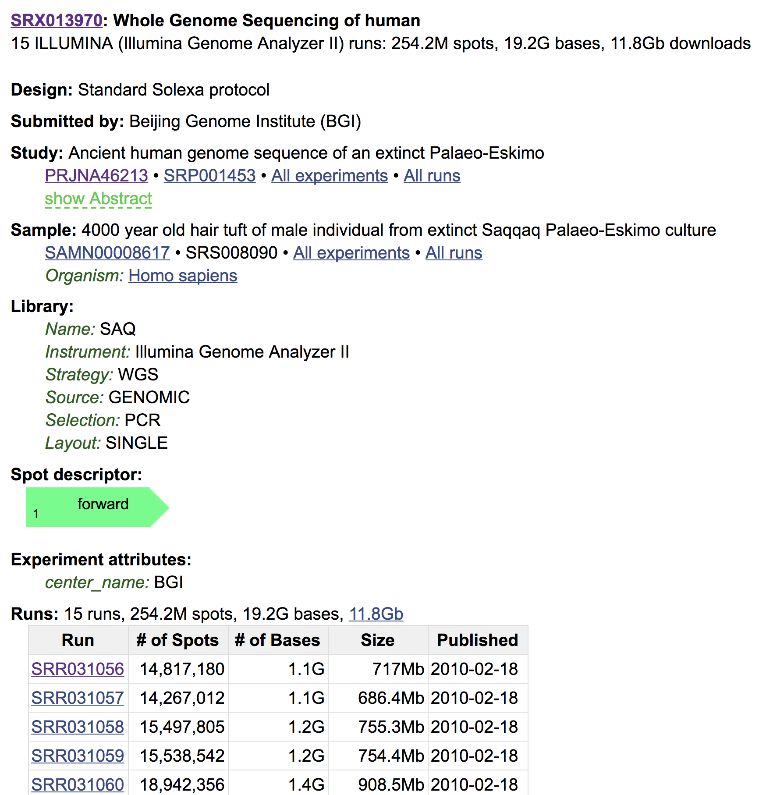{width="1.3260772090988626in" height="1.3888888888888888in"}   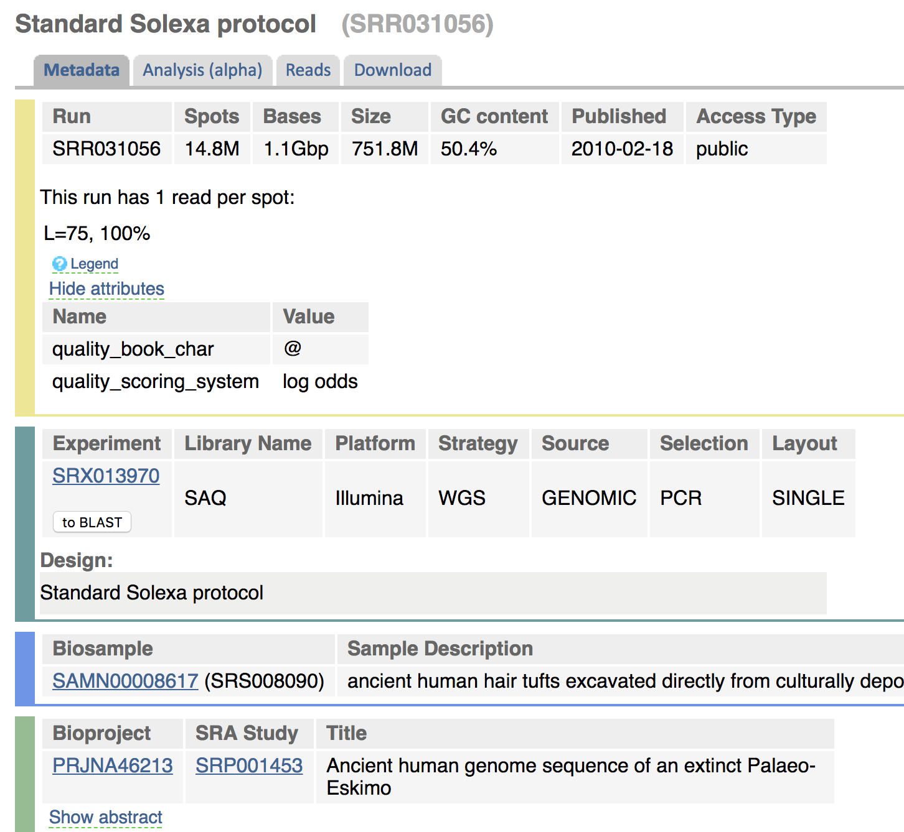{width="1.5118624234470692in" height="1.3931627296587927in"}
                                                                                                                                                                             
                                                                                      Experiment                                                                             Run
  ----------------------------------------------------------------------------------- -------------------------------------------------------------------------------------- --------------------------------------------------------------------------------------
  -----------------------------------------------------------------------------------------------------------------------------------------------------------------------------------------------------------------------------------------------------------------

Now, if you click on the “Reads” tab within the run, you can start
browsing the actual sequence reads:

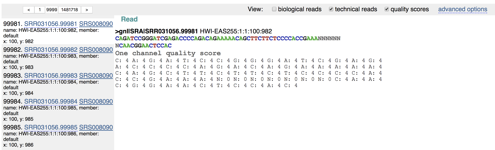{width="6.4215277777777775in"
height="1.9513888888888888in"}

Note that each base in the sequence read is given a quality score. This
score is usually between 0 and 40 and denotes how confident we are in
that particular base having been called correctly. The scores use the
Phred system (Ewing and Green, 1998; Ewing *et al.*, 1998):

  **Phred score**   **Probability that the base is wrong**   **Accuracy**
  ----------------- ---------------------------------------- --------------
  10                1 in 10                                  90 %
  20                1 in 100                                 99 %
  30                1 in 1000                                99.9 %
  40                1 in 10000                               99.99 %

  ---------------------------------------------------------------------------------------------------
  -   What do you think about the quality/accuracy of the DNA sequencing in this research study?   
                                                                                                   
  -   What factors do you think might have contributed to this?                                    
                                                                                                   
                                                                                                   
  ------------------------------------------------------------------------------------------------ --
  ---------------------------------------------------------------------------------------------------

Downloading NGS data
--------------------

It’s all very well examining individual sequence reads, but the whole
point of NGS is that it generates huge numbers of sequence reads … more
than you would ever have time to examine one-by-one. So, how can we
download a whole set of sequence reads?

  ------------------------------------------------------------------------------------------------------------------------------------------------------------------------------------------------------------------------------------------------------
  As you can see, clicking on the “Download” tab does not help much. To download data from the SRA you need to use a software package called the SRA Toolkit.      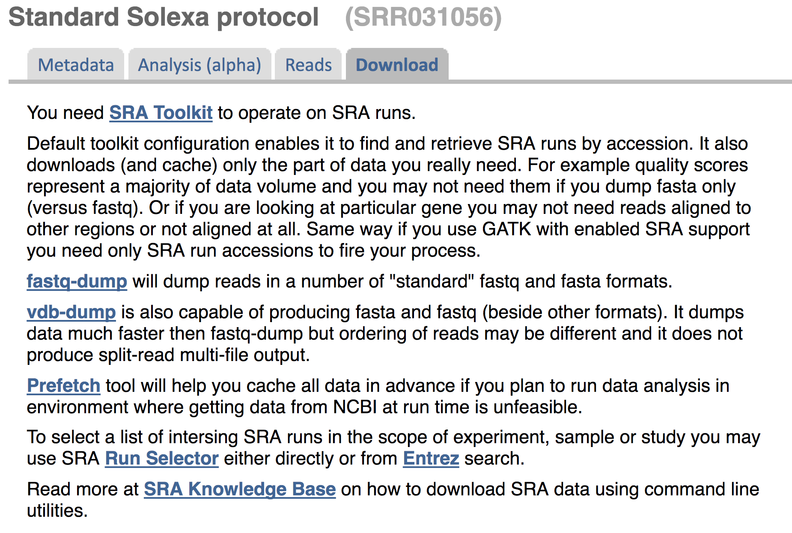{width="2.716398731408574in" height="1.8295374015748032in"}
                                                                                                                                                                   
  Rather than using the SRA Toolkit, we will use a simpler solution: downloading the same data from the ENA via European Bioinformatics Institute (EBI) website.   
                                                                                                                                                                   
  The ENA contains the same data as in the SRA but the website is quite different.                                                                                 
  ---------------------------------------------------------------------------------------------------------------------------------------------------------------- -------------------------------------------------------------------------------------
  ------------------------------------------------------------------------------------------------------------------------------------------------------------------------------------------------------------------------------------------------------

  -------------------------------------------------------------------------------------------------------------------------------------------------------------------------------------------------------------------------
  -   Try to navigate to the palaeo-eskimo sequencing data on the EBI website, using the search tool.                                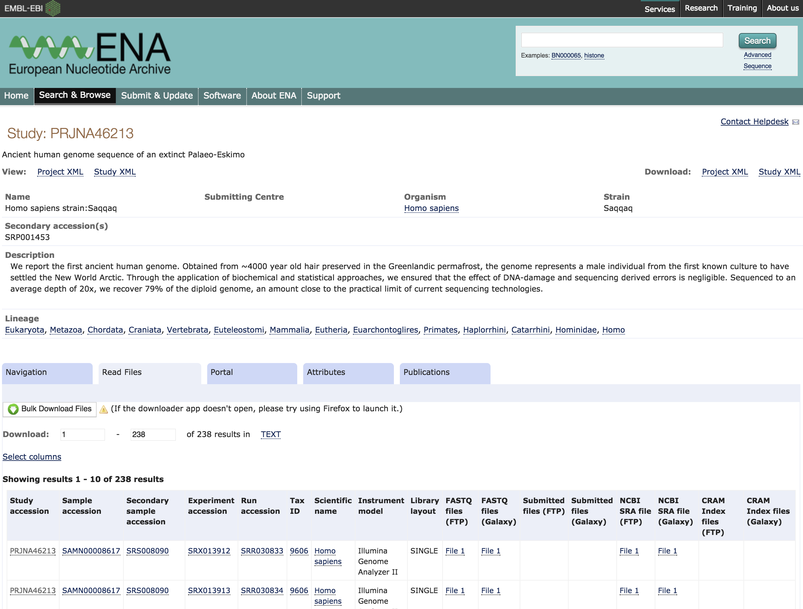{width="2.000320428696413in" height="1.5187893700787403in"}
                                                                                                                                     
  -   Alternatively, we can go directly to the relevant BioProject via this link: <https://www.ebi.ac.uk/ena/data/view/PRJNA46213>   
                                                                                                                                     
  -   One advantage of EBI’s web interface is that it allows us to directly download whole sets of reads from their FTP site.        
                                                                                                                                     
                                                                                                                                     
  ---------------------------------------------------------------------------------------------------------------------------------- --------------------------------------------------------------------------------------
  -   Download one of the sequence files. Choose the option of “FASTQ files (FTP)”.                                                  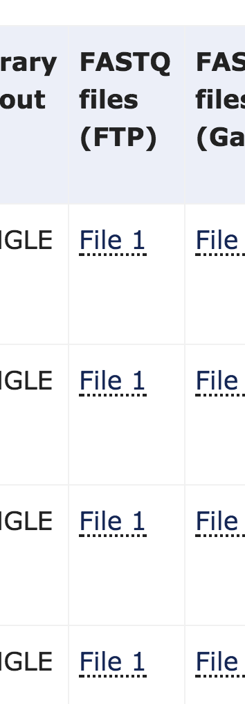{width="0.5576388888888889in" height="0.6196587926509186in"}
                                                                                                                                     
  -   Once you have downloaded your FastQ file, you will need to unzip it using something like WinZip.                               
                                                                                                                                     
                                                                                                                                     
  -------------------------------------------------------------------------------------------------------------------------------------------------------------------------------------------------------------------------

FastQ file format
-----------------

The standard file format for storing and distributing NGS data is called
FastQ. You can read more about this format in a published paper (Cock
*et al.*, 2010) that is included at the back of this document, and the
formal specification of the format
(<http://maq.sourceforge.net/fastq.shtml>). The Wikipedia article about
FastQ is very informative too. You may already be familiar with FastA as
a format for representing nucleotide and amino-acid sequences. Why do
you think this format is called FastQ? The main advantage of FastQ over
FastA is that it can neatly include not only the sequence itself but
also the quality scores for each base in the sequence.

The FastQ format looks like this:

  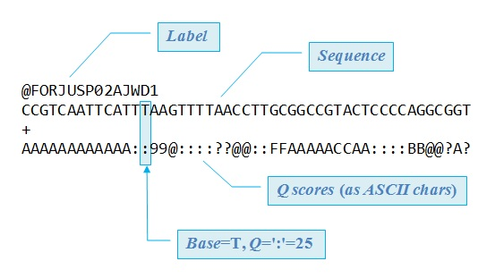{width="2.2418350831146108in" height="1.2606835083114611in"}   Can you think of any advantage of representing the quality scores in this manner rather than what we saw on the NCBI website?
  -------------------------------------------------------------------------------------- -------------------------------------------------------------------------------------------------------------------------------

Can you write the quality scores for each base in the following sequence
read?

  -------------------------------------------------------------------------------------------------------------------------------------------------------------------------------------------
  FastQ                                                          @SRR1515238.1 HISEQ:317:C43Y2ACXX:6:1101:1634:2111/1
                                                                 
                                                                 NTGATCTGGCGGCGGCAGCTCATACTCCAGGGCGGCATGTCGGTGCTGTTGGCAGCCTGGCAGATGCCGCATTCGCTGCGCTGGGAGTGGGAAGCCATCG
                                                                 
                                                                 +
                                                                 
                                                                 \#1=DDDDDDDDDDII0;ADEIIIIDDDDDDDDD@?:-6&lt;AA?::?:AAAAA?&gt;&gt;?&lt;????????AAAA???&gt;;&gt;A?&gt;???????????????A????AA?
  -------------------------------------------------------------- ----------------------------------------------------------------------------------------------------------------------------
  Quality scores                                                 

  Which encoding was used? See paper at back of this document.   
  -------------------------------------------------------------------------------------------------------------------------------------------------------------------------------------------

Here is a summary of the ASCII code, which you will need to decode the
quality scores:

{width="4.585416666666666in"
height="2.737208005249344in"}

You can check your answer here:
<https://trace.ncbi.nlm.nih.gov/Traces/sra/?run=SRR1515238>

Remember to check the “quality scores” tickbox.

Assessing the quality of sequence data (in FastQ format)
--------------------------------------------------------

You now know how to manually extract the quality scores for the base at
each position in a sequence read and hence make some judgement about the
reliability of the data. However, clearly this would not be a feasible
approach when dealing with large numbers of reads. Now you are going to
use a software package called FastQC to assess the quality of the whole
set of sequence reads rather than just looking at a single read.
Earlier, you downloaded a FastQ file from the EBI’s website. Please
assess the quality of that FastQ file using FastQC, as illustrated
below. You can find out more about FastQC at its website
(<http://www.bioinformatics.bbsrc.ac.uk/projects/fastqc/>).

### Launching the FastQC software in Windows:

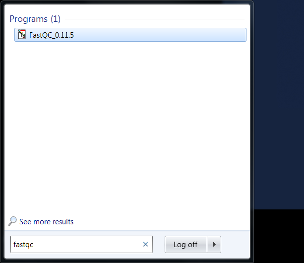{width="2.325300743657043in"
height="2.3921905074365704in"}
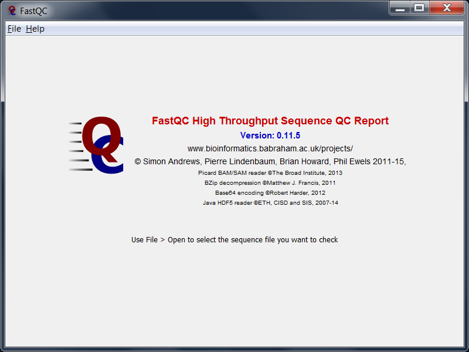{width="3.2168667979002623in"
height="2.412650918635171in"}

### Opening a FastQ file in the FastQC software:

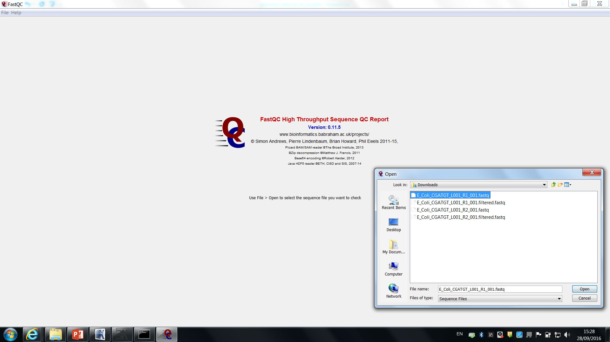{width="4.1636920384951885in"
height="2.3418799212598427in"}

### Now wait a minute while the FastQC software analyses the FastQ file:

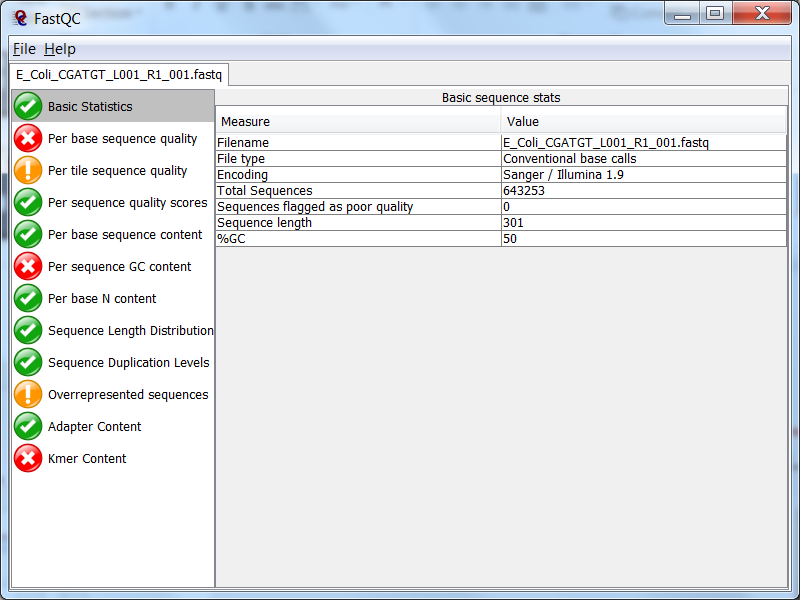{width="3.0143536745406823in"
height="2.2606846019247593in"}

The FastQC program performs a number of tests which determines whether a
green tick (pass), exclamation mark (warning) or red cross (fail) is
displayed. However, it is important to realise that FastQC has no
knowledge of what your DNA library is or should look like. All of its
tests are based on a completely random library with 50% GC content.
Therefore, if you have a sample which does not match these assumptions,
it may 'fail' the library. For example, if you have a high AT or high GC
organism it may fail the per sequence GC content. If you have any
barcodes or low complexity libraries (e.g. small RNA libraries) they may
also fail some of the sequence complexity tests.

Now let’s take a tour through the more important information provided by
FastQC about our sequence dataset.

### Quality scores

This is one of the most important metrics. If the quality scores are
poor, either the wrong FastQ encoding (Cock *et al.*, 2010) has been
guessed by FastQC (see the title of the chart), or the data itself is
poor quality. This view shows an overview of the range of quality values
across all bases at each position in the FASTQ file. Generally anything
with a median quality score greater than Q20 is regarded as acceptable;
anything above Q30 is regarded as 'good'.

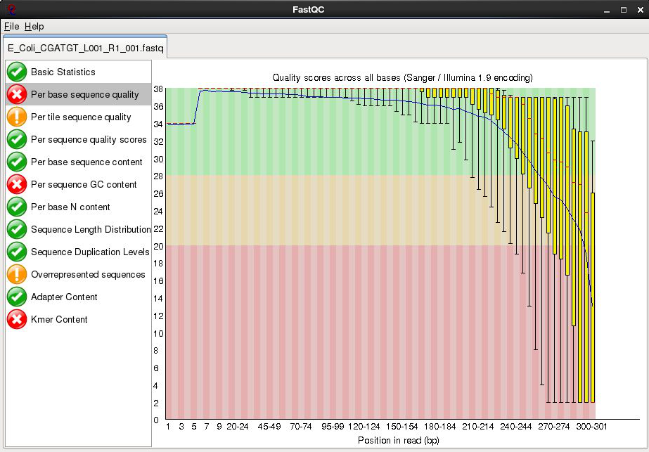{width="3.2387674978127734in"
height="2.256410761154856in"}

In this case this check is red - and it is true that the quality drops
off at the end of the reads. It is normal for read quality to get worse
towards the end of the read. You can see that at 250 bases the quality
is still very good. We could simply trim the sequence reads down to 250
bp to eliminate most of the poor-quality data.

  ------------------------------------------------------------------------------------------------------------------------------------------------------------------------------------------------
  Note that what we are looking at “box and whiskers” plots of the quality scores at each position.   {width="2.538461286089239in" height="0.9949278215223097in"}
                                                                                                      
                                                                                                      <http://www.bbc.co.uk/schools/gcsebitesize/maths/statistics/representingdata3hirev6.shtml>
  --------------------------------------------------------------------------------------------------- --------------------------------------------------------------------------------------------
  ------------------------------------------------------------------------------------------------------------------------------------------------------------------------------------------------

### Per-tile sequence quality

This is a purely technical view on the sequencing run, it is more
important for the team running the sequencer. The sequencing flowcell is
divided up into areas called cells. You can see that the read quality
drops off in some cells faster than others. This maybe because of the
way the sample flowed over the flowcell or a mark or smear on the lens
of the optics.

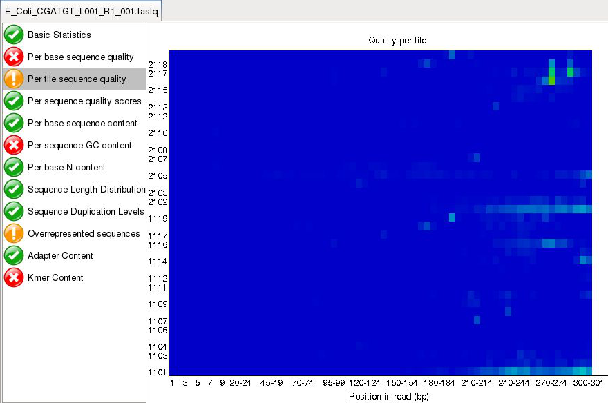{width="3.3483584864391953in"
height="2.2222222222222223in"}

### Per-base sequence content

For a completely randomly generated library with a GC content of 50% one
expects that at any given position within a read there will be a 25%
chance of finding an A, C, T or G base. Here we can see that our library
satisfies these criteria, although there appears to be some minor bias
at the beginning of the read. This may be due to PCR duplicates during
amplification or during library preparation. It is unlikely that one
will ever see a perfectly uniform distribution.

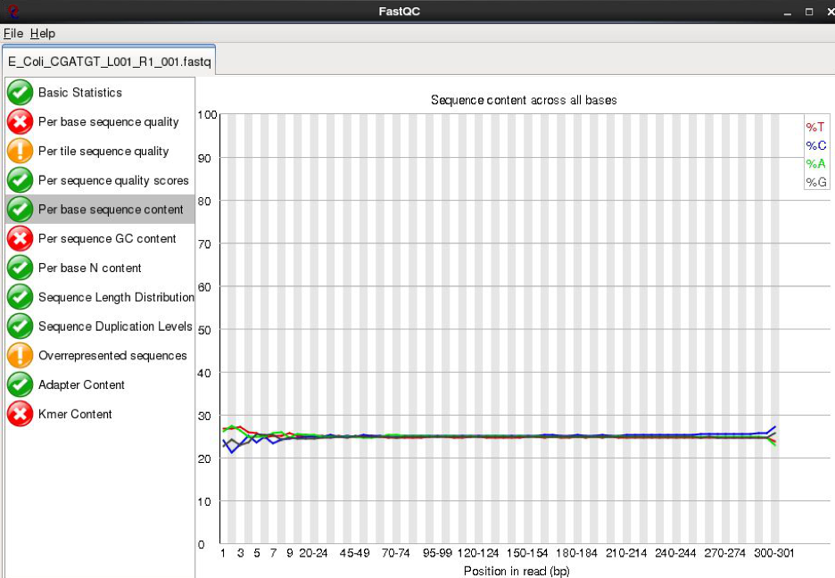{width="4.764957349081365in"
height="3.2989359142607175in"}

### Sequence duplication levels

In a library that covers a whole genome uniformly most sequences will
occur only once in the final set. A low level of duplication may
indicate a very high level of coverage of the target sequence, but a
high level of duplication is more likely to indicate some kind of
enrichment bias (e.g. PCR over-amplification). FastQC counts the degree
of duplication for every sequence in the set and creates a plot showing
the relative number of sequences with different degrees of duplication.

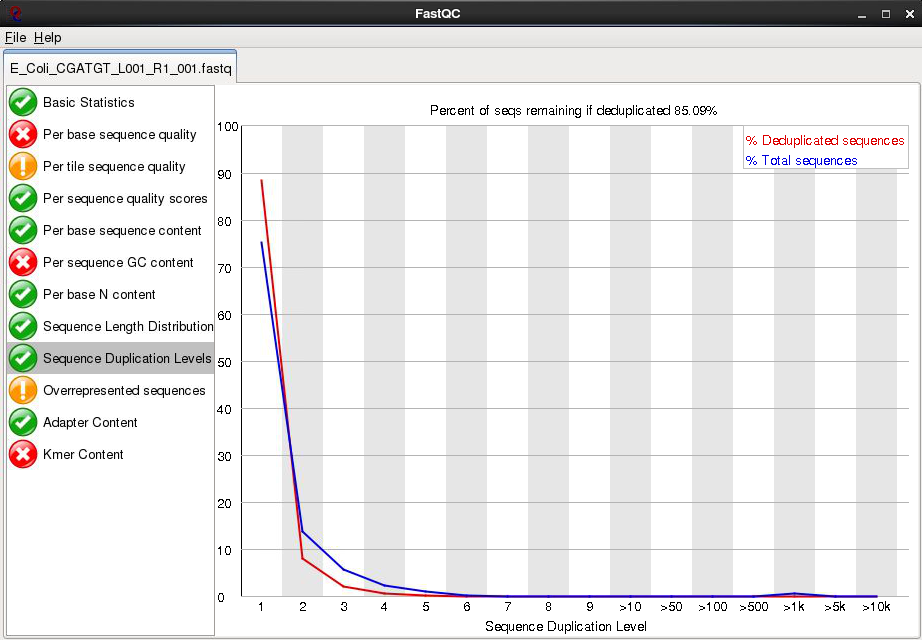{width="3.476519028871391in"
height="2.4131353893263343in"}

Finally, please gather the following information about your downloaded
dataset. Some of this information can be found on the websites and some
can be found using the FastQC software.

  Filename of the FastQ file                                                                             
  ------------------------------------------------------------------------------------------------------ --
  Accession number of the sequencing run. This will likely begin with “SRR”.                             
  How many sequence reads are there in this file?                                                        
  What is the length of the sequence reads?                                                              
  Would you recommend trimming the ends of the reads before further analysis? If so, then by how much?   
  Are there any other problems with the quality of the data? If so, what are they?                       

Well done; you made it to the end. In subsequent computer practicals, we
will look at the main approaches to utilising NGS data (following
quality control); that is alignment to a reference sequence and *de
novo* assembly. For alignment to a reference sequence, we will explore
the use of a genome browser software.

References
----------

Cock, P.J. a, Fields, C.J., Goto, N., Heuer, M.L., and Rice, P.M. (2010)
The Sanger FASTQ file format for sequences with quality scores, and the
Solexa/Illumina FASTQ variants. *Nucleic Acids Res.* **38**: 1767–71.

Ewing, B. and Green, P. (1998) Base-calling of automated sequencer
traces using phred. II. Error probabilities. *Genome Res.* **8**:
186–94.

Ewing, B., Hillier, L., Wendl, M.C., and Green, P. (1998) Base-calling
of automated sequencer traces using phred. I. Accuracy assessment.
*Genome Res.* **8**: 175–85.

Kodama, Y., Shumway, M., and Leinonen, R. (2012) The sequence read
archive: explosive growth of sequencing data. *Nucleic Acids Res.*
**40**: D54–D56.

Leinonen, R., Akhtar, R., Birney, E., Bower, L., Cerdeno-Tarraga, A.,
Cheng, Y., et al. (2011) The European Nucleotide Archive. *Nucleic Acids
Res.* **39**: D28–D31.

Leinonen, R., Sugawara, H., and Shumway, M. (2011) The Sequence Read
Archive. *Nucleic Acids Res.* **39**: D19–D21.

Rasmussen, M., Li, Y., Lindgreen, S., Pedersen, J.S., Albrechtsen, A.,
Moltke, I., et al. (2010) Ancient human genome sequence of an extinct
Palaeo-Eskimo. *Nature* **463**: 757–62.

Silvester, N., Alako, B., Amid, C., Cerdeño-Tarrága, A., Clarke, L.,
Cleland, I., et al. (2018) The European Nucleotide Archive in 2017.
*Nucleic Acids Res.* **46**: D36–D40.
