  
# Handling “next-generation” sequencing data: alignments against a reference genome

## Introduction
In the previous practical, you saw the raw data output from
‘next-generation’ sequencing (NGS) and explored some databases from
which such data can be obtained. You saw that NGS data from shotgun
sequencing of a genome typically generates very large numbers of short
sequence reads. Today, we are going to see how we can make some sense of
the data, by viewing the reads aligned against a reference genome
sequence.

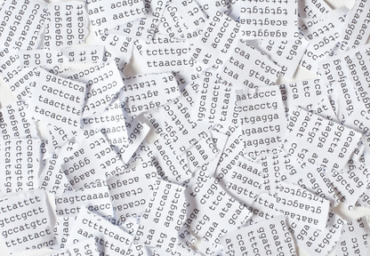

Making sense of short sequence reads is something like piecing together scraps of text from a shredder.
There are two main approaches:
                                                                                       
* alignment against a reference genome sequence and
* *de novo* assembly.
                                                                                       
Today we will look at the former. The latter will be covered in a future practical.

## The data
The sequence data that we are using today comes from the genome (and
transcriptome) of the bacterium *Mycobacterium tuberculosis*, a
bacterial pathogen that infects about 2 billion people (a third of the
world’s population) and is the causative agent of tuberculosis.

Its genome is small and therefore convenient for handling in a short
educational workshop. The same principles that we learn about today are
mostly applicable for larger genomes too but would require more time and
computer resource to analyse. Specifically, we will be using genomic
sequence data from a
[survey of tuberculosis transmission in Oxfordshire,UK](https://www.ncbi.nlm.nih.gov/pubmed/24717625)
and transcriptomic data from another as-yet
unpublished study.

Both these datasets consist of pairs of short reads,
generated using Illumina sequencing. We will also take a look at a
[genomic sequence dataset generated using
PacBio longer reads](https://www.ncbi.nlm.nih.gov/pubmed/?term=10.1016%2Fj.gdata.2016.08.007) 

As the reference genome sequence, we will use the [completely assembled
sequence of strain H37Rv](https://www.ncbi.nlm.nih.gov/pubmed/9634230).
Prior to this practical,
alignment files were generated for you: the sequence reads were aligned
against H37Rv reference genome sequence using a software package called
BWA (Li and Durbin, 2009).

  SRA accession number  | Genome / transcriptome |  Strain of *M. tuberculosis* |  Sequencing method
  --------------------- | ---------------------- | ---------------------------- | -------------------
  ERR400344              | Genome                 |  OxTb-6                     |   Illumina HiSeq
  ERR400311              | Genome                 |  OxTb-321                   |   Illumina HiSeq
  SRR3667790             | Genome                 |  SB24                       |   PacBio SMRT
  SRR5061507             | Transcriptome          |  H37Rv                      |   Illumina HiSeq
  SRR5061515             | Transcriptome          |  H37Rv                      |   Illumina HiSeq

Please download all of the data files from
<https://tinyurl.com/yde9ojy7> onto your Windows PC.

## The software: IGV
To interactively browse the genome, and the NGS sequence data aligned
against the genome, we are going to us the Integrative Genomics Viewer
(IGV) (Thorvaldsdottir *et al.*, 2013). This software should already be
installed on the Windows PCs in Hatherly; alternatively you can access
the software from the authors’ website here:
<https://software.broadinstitute.org/software/igv/download>

## What you need to do
You need to follow the steps described below. These will lead you
through how to load the reference genome the aligned NGS reads into IGV.
You then need to play around with IGV and learn to drive it. Try to
answer the questions below.

## Loading the reference genome into IGV
When you first start IGV, it will look something like this:

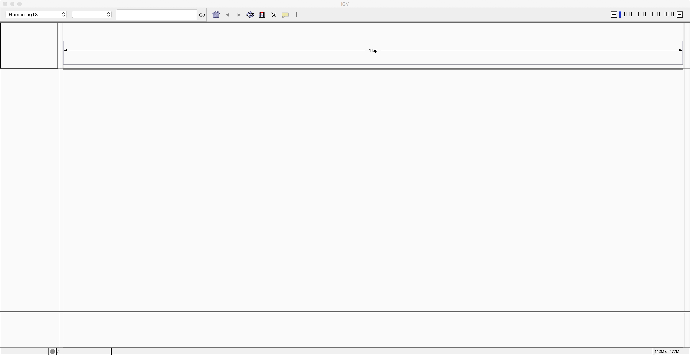

To load the nucleotide sequence of the reference genome, locate the
“Genomes” menu item. Choose “Genomes -&gt; Load genome from file” and
locate the reference genome sequence file that you downloaded earlier.
This file should be called “GCA\_000195955.2\_ASM19595v2\_genomic.fna”.

Once you have loaded this reference genome sequence, use the control
near the top right corner of the IGV window to zoom in as far as you
can. Then you should be able to see the nucleotide sequence of the
reference genome along the bottom:

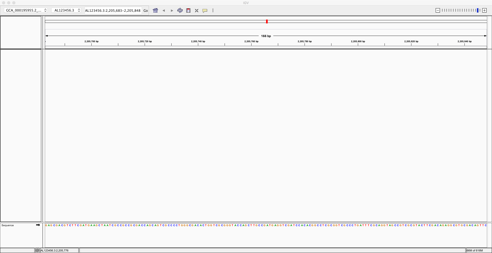

Next, we need to load the genome annotation. Use the menu item called
“File -&gt; Load from file” to select the annotation file that you
downloaded earlier. This should be called
“GCA\_000195955.2\_ASM19595v2\_genomic.gff”. After loading the
annotation and zooming out a bit, you should see something like this:

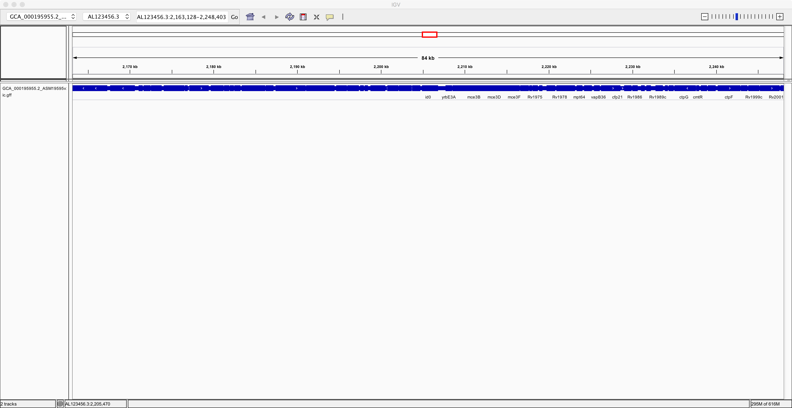

Now, to improve clarity, right-click on the genes track and select the
“Expanded” option. Now you can see the individual genes more clearly on
the reference genome:

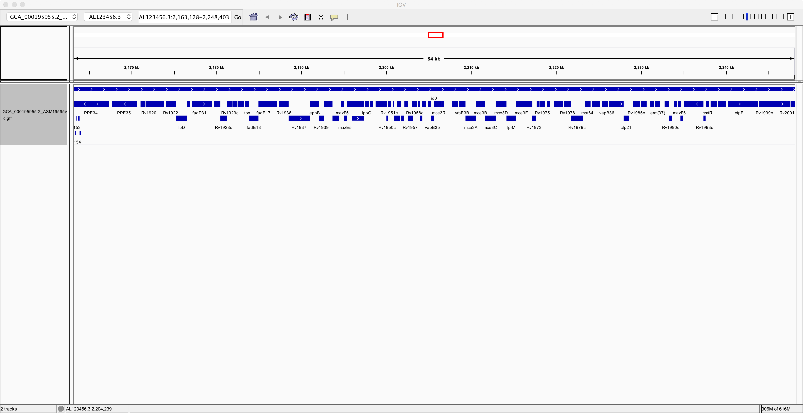

Now spend at least a few minutes learning how to navigate around the
genome, zooming in on specific regions and finding information about
specific genes:

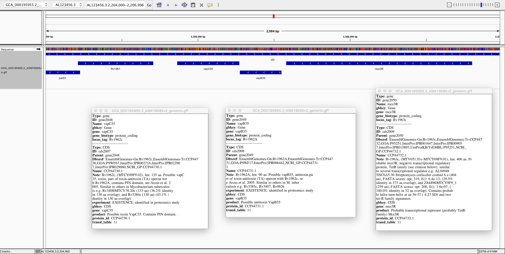

Note that you can navigate to specific sites on the genome or search for
specific genes, using the search field near the top:

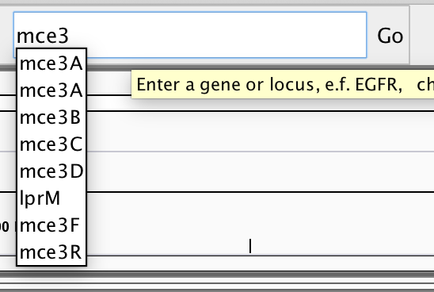

You might wish to locate genes of particular interest that are involved
in virulence of this pathogen, *e.g.* *katG*, *hspX* (*acr*), *erp*,
*hma*, *pcaA*. Once you are confident that you understand what you are
looking at and are reasonably adept at navigating around the genome,
then please proceed to loading the alignment data into IGV.

## Loading the alignments into IGV
Use the “File -&gt; Load from file” menu item to load the alignment
files that you downloaded earlier. The names of these files should end
in “.bam”. Please note that you also need to have the index files
(“.bai”) present in the same folder. In the screenshot below, I am
loading two alignment files:

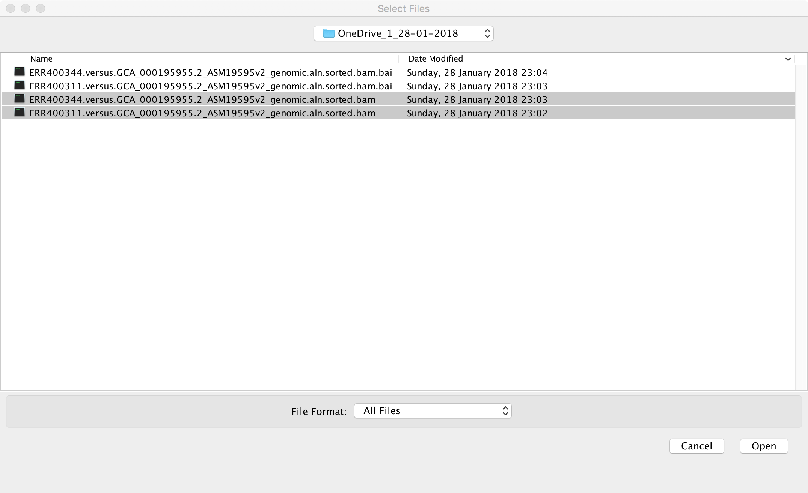

After loading these two alignments of genomic reads, we see something
like the following screenshot. Please note that right-clicking on
various parts of the window brings up menus that allow you to configure
and rename tracks.

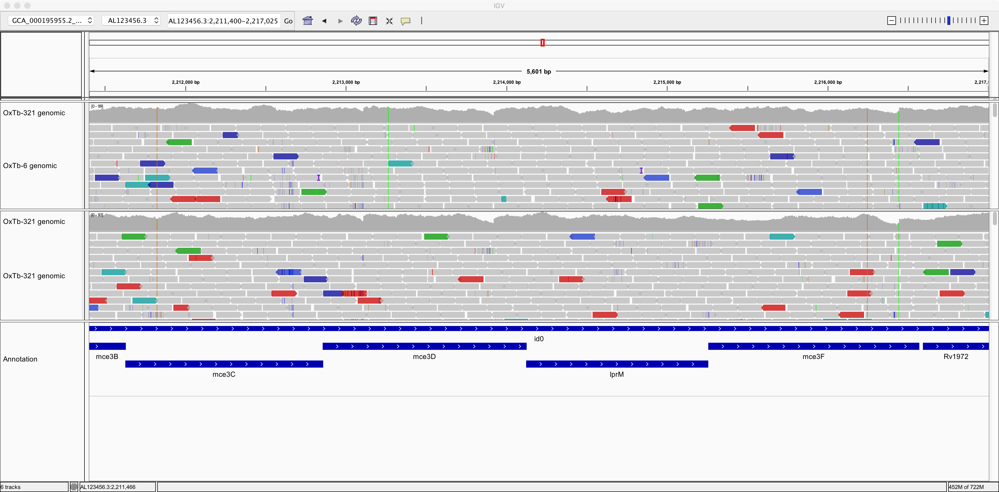

So, now we can see individual sequence reads aligned against the
reference genome. We can also see plots of coverage depth.

Now let’s right-click on the tracks and choose the option to “View as
pairs”. Now we can see pairs of reads joined by a thin horizontal line.
This pairing arises from the fact that sequencing was performed at both
ends of the genomic fragments.

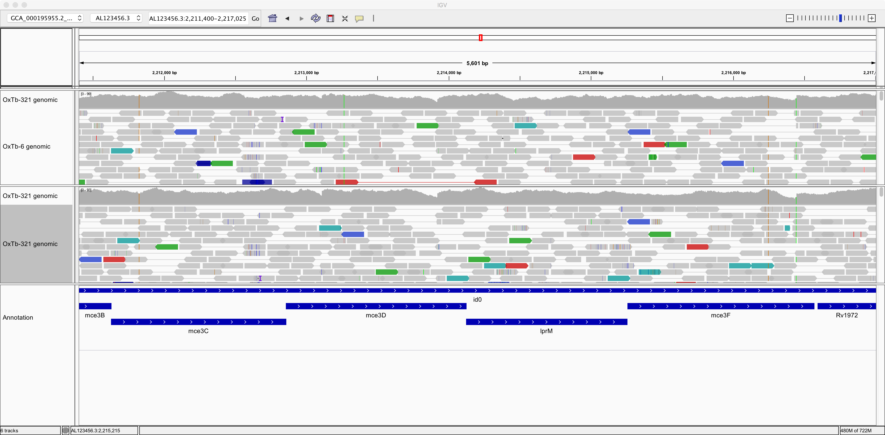

  What size, approximately, were the fragments of genomic DNA in these two samples?   
  ----------------------------------------------------------------------------------- --
  What do you think is denoted by the different colours of the sequence reads?        

Now let’s zoom in on position AL123456.3:2,213,265:

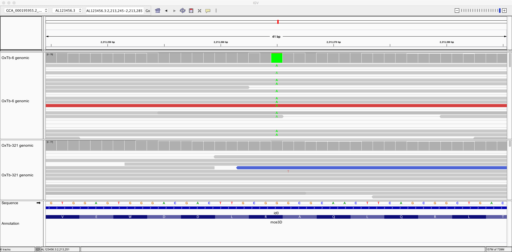

Here we can see a single-nucleotide polymorphism (SNP). Both the
reference genome and strain OxTb-321 have a G at this position; but
strain OxTb-6 has an A.

> Do you think this G/A SNP will have any impact on an encoded protein? Why?   

Now, try to find a few more SNPs:

Genomic position                |  Reference base  |   Alternative base |  Effect on protein
------------------------------- | ---------------- | ------------------ | -------------------
_______________________________ | ________________ | __________________ | __________________________________
_______________________________ | ________________ | __________________ | __________________________________
_______________________________ | ________________ | __________________ | __________________________________
                                                                                                                 
Now, take a look at this genomic region: AL123456.3:2,232,639-2,244,376.

Here, strain OxTb-6 appears to lack a genomic region comprising 4 genes
that are present in the reference and in OxTb-321. Notice how the read
pairs span across the gap in OxTb-6. Can you find any other genes
missing from OxTb-6 and/or OxTb-321?

Now let’s take a look at the genomic data generated using the PacBio
method. This is in file
“SRR3667790.versus.GCA\_000195955.2\_ASM19595v2\_genomic.aln.sorted.bam”.
Notice how the reads are much longer but contain numerous errors:

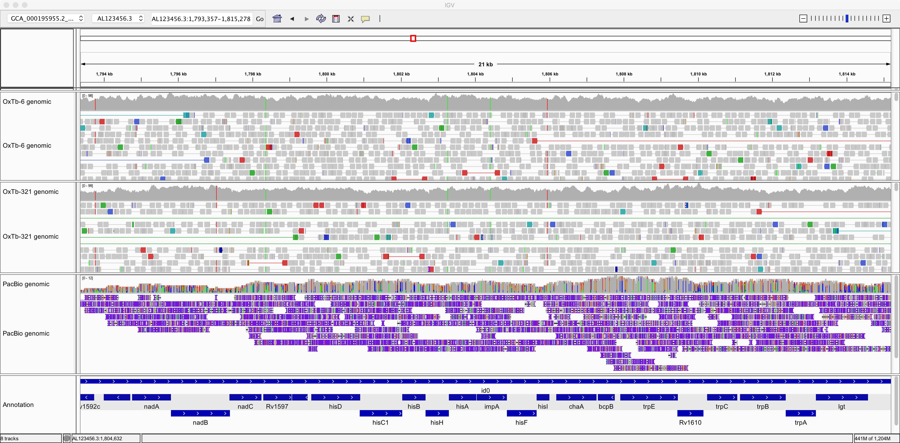

Now, let’s take a look at some transcriptomic data. Use “File -&gt; Load
from file” to load alignment files
“SRR5061507.versus.GCA\_000195955.2\_ASM19595v2\_genomic.aln.sorted.bam”
and
“SRR5061515.versus.GCA\_000195955.2\_ASM19595v2\_genomic.aln.sorted.bam”.
You will learn more about transcriptomics during Dr Santos’ lectures
later in the course. For now, understand that this RNA-seq data consists
of paired-read Illumina sequencing of fragments if cDNA. It therefore
presents a survey of the transcripts present in the bacterial cell. The
two samples were prepared from the same bacterial strain but under
different growth conditions.

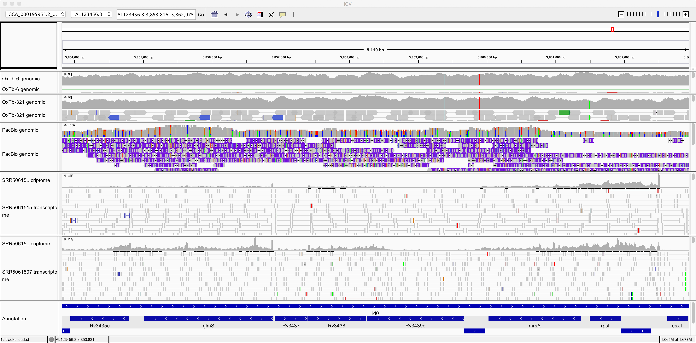

Note that the transcriptomics data looks quite different from the
genomic data in at a few respects. Make sure you understand the reason
for each of these:

* The depth of coverage by genomic sequence is more uniform than by
    transcriptomic sequence.

* There are many “gaps” on the reference genome with little or no
    coverage by transcriptomic sequence.

* There tend to be fewer mismatches between the RNA-seq sequences and
    the reference genome than is the case for these genomic datasets.

Also note in the image above, it seems that gene *glmS* is significantly
more expressed (transcribed) in one sample than in the other. Can you
find any more examples of such differentially expressed genes?

## Qualimap: QC and summary statistics for alignments
Qualimap (García-Alcalde *et al.*, 2012; Okonechnikov *et al.*, 2015)
(<http://qualimap.bioinfo.cipf.es/>) is a program that summarises the
alignment in much more detail than the mapping stats file we produced.
It’s primarily a technical tool which allows you to assess the
sequencing for any problems and biases in the sequencing and the
alignment rather than a tool to deduce biological features. There is a
lot of information in the report so here are just a few highlights:

## Loading a BAM file into Qualimap software:

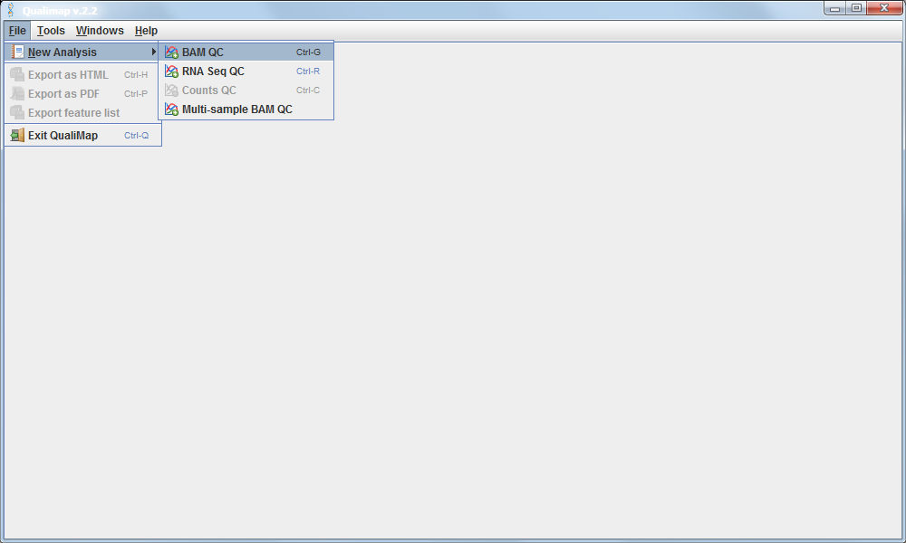

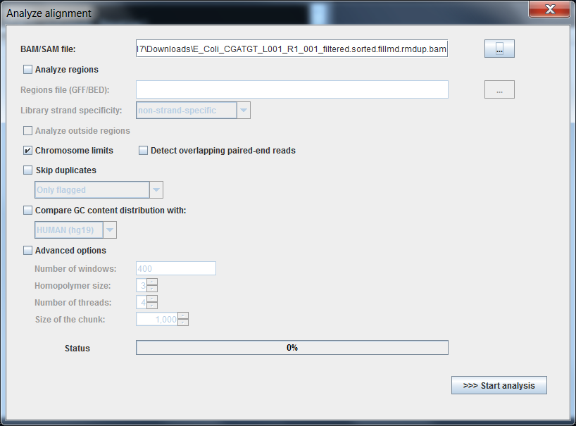

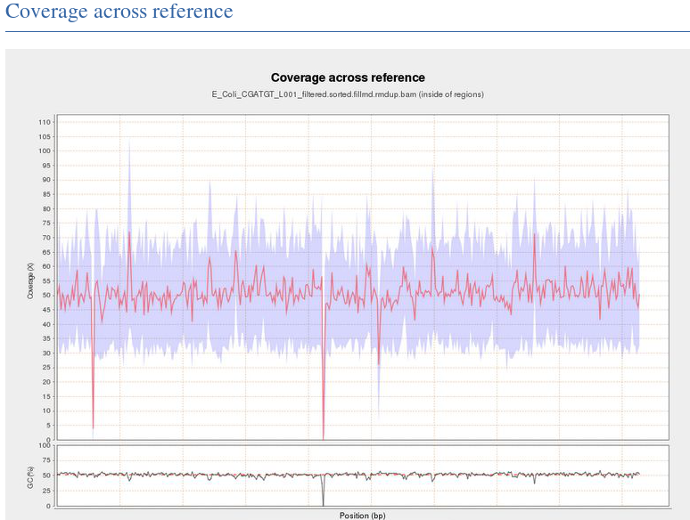

This shows the number of reads that 'cover' each section of the genome.
The red line shows a rolling average around 50x - this means that on
average every part of the genome was sequenced 50X. It is important to
have sufficient depth of coverage in order to be confident that any
features you find in your data are real and not a result of sequencing
errors.

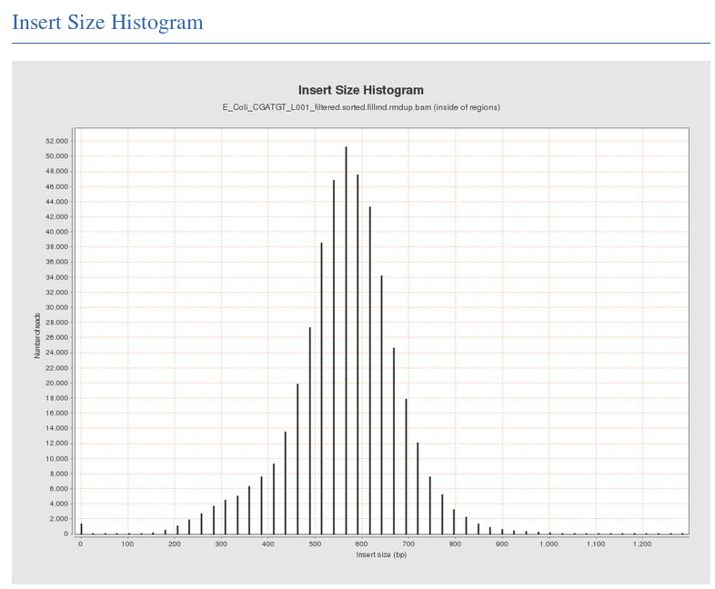

The Insert Size Histogram displays the range of sizes of the DNA
fragments. It shows how well your DNA was size selected before
sequencing. Note that the 'insert' refers to the DNA that was inserted
between the sequencing adaptors, so equates to the size range of the DNA
that was used. In this case we have 300 paired end reads and our insert
size varies around 600 bases - so there should only be a small gap
between the reads that was not sequenced.

Have a look at some of the other graphs produced with your alignment
files and try to figure out their meaning and significance.

## References

Cole, S.T., Brosch, R., Parkhill, J., Garnier, T., Churcher, C., Harris,
D., et al. (1998) Deciphering the biology of Mycobacterium tuberculosis
from the complete genome sequence. *Nature* **393**: 537–544.

García-Alcalde, F., Okonechnikov, K., Carbonell, J., Cruz, L.M., Götz,
S., Tarazona, S., et al. (2012) Qualimap: evaluating next-generation
sequencing alignment data. *Bioinformatics* **28**: 2678–9.

Li, H. and Durbin, R. (2009) Fast and accurate short read alignment with
Burrows-Wheeler transform. *Bioinformatics* **25**: 1754–60.

Okonechnikov, K., Conesa, A., and García-Alcalde, F. (2015) Qualimap 2:
Advanced multi-sample quality control for high-throughput sequencing
data. *Bioinformatics* **32**:.

Philip, N., Rodrigues, K.F., William, T., and John, D.V. (2016) Whole
genome sequencing of Mycobacterium tuberculosis SB24 isolated from
Sabah, Malaysia. *Genomics Data* **9**: 137–139.

Thorvaldsdottir, H., Robinson, J.T., and Mesirov, J.P. (2013)
Integrative Genomics Viewer (IGV): high-performance genomics data
visualization and exploration. *Brief. Bioinform.* **14**: 178–192.

Walker, T.M., Lalor, M.K., Broda, A., Ortega, L.S., Morgan, M., Parker,
L., et al. (2014) Assessment of Mycobacterium tuberculosis transmission
in Oxfordshire, UK, 2007-12, with whole pathogen genome sequences: An
observational study. *Lancet Respir. Med.* **2**: 285–292.
