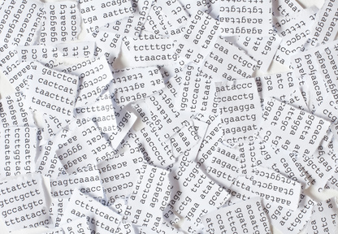
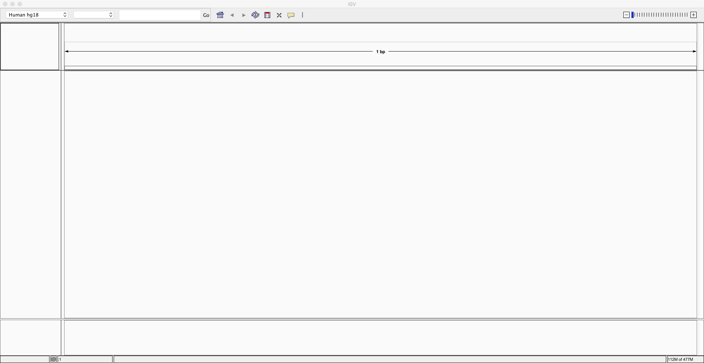
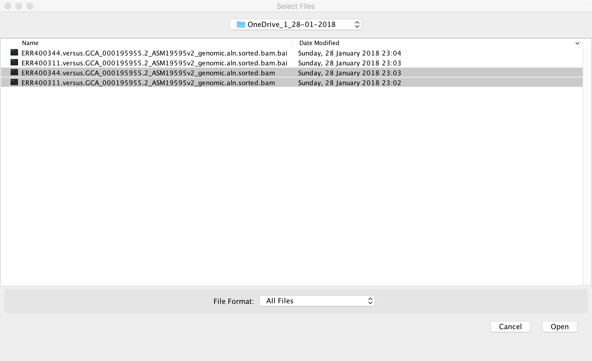
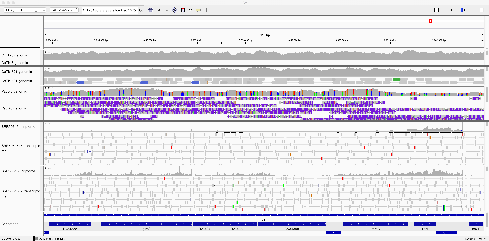
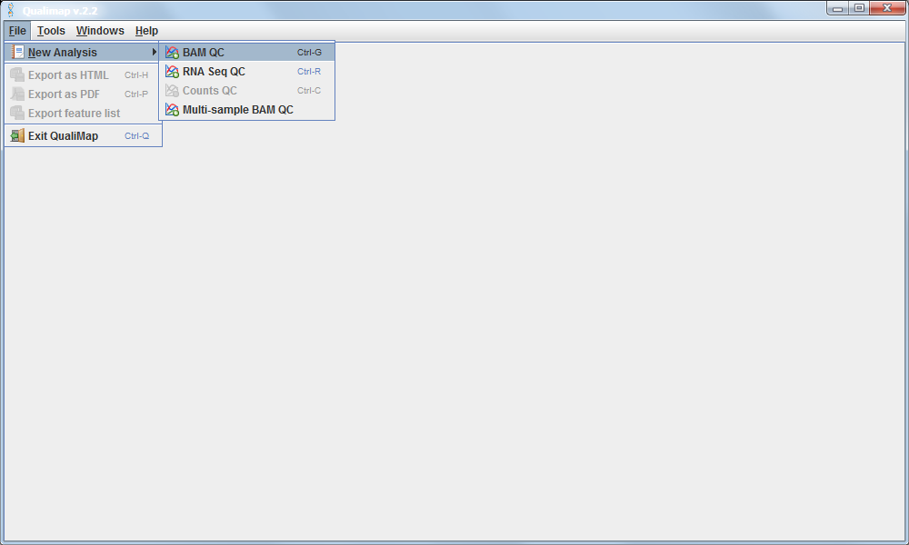
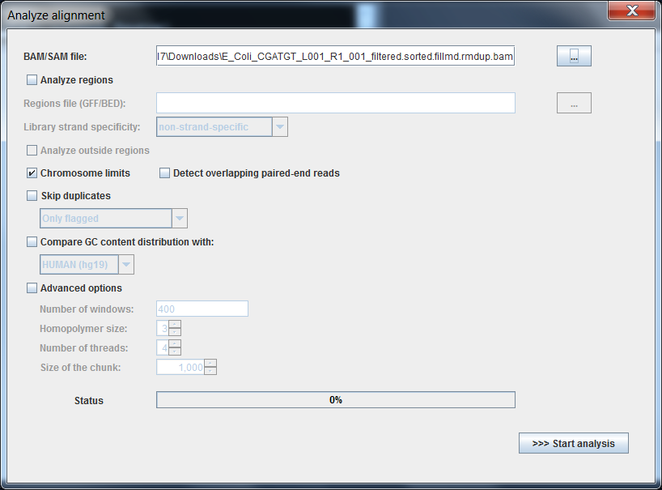
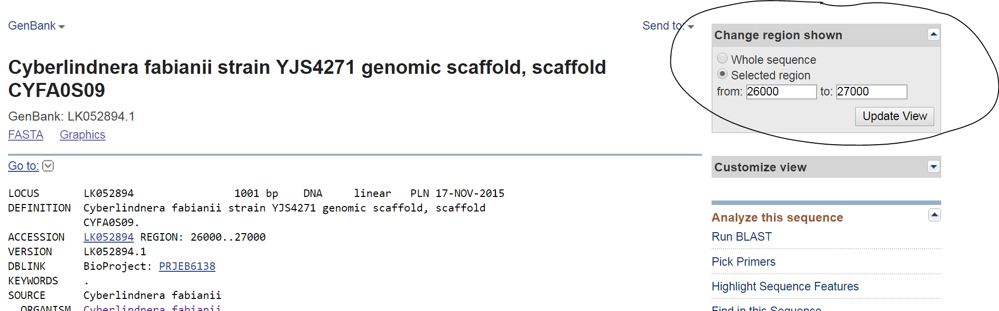

 
  
# BIO2092 Practical 3: Handling “next-generation” sequencing data: alignments against a reference genome

## Introduction
In the previous practical, you saw the raw data output from
‘next-generation’ sequencing (NGS) and explored some databases from
which such data can be obtained. You saw that NGS data from shotgun
sequencing of a genome typically generates very large numbers of short
sequence reads. Today, we are going to see how we can make some sense of
the data, by viewing the reads aligned against a reference genome
sequence.



Making sense of short sequence reads is something like piecing together text on scraps of paper from a shredder.
There are two main approaches:
                                                                                       
* alignment against a reference genome sequence and
* *de novo* assembly.
                                                                                       
Today we will look at the former (alignment). The latter (*de novo* assembly) will be covered in a future practical.

## The data
The sequence data that we are using today comes from the genome (and
transcriptome) of the bacterium *Mycobacterium tuberculosis*, a
bacterial pathogen that infects about 2 billion people (a third of the
world’s population) and is the causative agent of tuberculosis.

Its genome is small and therefore convenient to work with.
The same principles that we learn about today are
mostly applicable for larger genomes too but would require more time and
computer resource to analyse. Specifically, we will be using genomic
sequence data from a
[survey of tuberculosis transmission in Oxfordshire,UK](https://doi.org/10.1016/S2213-2600(14)70027-X)
and transcriptomic data from another as-yet
unpublished study.

Both these datasets consist of pairs of short reads,
generated using Illumina sequencing. We will also take a look at a
[genomic sequence dataset generated using
PacBio longer reads](https://www.ncbi.nlm.nih.gov/pubmed/?term=10.1016%2Fj.gdata.2016.08.007) 

As the reference genome sequence, we will use the [completely assembled
sequence of strain H37Rv](https://www.ncbi.nlm.nih.gov/pubmed/9634230).
Prior to this practical, I generated some
alignment files for you: the sequence reads were aligned
against H37Rv reference genome sequence using a
[software package called BWA](http://bio-bwa.sourceforge.net/).

  SRA accession number  | Genome / transcriptome |  Strain of *M. tuberculosis* |  Sequencing method
  --------------------- | ---------------------- | ---------------------------- | -------------------
  ERR400344              | Genome                 |  OxTb-6                     |   Illumina HiSeq
  ERR400311              | Genome                 |  OxTb-321                   |   Illumina HiSeq
  SRR3667790             | Genome                 |  SB24                       |   PacBio SMRT
  SRR5061507             | Transcriptome          |  H37Rv                      |   Illumina HiSeq
  SRR5061515             | Transcriptome          |  H37Rv                      |   Illumina HiSeq

All of the files that you need are available via the links
[on the ELE page, here](https://vle.exeter.ac.uk/course/view.php?id=4041#section-6).
We will use these datasets again in a later practical to look at genetic basis of antibimicrobial resistance.

## The software: IGV
To interactively browse the genome, and the NGS sequence data aligned
against the genome, we are going to us the [Integrative Genomics Viewer
(IGV)](https://software.broadinstitute.org/software/igv/home), which should be already
installed on the Windows PCs in Hatherly.

### If you have problems running the installed version of IGV ...
From past experience, we know that there are sometimes issues with running the installed IGV software. Therefore we have a plan B:
* You may get a better experience if you can access the software [from the authors’ website here](https://software.broadinstitute.org/software/igv/download) and look for the section entitled "Launch IGV using Java Web Start".Depending on which version of Java is installed on your computer, the 2Gb and 10Gb versions might not work.
* There is a [web-based version of the IGV software, here](https://igv.org/app/), the web rather than on your local computer. Under some circumstances this version runs much more smoothly than the locally installed version. The disadvantage is that some of the details of the menus and functions etc. are slightly different than those in the locally installed version; so, you may need to ask for help if you get stuck with this. **Some guidance is provided at the end of this document on how to load the reference genome and alignment data into the web-based IGV**.

### If you want to find out more:
* An online tutorial for the locally installed IGV is [available from here](https://software.broadinstitute.org/software/igv/UserGuide).
* A tutorial video is available here: https://www.youtube.com/watch?v=YpNg0hNUuo8, which uses some human genome data.
* For the web-based version of IGV, [help is available at this site, here](https://igvteam.github.io/igv-webapp/).

However, by using this document and a bit of trial and error you should be able to quickly learn how to use IGV without
needing to access those tutorial materials.

## What you need to do
You need to follow the steps described below. These will lead you
through how to load the reference genome the aligned NGS reads into IGV.
You then need to play around with IGV and learn to drive it. Try to
answer the questions below.

## Loading the reference genome into IGV
When you first start (the locally installed version of) IGV, it will look something like this:



To load the nucleotide sequence of the reference genome, locate the
“Genomes” menu item. Choose “Genomes -&gt; Load genome from file” and
locate the reference genome sequence file that you downloaded earlier.
This file should be called ```GCA_000195955.2_ASM19595v2_genomic.fna```.

Once you have loaded this reference genome sequence, use the control
near the top right corner of the IGV window to zoom in as much as you
can. Then you should be able to see the nucleotide sequence of the
reference genome along the bottom:


Next, we need to load the **genome annotation**. Use the menu item called
“File -&gt; Load from file” to select the annotation file that you
downloaded earlier. This should be called
```GCA_000195955.2_ASM19595v2_genomic.gff```. After loading the
annotation and zooming out a bit, you should see something like this:


Notice that you have now added an extra track containing the annotation of the genome.
Next, to improve clarity, right-click on the annotation track and select the
“Expanded” option. Now you can see the individual genes more clearly on
the reference genome:


Now spend at least a few minutes learning how to navigate around the
genome, zooming in on specific regions and finding information about
specific genes:


Note that you can navigate to specific sites on the genome or search for
specific genes, using the search field near the top:


You might wish to locate genes of particular interest that are involved
in virulence of this pathogen, *e.g.* *katG*, *hspX* (*acr*), *erp*,
*hma*, *pcaA*. Once you are confident that you understand what you are
looking at and are reasonably adept at navigating around the genome,
then please proceed to loading the alignment data into IGV.

## Loading the alignments into IGV
Use the “File -&gt; Load from file” menu item to load the alignment
files that you downloaded earlier. The names of these files should end
in ```.bam```. Please note that you also need to have the index files
(```.bam.bai```) present in the same folder. In the screenshot below, I am
loading two alignment files:



After loading these two alignments of genomic reads, we see something
like the following screenshot. Please note that right-clicking on
various parts of the window brings up menus that allow you to configure
and rename tracks.

What is this 'alignment data' that you have added (from the .bam files)?
It is the result of aligning each *sequence read* against this *reference genome* sequence.
Make sure that you understand the following concepts:
* DNA sequencing
* Shodtgun DNA sequencing
* A sequence read
* Sequence alignment
* Aligning sequence reads against a reference genome sequence
* Coverage depth
* "Paired-end" DNA sequencing

If you are unsure then revise the relevant lecture
material and recommended reading material. Also, please ask questions during the practicals and lectures
or via the [discussion forum, here](https://vle.exeter.ac.uk/mod/forum/view.php?id=324560).


So, now we can see individual sequence reads aligned against the
reference genome. We can also see plots of *coverage depth*.

Now let’s right-click on the tracks and choose the option to “View as
pairs”. Now we can see pairs of reads joined by a thin horizontal line.
This pairing arises from the fact that sequencing was performed at both
ends of the genomic fragments.


Question                                                                            | Answer
----------------------------------------------------------------------------------- | ----
What size, approximately, were the fragments of genomic DNA in these two samples?   | ___________________________
What do you think is denoted by the different colours of the sequence reads?        | ___________________________

Now let’s zoom in on position AL123456.3:2,213,265:


Here we can see a single-nucleotide polymorphism (SNP). Both the
reference genome and strain OxTb-321 have a G at this position; but
strain OxTb-6 has an A.

> Do you think this G/A SNP will have any impact on an encoded protein? Why?   

Now, try to find a few more SNPs:

Genomic position                |  Reference base  |   Alternative base |  Effect on protein
------------------------------- | ---------------- | ------------------ | -------------------
_______________________________ | ________________ | __________________ | __________________________________
_______________________________ | ________________ | __________________ | __________________________________
_______________________________ | ________________ | __________________ | __________________________________
                                                                                                                 
Now, take a look at this genomic region: AL123456.3:2,232,639-2,244,376.


Here, strain OxTb-6 appears to lack a genomic region comprising 4 genes
that are present in the reference and in OxTb-321. Notice how the read
pairs span across the gap in OxTb-6. Can you find any other genes
missing from OxTb-6 and/or OxTb-321?

Now let’s take a look at the genomic data generated using the PacBio
method. This is in file
```SRR3667790.versus.GCA_000195955.2_ASM19595v2_genomic.aln.sorted.bam```.
Notice how the reads are much longer but contain numerous errors:


This illustrates the trade-off between read-length and read-accuracy that we are
faced with when deciding the best strategy for sequencing a genome. In practice,
often researchers have used a combination of Illumina plus PacBio sequencing, using 
short, accurate Illumina reads to correct the errors in the long, innaccurate reads.
(More recently, the accuracy of PacBio sequencing has improved dramatically, such that it
is now feasible to use only long PacBio reads; but the databases still contain a lot of poor-quality
legacy data).


Now, let’s take a look at some transcriptomic data. Use “File -&gt; Load
from file” to load alignment files
```SRR5061507.versus.GCA_000195955.2_ASM19595v2_genomic.aln.sorted.bam```
and ```SRR5061515.versus.GCA_000195955.2_ASM19595v2_genomic.aln.sorted.bam```.

You will learn more about transcriptomics during Dr Santos’ lectures
during this course. For now, understand that this data consists
of Illumina sequencing of fragments of cDNA (*i.e.* DNA generated in the lab by
reverse-transcribing messenger RNA). It therefore
presents a survey of the sequences mRNA transcripts present in the cell. The
two samples were prepared from the same bacterial strain but under
different growth conditions.



Note that the transcriptomics data looks quite different from the
genomic data in  a few respects. Make sure you understand the reason
for each of these:

* The depth of coverage by genomic sequence is more uniform than by
    transcriptomic sequence.

* There are many “gaps” on the reference genome with little or no
    coverage by transcriptomic sequence.

* There tend to be fewer mismatches between the RNA-seq sequences and
    the reference genome than is the case for these genomic datasets.

Also note in the image above, it seems that gene *glmS* is significantly
more expressed (transcribed) in one sample than in the other. Can you
find any more examples of such **differentially expressed genes (DGEs)**?

## Qualimap: QC and summary statistics for alignments
[Qualimap](https://www.ncbi.nlm.nih.gov/pubmed/?term=10.1093%2Fbioinformatics%2Fbts503)
is a program that generates summary statistics for an alignment of reads against a reference sequence.
It’s primarily a technical tool which allows you to assess the
sequencing for any problems and biases in the sequencing and the
alignment rather than a tool to deduce biological features. There is a
lot of information in the report so here are just a few highlights:

## Loading a BAM file into Qualimap software:
Recall that the alignment data is contained in the .bam file. So we must load this file into the Qualimap software.






This shows the number of reads that 'cover' each section of the genome.
The red line shows a rolling average around 50x - this means that on
average every part of the genome was sequenced 50 times. It is important to
have sufficient depth of coverage in order to be confident that any
features you find in your data are real and not a result of noise (sequencing
errors).


The Insert Size Histogram displays the range of sizes of the DNA
fragments that were sequenced. Note that the 'insert' refers to the DNA that was inserted
between the sequencing adaptors, so equates to the size range of the DNA
that was used. Recall that paired-end sequencing involves sequencing both ends of each fragment.
Therefore, after aligning both ends against the reference, it is possible to measure the distance
between each end of the fragment with respect to their positions in the reference genome.

In this case we have paired 300-base reads and our insert
size is around 600 base; so there should only be a small unsequenced gap
between the pair of reads.

Have a look at some of the other graphs produced with your alignment
files and try to figure out their meaning and significance.

## What next? Comparative genomics of *Cyberlindnera fabianii*
In your coursework assignment, you are asked to perform genomic comparisons between
different sequenced strains of a single microbial species.

So, to help you plan how you might tackle that task, let's work through an example using the yeast *Cyberlindnera fabianii*.
You will see from the [published literature](https://www.ncbi.nlm.nih.gov/pubmed/?term=candida+fabianii)
that this yeast can cause [fungaemia](https://www.ncbi.nlm.nih.gov/books/NBK436012/) in human patients, albeit rarely.

Now, you should apply the skills you have learned in these practicals to the *C. fabianii* data to find some interesting features of its genome and/or differences between different strains. All of the files that you need are available via the links
[on the ELE page, here](https://vle.exeter.ac.uk/course/view.php?id=4041#section-6).

Below we work through an example.

By [searching the NCBI Entrez web portal](https://www.ncbi.nlm.nih.gov/assembly/?term=candida+fabianii), you can see that there are several genome assemblies available for this species:

Strain name | Assembly accession number                                                | SRA accession number  
----------- | ------------------------------------------------------------------------ | -------------------- 
YJS4271     | [GCA_003205855.1](https://www.ncbi.nlm.nih.gov/assembly/GCA_003205855.1) | n/a                 
65          | [GCA_001983305.1](https://www.ncbi.nlm.nih.gov/assembly/GCA_001983305.1) | [SRR5047278](https://trace.ncbi.nlm.nih.gov/Traces/sra/?run=SRR5047278) 
JCM 3601    | [GCA_001599195.1](https://www.ncbi.nlm.nih.gov/assembly/GCA_001599195.1) | [DRR032607](https://trace.ncbi.nlm.nih.gov/Traces/sra/?run=DRR032607) and [DRR032482](https://trace.ncbi.nlm.nih.gov/Traces/sra/?run=DRR032482)
Ex2         |  [GCA_004195225.1](https://www.ncbi.nlm.nih.gov/assembly/GCA_004195225.1) |  n/a

Can you find out any information about these genome sequencing projects?
For example, are there any published papers describing these genome?
try to fill the missing information in this table:

Strain    | Source                      | Genome annotated? | Published paper  
--------- | --------------------------- | ----------------- | ----------------
YJS4271   |                             |  Yes              | 
65        |                             |                   |  
JCM 3601  |                             |                   | Shen *et al*. (2018) Tempo and Mode of Genome Evolution in the Budding Yeast Subphylum. *Cell*. **175**:1533-1545.e20. 
Ex2       | Clinical sample, Exeter     | No                | None     


Let's load the genome of *C. fabianii* YJS4271 into the IGV viewer. First we load the genome sequence file
```GCA_003205855.1_ASM320585v1_genomic.fna``` (using the 'Genome' menu)  and then the annotation file ```GCA_003205855.1_ASM320585v1_genomic.gff``` (using the 'File' menu). Expand the annotation view, zoom into a
specific place in the genome and it should look something like this:


Now, let's load the files containing alignments of sequence reads against the YJS4271 reference genome sequence.
Using the 'File' menu, we will load the following files: 
```DRR032482.versus.YJS4271.bam```,
```DRR032607.versus.YJS4271.bam```,
```Ex2.versus.YJS4271.bam```,
```SRR5047278.versus.YJS4271.bam```


Remember that for each ```.bam``` file you need to have the corresponding ```.bam.bai``` file also in the same directory.

After loading the ```.bam``` files, your IGV should now look something like this:


... and after zooming in, it might look something like this:


And after right-clicking to rename the tracks and change font sizes, etc., it might look like this:


Now, let's zoom-in on one of the sequence discrepancies:


Here we can see a single-nucleotide polymorphism at position LK052894.1:26,672. In strain JCM 3601 there is a
C while in genomic reads from strains Ex2 and 65, the reads all agree with the T found in the strain YJS4271
reference sequence.

This polymorphism falls within a GAA codon that encodes glutamate (=E = Glu); in strain JCM 3601,
the GAA is changed to GAG, which also encodes glutamate. So, this is a synonymous change that does **not** affect
the amino-acid sequence of the protein.

Note that I have clicked the small arrow at the bottom left to reveal the
bases on the reverse strand of the DNA (because this gene happens to be on the reverse strand).

By clicking on the protein sequence, we can obtain a pop-up window with some information about the mutated gene:


Remember that we can access public sequences via the NCBI Entrez web portal and that we can even access sub-sequences
from a larger sequence. So, we could access the sequence of the region that we are looking at here: https://www.ncbi.nlm.nih.gov/nuccore/LK052894.1




And we can access the protein sequence here: https://www.ncbi.nlm.nih.gov/protein/663445730


Finally, some possible questions that you might consider tackling:
* How different is the Ex2 clinical isolate from previously sequenced non-clinical isolates?
* Can you find any genes that are unusually variable between strains of *C. fabianii*?
* Are any *C. fabianii* genes absent from any of the strains? 
* Apart from single-nucleotide polymorphisms, can you find any other types of variation?
* Is variation more common in some parts of the genome than others?
* Can you find any loss-of-function mutations?
* To which of the previously sequenced strains is the clinical isolate Ex2 most closely related?
* Are there any genes missing from the annotations?

# Using the web-based version of IGV
If you encounter problems with the locally installed version of IGV, try the web-based version instead.

First, in your web browser, navigate to https://igv.org/app/
Then use the ```Genome -> Local File``` menu item to load your reference genome:


You need to select **both** of two files: the ```.fasta``` sequence file and the ```.fasta.fai``` index file:


Next, use the ```Tracks -> Local File``` menu item to load your annotation.


You need to to select the ```.gff``` file, which contains the annotation (positions of genes etc) of the reference genome:


Finally, you use the ```Tracks -> Local File``` to select your .bam files. Simultaneously, you also need to select the corrsponding ```.bam.bai``` file for each of your ```.bam``` files:


After zooming-in (using the tool in the top-right), you should see the aligned reads something like the image below. Note that you can configure various aspects of the display by clicking on the widgets at the right side of the window.


