# BIO2092 Computer Practical – Microbial Genomics and antimicrobial resistance

## Introduction

The objective of this practical is to gain some further hands-on
experience of next-generation sequencing data. Specifically, we will use
whole-genome shotgun sequence data, generated using the Illumina
sequencing platforms (HiSeq and MiSeq). We will use data from pathogenic
bacteria, including some of the same data as in the previous practical session.
This has the advantage that the genomes are quite small (a few
megabases) and so it is feasible to perform the tasks on a standard PC.
Some of what you will learn can also be applied to larger genomes (such
as human genomes) but we would need a lot more compute power, disk space
and RAM. In particular today we are going to focus on predicting
antibiotic resistance (phenotype) from genomic sequence (genotype),
which of course is of particular relevance in microbial pathogens.

## The data

For your convenience, all of the data that you need has been collected
together on the University’s One Drive here. You can access the data via
a link on the ELE page (http://vle.exeter.ac.uk/mod/url/view.php?id=722134).

As the **reference genome sequence**, we will use the [completely assembled
sequence of strain H37Rv](https://www.ncbi.nlm.nih.gov/pubmed/9634230).

You can download it from the
“`Mycobacterium reference genome`” folder on the One Drive (see above).
This is the same reference genome that we used in the previous
practical. You will find a .fna file that contains the genomic sequence
in FastA format and you will find a .gff file that contains the
annotation of the genome, including predicted genes, in General Feature
Format (GFF).

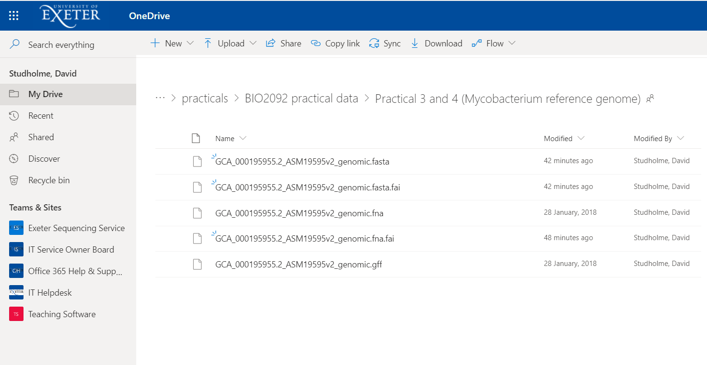

In addition to the reference genome, for today’s practical you also need
some FastQ files containing genomic sequence reads of various strains of
*M. tuberculosis*. You also need some .bam and .bai files that contain
alignments of these genomic reads aligned against the reference genome.
You can find all of these files in the `Data for Mycobacterium
resistance prediction` folder. You can download the whole set of files
by selecting all and hitting the Download button:

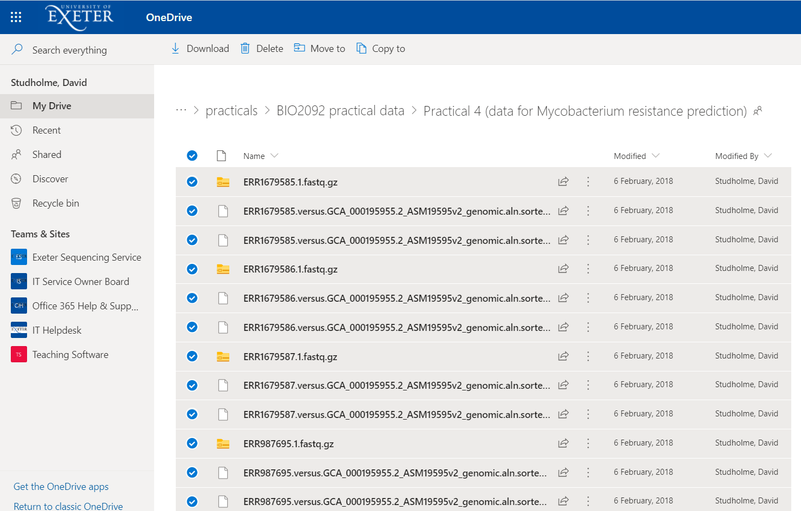

This should result in a .zip file being downloaded into your Downloads
folder. You must then extract the files from this `.zip` file by
right-clicking and selecting “Extract All”. This will generate a new
folder in which you will find your files.

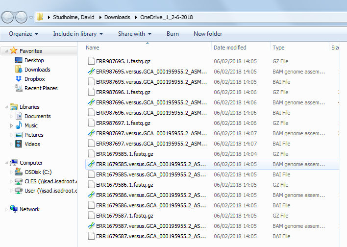

## Task 1. Obtain background information about the data.

Try to find some background information about these datasets and fill in
the table. The filenames indicate the Sequence Read Archive (SRA)
accession numbers of these datasets. So, for example, we could look up
ERR1679585 at the European Bioinformatics Institute (EBI) website, which
would take us to here: <https://www.ebi.ac.uk/ena/data/view/ERR1679585>.
On that web page we can see that the data were generated using Illumina
MiSeq and there is a link to BioSample accession number SAMEA4501278.
Clicking on the SAMEA4501278 link brings us to a page that says the
sample name is NG1. On the other hand, there is a link to BioProject
accession PRJEB15857 and clicking the link to this BioProject reveals
some information about the project. In fact this project has been
published ([Senghore *et al.*, 2017](https://www.ncbi.nlm.nih.gov/pubmed/?term=28926571)).

  FastQ file name | Sample name | Sequencing platform | Brief description of research project
----------------- | ----------- | ------------------- | --------------------------------------
ERR1679585.1.fastq.gz | NG1     | Illumina MiSeq      | Whole-genome sequencing illuminates the evolution and spread of multidrug-resistant tuberculosis in Southwest Nigeria
ERR1679586.1.fastq.gz |         |                     | 
ERR1679587.1.fastq.gz |         |                     |  
ERR987695.1.fastq.gz  |         |                     | 
ERR987696.1.fastq.gz  |         |                     |     
ERR987696.1.fastq.gz  |         |                     |         
ERR987697.1.fastq.gz  |         |                     | 

## Task 2 (optional). Check the quality of your data using the FastQC software.

Now, gather some quality-control information about these datasets. Use the FastQC software to find out how many sequence reads.

  FastQ file name          | Number of reads   | Any comments on the quality of these data
  -----------------------  | ----------------- | -------------------------------------------
  ERR1679585.1.fastq.gz    |                   |  
  ERR1679586.1.fastq.gz    |                   |
  ERR1679587.1.fastq.gz    |                   | 
  ERR987695.1.fastq.gz     |                   | 
  ERR987696.1.fastq.gz     |                   |
  ERR987696.1.fastq.gz     |                   |
  ERR987697.1.fastq.gz     |                   |

## Task 3. Predict the antibiotic susceptibility profiles of each bacterial isolate using Mykrobe Predictor.

You have already downloaded the compressed FastQ files for each genome
(`.fastq.gz` files). Now, for each genome, use the Mykrobe Predictor
software (Bradley *et al.*, 2015) to predict to which antibiotics these
bacteria will be susceptible or resistant. Pay attention to the
‘Evidence’ section, because this tells you how the software came to the
decision and we will follow up on this later in the practical. The
Mykrobe predictor software should already be installed, but if you
encounter any problems, then you can download it from this location:
<http://www.mykrobe.com/products/predictor/#download-license-agreement-tb>

Simply drag your compressed FastQ file into the Mykrobe Predictor window
and wait … You should soon see results something like this:

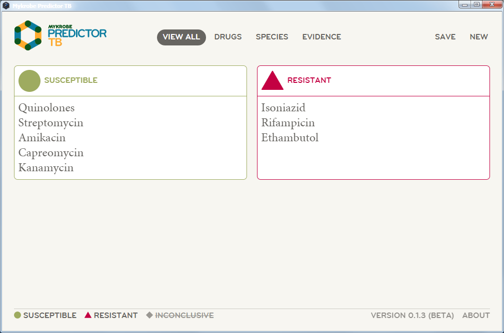

Repeat this process for some or all of the samples and record your
results:

  FastQ files            | Sample name  | *M. tb*. lineage   |  Resistant                        | Susceptible
 ----------------------- | -----------  | ----------------   | -----------------------------     | ------------
  ERR1679585.1.fastq.gz  |  NG1         |  European/American | Isoniazid, Rifampicin, Ethambutol | Quinolones, Streptomycin, Amikacin, Capreomycin, Kanamycin
  ERR1679586.1.fastq.gz  |              |                    |                                   |
  ERR1679587.1.fastq.gz  |              |                    |                                   |
  ERR987695.1.fastq.gz   |              |                    |                                   |
  ERR987696.1.fastq.gz   |              |                    |                                   |
  ERR987696.1.fastq.gz   |              |                    |                                   |
  ERR987697.1.fastq.gz   |              |                    |                                   |

Now let’s take a look at the evidence on which the software predictions are based.

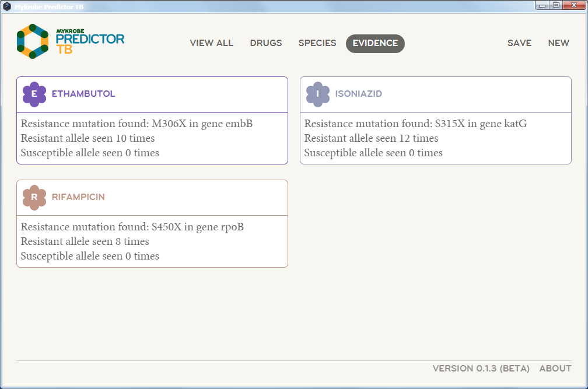

For example, note that the software predicts that this bacterial strain
is resistant to rifampicin, based on detection of a mutation in the
*rpoB* gene. Numerous studies
([Casali *et al.*, 2016](https://www.ncbi.nlm.nih.gov/pubmed/?term=27701423);
[Coll *et al.*, 2017](https://www.ncbi.nlm.nih.gov/pubmed/29358649);
[Grandjean *et al.*, 2017](https://www.ncbi.nlm.nih.gov/pubmed/?term=29281674);
[Naidoo and Pillay, 2017](https://www.ncbi.nlm.nih.gov/pubmed/?term=28947708);
[Senghore *et al.*, 2017](https://www.ncbi.nlm.nih.gov/pubmed/?term=28926571))
have reported correlations between particular mutations in
*rpoB* (and a few other genes) and resistance to antibiotics in M.
tuberculosis.
These mutations alter the structure of the encoded protein
such that they are no longer effectively targeted by the antibiotic.
Several naturally occurring mutations in *rpoB* are known to confer
rifampicin resistance. See for example this figure ([Ramaswamy and
Musser, 1998](https://www.ncbi.nlm.nih.gov/pubmed/?term=10645439))
listing known mutations in the *rpoB* gene associated with
rifampicin resistance. **Let’s see whether we can find the
resistance-conferring mutations** in our data in the next task …

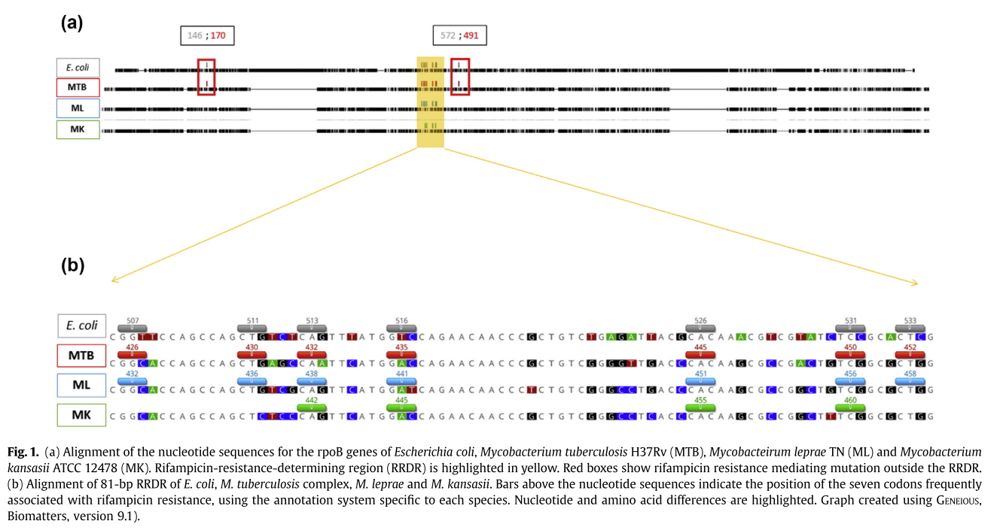

## Task 4. View the raw data using the Integrated Genome Viewer (IGV) software

We are going to use the IGV software (Thorvaldsdottir *et al.*, 2013) to
view the genome sequence reads aligned against a reference genome (as
discussed in previous lectures and as you have used previously in
practicals). It will look something like the images below:

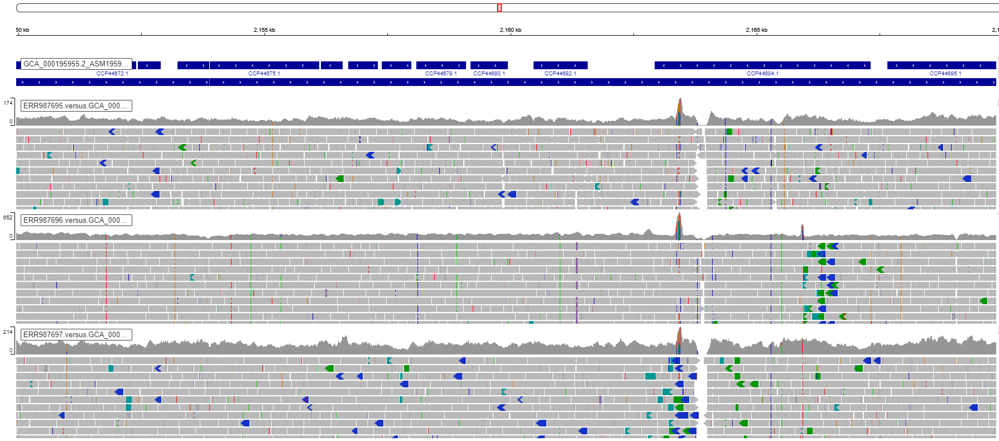

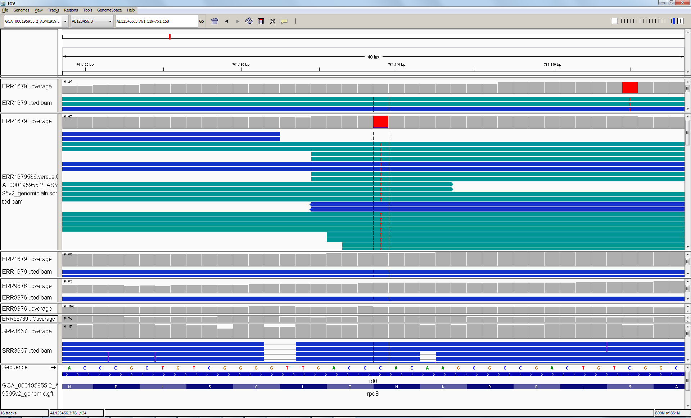

In preparation for this session, I have aligned each of the sequence
datasets against the reference genome sequence. You have already
downloaded these as `.bam` and `.bam.bai` files.

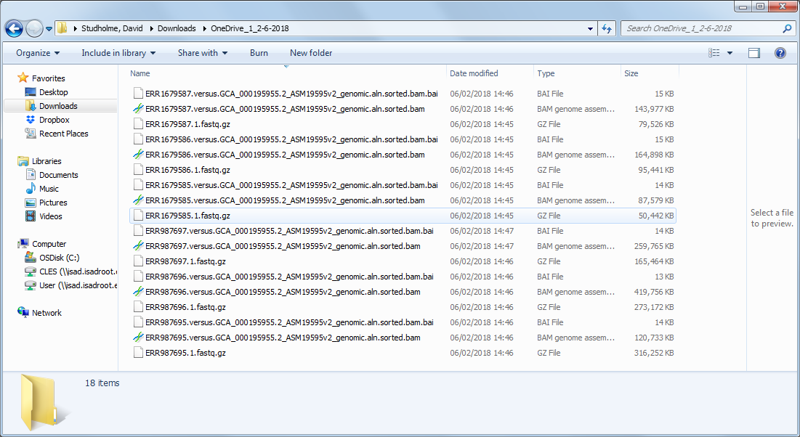

Please follow these steps to view the data:

* You need to download both the `.bam` files and the `.bai` files to
    your local PC.

* Make sure that you have downloaded the reference genome files

* Launch the IGV software. Spend a little bit of time familiarising
    yourself with zooming in and out and navigating around the genome if
    you have not already mastered this.

* In the IGV software, load the reference genome `.fna` file, using
    the `Genomes ->Load Genome from File` menu.

* Load the `.gff` annotation (gene predictions *etc*.) file for the
    reference genome, using the `File -> Load from File` menu.

* Load the `.bam` files using the `File -> Load from File` menu.
    The corresponding `.bai` files must be present in the same folder as
    the `.bam` files.

* Navigate to this position on the genome: 759807 - 763325. You should
    be able to see *rpoB* gene. What is the relevance of this gene to
    antibiotic resistance? What sequence variation do you observe in
    this gene?

Here is an overview of the data for the *rpoB* gene in our several
samples:

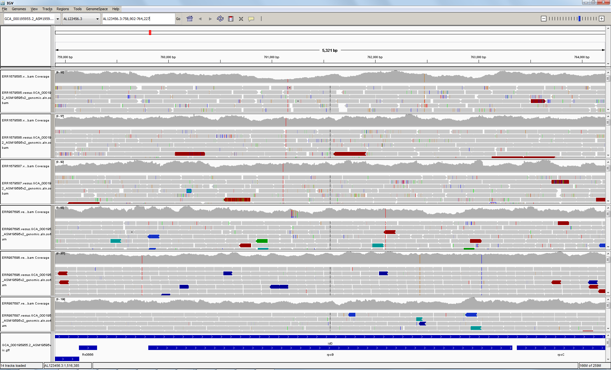

Here, we zoom in on the S40X mutation in *rpoB*:

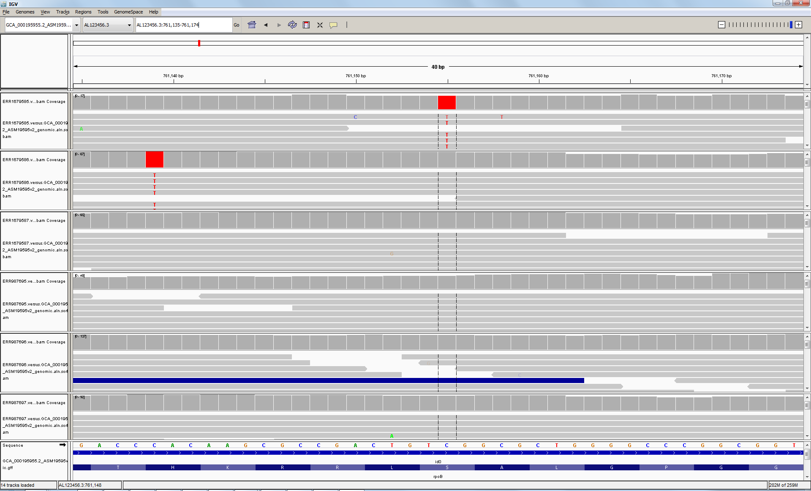

What about the mutation in the His residue in the second sample? Will
this have any impact on drug resistance? You can find a full list of the
mutations that Mykrobe predictor uses in Supplementary Table 15 of the
published paper (Bradley *et al.*, 2015).

Now, if you still have some time left, have a look at some other
antibiotic-resistance-associated loci and check whether the genomic
sequence data are consistent with the Mykrobe Predictor results that you
generated and tabulated earlier. Try to summarise your findings in the
table below.

  Locus     | Genomic position  | Any resistance-associated mutations? |  Relevant resistance prediction (from Mykrobe predictor)
  --------- | ----------------- | ------------------------------------ | ---------------------------------------------------------
  *rpoB*    | 759807-763325     |                                      |   
  *katG*    | 2153889-2156111   |                                      |  
  *fabG1*   | 1673440-1674183   |                                      |  
  *gyrA*    | 7302-9818         |                                      |  
  *embB*    | 4246514-4249810   |                                      |  
  *rpsL*    | 781560-781934     |                                      |  

## References

Bradley, P., Gordon, N.C., Walker, T.M., Dunn, L., Heys, S., Huang, B.,
et al. (2015) Rapid antibiotic-resistance predictions from genome
sequence data for Staphylococcus aureus and Mycobacterium tuberculosis.
*Nat. Commun.* **6**: 10063.

Casali, N., Broda, A., Harris, S.R., Parkhill, J., Brown, T., and
Drobniewski, F. (2016) Whole Genome Sequence Analysis of a Large
Isoniazid-Resistant Tuberculosis Outbreak in London: A Retrospective
Observational Study. *PLoS Med.* **13**: 1–18.

Cole, S.T., Brosch, R., Parkhill, J., Garnier, T., Churcher, C., Harris,
D., et al. (1998) Deciphering the biology of Mycobacterium tuberculosis
from the complete genome sequence. *Nature* **393**: 537–544.

Coll, F., Phelan, J., Hill-Cawthorne, G.A., Nair, M.B., Mallard, K.,
Ali, S., et al. (2017) The Mycobacterium tuberculosis resistome from a
genome-wide analysis of multi- and extensively drug-resistant
tuberculosis. *Under Rev.* **50**:.

Grandjean, L., Gilman, R.H., Iwamoto, T., Köser, C.U., Coronel, J.,
Zimic, M., et al. (2017) Convergent evolution and topologically
disruptive polymorphisms among multidrug-resistant tuberculosis in Peru.
*PLoS One* **12**: 1–16.

Naidoo, C.C. and Pillay, M. (2017) Fitness-compensatory mutations
facilitate the spread of drug-resistant F15/LAM4/KZN and F28
Mycobacterium tuberculosis strains in KwaZulu-Natal, South Africa. *J.
Genet.* **96**: 599–612.

Ramaswamy, S. and Musser, J.M. (1998) Molecular genetic basis of
antimicrobial agent resistance in Mycobacterium tuberculosis: 1998
update. *Tuber. Lung Dis.* **79**: 3–29.

Senghore, M., Otu, J., Witney, A., Gehre, F., Doughty, E.L., Kay, G.L.,
et al. (2017) Whole-genome sequencing illuminates the evolution and
spread of multidrug-resistant tuberculosis in Southwest Nigeria. *PLoS
One* **12**: e0184510.

Thorvaldsdottir, H., Robinson, J.T., and Mesirov, J.P. (2013)
Integrative Genomics Viewer (IGV): high-performance genomics data
visualization and exploration. *Brief. Bioinform.* **14**: 178–192.
