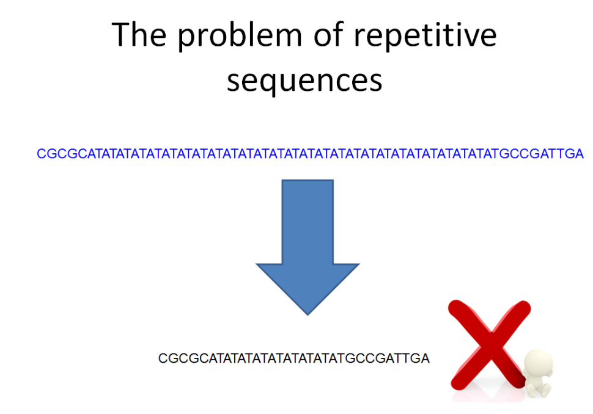

BIO2092 Computer Practical 5. Sequence assembly

You should be able to complete this easily within the three-hour session
so there is plenty of time to ask questions to the instructor(s) and to
finish the previous practical. You may wish to work in pairs or small
groups or individually.

**Intended Learning Outcomes**

The point of this practical is to consolidate your understanding *de
novo* sequence assembly, which we already covered in the lectures. The
emphasis is on understanding the underlying principles rather than the
software implementations. Therefore, you will perform the alignment and
assembly tasks ‘manually’ using laminated paper and scissors.

{width="3.4129013560804897in"
height="2.186748687664042in"}{width="3.120138888888889in"
height="2.0840277777777776in"}

For these tasks you can either manipulate the sequences using a
word-processor or text editor software on your computer or you can cut
out the sequences with scissors and arrange them on your desk.

The **sequences are reproduced on the last pages of this hand-out** so
you can remove the pages and cut them up. They are also provided on
laminated paper, which you can cut up if you wish.

By the end of these exercises, you should have a much stronger
understanding of the basic concepts of sequence assembly.

**Exercise I. A simple sequence assembly example.**

The following sequence reads come from shotgun sequencing of the genome
of a virus isolated from a dragonfly. Try to assemble these 10 sequence
reads into a single contiguous sequence (contig):

> 5’ TTCTATATAGGTGCCACTGCCACTGCTCCACCGTA 3’
>
> 5’ GATAGCCTTCTATATAGATGCCACTGCCACTGCTC 3’
>
> 5’ AGCGGTGGCAGTGGCACCTATATAGAAGGCTATCG 3’
>
> 5’ CCTATATAGAAGGCTATCGGAGATAAGACTACTTA 3’
>
> 5’ TATGGGAGATAAGACTACTTAATATTATTCTCTAC 3’
>
> 5’ GAGCAGTGGCAGTGGCACCTATATAGAAGGCTATC 3’
>
> 5’ AGAAGAATATTAAGTAGTCTTATCTCCGATAGCCT 3’
>
> 5’ CGATAGCCTTCTATATAGGTGGCACTGCCACTGCT 3’
>
> 5’ CGGAGATAAGACTACTTAATATTATTCTCTACGGT 3’
>
> 5’ CCGTAGAGAATAATATTAAGTAGTCTTATCTCCGA 3’

You could try using the greedy algorithm, OLC or k-mer graph methods
that we covered in the lectures or you could try to devise a method
yourself. Note that this is an extremely simplified example. In a ‘real’
genome sequence assembly task, you would typically be handling many
millions of sequence reads and most genomes are far bigger than this toy
example.

**Exercise II. Assembly of a repetitive region using paired reads.**

Recall from the lecture that assembling this sequence from shotgun reads
was problematic; specifically, the greedy algorithm resulted in
collapsing of the repeat.

{width="4.5739129483814525in"
height="3.41047353455818in"}

However, using paired reads, we can overcome this problem, at least
partially. To see how this works, you will attempt to assemble some
unpaired sequence reads and then an equivalent set of paired reads.
Again, use scissors and glue or sticky tape. The sequences can be cut
from the pages at the end of this document.

**First, try assembling these 34 (unpaired or singleton) reads:**

  TATATATATATATATA   TATATATATATATATA
  ------------------ ------------------
  CGCATATATATATATA   TATATATATATATATA
  ATATATATATATATAT   ATATATATATATATAT
  TATATATATATATATA   TATATATATATATATG
  TATATATATATATATA   TATATATATATATATA
  TATATATATATATATA   TATATATATATATGCC
  TATATATATATATATA   TATATATATGCCGATT
  CATATATATATATATA   TATATATATATATATA
  CGCGCATATATATATA   TATATATATATATATA
  ATATATATATATATAT   ATATATATATGCCGAT
  CGCGCATATATATATA   TATATATATATATATA
  TATATATATATATATA   TATATATATATATGCC
  ATATATATATATATAT   ATATATATATATATAT
  ATATATATATATATAT   ATATATATATATGCCG
  ATATATATATATATAT   ATATATATATGCCGAT
  TATATATATATATATA   TATATATATGCCGATT
  TATATATATATATATA   TATATATATATATGCC

**Now, try assembling these 17 paired reads:**

TATATATATATATATAnnnnnnnnnnnnnnnnnnnnTATATATATATATATA

CGCATATATATATATAnnnnnnnnnnnnnnnnnnnnTATATATATATATATA

ATATATATATATATATnnnnnnnnnnnnnnnnnnnnATATATATATATATAT

TATATATATATATATAnnnnnnnnnnnnnnnnnnnnTATATATATATATATG

TATATATATATATATAnnnnnnnnnnnnnnnnnnnnTATATATATATATATA

TATATATATATATATAnnnnnnnnnnnnnnnnnnnnTATATATATATATGCC

TATATATATATATATAnnnnnnnnnnnnnnnnnnnnTATATATATGCCGATT

CATATATATATATATAnnnnnnnnnnnnnnnnnnnnTATATATATATATATA

CGCGCATATATATATAnnnnnnnnnnnnnnnnnnnnTATATATATATATATA

ATATATATATATATATnnnnnnnnnnnnnnnnnnnnATATATATATGCCGAT

CGCGCATATATATATAnnnnnnnnnnnnnnnnnnnnTATATATATATATATA

TATATATATATATATAnnnnnnnnnnnnnnnnnnnnTATATATATATATGCC

ATATATATATATATATnnnnnnnnnnnnnnnnnnnnATATATATATATATAT

ATATATATATATATATnnnnnnnnnnnnnnnnnnnnATATATATATATGCCG

ATATATATATATATATnnnnnnnnnnnnnnnnnnnnATATATATATGCCGAT

TATATATATATATATAnnnnnnnnnnnnnnnnnnnnTATATATATGCCGATT

TATATATATATATATAnnnnnnnnnnnnnnnnnnnnTATATATATATATGCC

You should find assembly using paired reads is much more accurate than
using the unpaired reads.

  TATATATATATATATA   TATATATATATATATA
  ------------------ ------------------
  CGCATATATATATATA   TATATATATATATATA
  ATATATATATATATAT   ATATATATATATATAT
  TATATATATATATATA   TATATATATATATATG
  TATATATATATATATA   TATATATATATATATA
  TATATATATATATATA   TATATATATATATGCC
  TATATATATATATATA   TATATATATGCCGATT
  CATATATATATATATA   TATATATATATATATA
  CGCGCATATATATATA   TATATATATATATATA
  ATATATATATATATAT   ATATATATATGCCGAT
  CGCGCATATATATATA   TATATATATATATATA
  TATATATATATATATA   TATATATATATATGCC
  ATATATATATATATAT   ATATATATATATATAT
  ATATATATATATATAT   ATATATATATATGCCG
  ATATATATATATATAT   ATATATATATGCCGAT
  TATATATATATATATA   TATATATATGCCGATT
  TATATATATATATATA   TATATATATATATGCC

Blank page (to allow you to cut up the sequences on the other side of
this sheet)

TATATATATATATATAnnnnnnnnnnnnnnnnnnnnTATATATATATATATA

CGCATATATATATATAnnnnnnnnnnnnnnnnnnnnTATATATATATATATA

ATATATATATATATATnnnnnnnnnnnnnnnnnnnnATATATATATATATAT

TATATATATATATATAnnnnnnnnnnnnnnnnnnnnTATATATATATATATG

TATATATATATATATAnnnnnnnnnnnnnnnnnnnnTATATATATATATATA

TATATATATATATATAnnnnnnnnnnnnnnnnnnnnTATATATATATATGCC

TATATATATATATATAnnnnnnnnnnnnnnnnnnnnTATATATATGCCGATT

CATATATATATATATAnnnnnnnnnnnnnnnnnnnnTATATATATATATATA

CGCGCATATATATATAnnnnnnnnnnnnnnnnnnnnTATATATATATATATA

ATATATATATATATATnnnnnnnnnnnnnnnnnnnnATATATATATGCCGAT

CGCGCATATATATATAnnnnnnnnnnnnnnnnnnnnTATATATATATATATA

TATATATATATATATAnnnnnnnnnnnnnnnnnnnnTATATATATATATGCC

ATATATATATATATATnnnnnnnnnnnnnnnnnnnnATATATATATATATAT

ATATATATATATATATnnnnnnnnnnnnnnnnnnnnATATATATATATGCCG

ATATATATATATATATnnnnnnnnnnnnnnnnnnnnATATATATATGCCGAT

TATATATATATATATAnnnnnnnnnnnnnnnnnnnnTATATATATGCCGATT

TATATATATATATATAnnnnnnnnnnnnnnnnnnnnTATATATATATATGCC

Blank page (to allow you to cut up the sequences on the other side of
this sheet)

5’ TTCTATATAGGTGCCACTGCCACTGCTCCACCGTA 3’

5’ GATAGCCTTCTATATAGATGCCACTGCCACTGCTC 3’

5’ AGCGGTGGCAGTGGCACCTATATAGAAGGCTATCG 3’

5’ CCTATATAGAAGGCTATCGGAGATAAGACTACTTA 3’

5’ TATGGGAGATAAGACTACTTAATATTATTCTCTAC 3’

5’ GAGCAGTGGCAGTGGCACCTATATAGAAGGCTATC 3’

5’ AGAAGAATATTAAGTAGTCTTATCTCCGATAGCCT 3’

5’ CGATAGCCTTCTATATAGGTGGCACTGCCACTGCT 3’

5’ CGGAGATAAGACTACTTAATATTATTCTCTACGGT 3’

5’ CCGTAGAGAATAATATTAAGTAGTCTTATCTCCGA 3’
