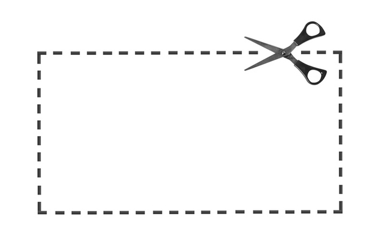

# BIO2092 Computer Practical 5. Sequence assembly

You should be able to complete this easily within the three-hour session
so there is plenty of time to ask questions to the instructor(s) and to
finish the previous practical(s). You may wish to work in pairs or small
groups or individually.

## Intended Learning Outcomes

The point of this practical is to consolidate your understanding *de
novo* sequence assembly, which we are also covereing in the lectures. The
emphasis is on understanding the underlying principles rather than the
software implementations. Therefore, you will perform the alignment and
assembly tasks ‘manually’ with pen and paper or using laminated paper and scissors.



For these tasks you can either manipulate the sequences using pen and paper or
word-processor or text editor software on your computer or you can cut
out the sequences with scissors and arrange them on your desk. 

The **sequences are reproduced on the last pages of this hand-out** so
you can remove the pages and cut them up. They are also provided on
laminated paper, which you can cut up if you wish.

By the end of these exercises, you should have a much stronger
understanding of the basic concepts of sequence assembly.

## Exercise 1: A simple sequence assembly example

The following sequence reads come from shotgun sequencing of the genome
of a virus isolated from a dragonfly. Try to assemble these 10 sequence
reads into a single contiguous sequence (contig):

`5’ TTCTATATAGGTGCCACTGCCACTGCTCCACCGTA 3’`

`5’ GATAGCCTTCTATATAGATGCCACTGCCACTGCTC 3’`

`5’ AGCGGTGGCAGTGGCACCTATATAGAAGGCTATCG 3’`

`5’ CCTATATAGAAGGCTATCGGAGATAAGACTACTTA 3’`

`5’ TATGGGAGATAAGACTACTTAATATTATTCTCTAC 3’`

`5’ GAGCAGTGGCAGTGGCACCTATATAGAAGGCTATC 3’`

`5’ AGAAGAATATTAAGTAGTCTTATCTCCGATAGCCT 3’`

`5’ CGATAGCCTTCTATATAGGTGGCACTGCCACTGCT 3’`

`5’ CGGAGATAAGACTACTTAATATTATTCTCTACGGT 3’`

`5’ CCGTAGAGAATAATATTAAGTAGTCTTATCTCCGA 3’`

(Note: in the practical, you will be provided with a card and scissors from which you
can cut-out these sequences and arrange them on your desk.)

You could try using the greedy algorithm, OLC or
that we covered in the lectures or you could try to devise a method
yourself. You might be able to just align the sequences together to form a contig.
It is probably not feasible to attempt a k-mer / de Bruijn graph
with this example.

Note that this is an extremely simplified example. In a ‘real’
genome sequence assembly task, you would typically be handling many
millions of sequence reads and most genomes are far bigger than this toy
example.

When assembling this sequence, remember what you have learned about DNA and sequencing.
For example, recall that
* DNA is double-stranded
* DNA sequencing is not 100% accurate
* DNA molecules can be linear or circular


## Exercise 2: Assembly of a repetitive region using unpaired and paired reads

As we discussed in the lectures, assembling repetitive sequences is difficult.
If the sequence reads are shorter than the repetitive sequence, then multiple repeats
can get collapsed together, yielding an incorrect sequence.


Try assembling these 34 reads:

  `TATATATATATATATA   TATATATATATATATA
  CGCATATATATATATA   TATATATATATATATA
  ATATATATATATATAT   ATATATATATATATAT
  TATATATATATATATA   TATATATATATATATG
  TATATATATATATATA   TATATATATATATATA
  TATATATATATATATA   TATATATATATATGCC
  TATATATATATATATA   TATATATATGCCGATT
  CATATATATATATATA   TATATATATATATATA
  CGCGCATATATATATA   TATATATATATATATA
  ATATATATATATATAT   ATATATATATGCCGAT
  CGCGCATATATATATA   TATATATATATATATA
  TATATATATATATATA   TATATATATATATGCC
  ATATATATATATATAT   ATATATATATATATAT
  ATATATATATATATAT   ATATATATATATGCCG
  ATATATATATATATAT   ATATATATATGCCGAT
  TATATATATATATATA   TATATATATGCCGATT
  TATATATATATATATA   TATATATATATATGCC`
  
(Note: in the practical, you will be provided with a card and scissors from which you
can cut-out these sequences and arrange them on your desk.)
  
What was the answer? Perhaps you assembled the sequence as ```CGCGCATATATATATATATATATGCCGATT```?
Actually, the original genome sequence was ```CGCGCATATATATATATATATATATATATATATATATATATATATATATATATATATATGCCGATT```. See how the repeats have been collapsed.  
  
However, using paired reads, we can overcome this problem, at least
partially. To see how this works, try assembling these 17 paired reads:

`TATATATATATATATAnnnnnnnnnnnnnnnnnnnnTATATATATATATATA`

`CGCATATATATATATAnnnnnnnnnnnnnnnnnnnnTATATATATATATATA`

`ATATATATATATATATnnnnnnnnnnnnnnnnnnnnATATATATATATATAT`

`TATATATATATATATAnnnnnnnnnnnnnnnnnnnnTATATATATATATATG`

`TATATATATATATATAnnnnnnnnnnnnnnnnnnnnTATATATATATATATA`

`TATATATATATATATAnnnnnnnnnnnnnnnnnnnnTATATATATATATGCC`

`TATATATATATATATAnnnnnnnnnnnnnnnnnnnnTATATATATGCCGATT`

`CATATATATATATATAnnnnnnnnnnnnnnnnnnnnTATATATATATATATA`

`CGCGCATATATATATAnnnnnnnnnnnnnnnnnnnnTATATATATATATATA`

`ATATATATATATATATnnnnnnnnnnnnnnnnnnnnATATATATATGCCGAT`

`CGCGCATATATATATAnnnnnnnnnnnnnnnnnnnnTATATATATATATATA`

`TATATATATATATATAnnnnnnnnnnnnnnnnnnnnTATATATATATATGCC`

`ATATATATATATATATnnnnnnnnnnnnnnnnnnnnATATATATATATATAT`

`ATATATATATATATATnnnnnnnnnnnnnnnnnnnnATATATATATATGCCG`

`ATATATATATATATATnnnnnnnnnnnnnnnnnnnnATATATATATGCCGAT`

`TATATATATATATATAnnnnnnnnnnnnnnnnnnnnTATATATATGCCGATT`

`TATATATATATATATAnnnnnnnnnnnnnnnnnnnnTATATATATATATGCC`

(Note: in the practical, you will be provided with scissors and a card from which you
can cut-out these sequences and arrange them on your desk.)

You should find assembly using paired reads is more accurate than
using the unpaired reads, though it is still far from perfect with the number if repeats still ambiguous.
This illustrates one of the advantages of using paired reads, i.e.
where we sequence both ends of each DNA fragment rather than sequencing just one end (we routinely do this
when using the short-read Illumina method of DNA sequenicng). 
An alternative would be to generate longer reads such that an individual read spans across the repetive region.

## Exercise 3: Building a de Bruijn graph

For this excercise, it is best to use a pen/pencil and paper. A blank sheet of paper is included in the booklet
for this purpose. Your task is to generate a de Bruijn graph from the following ten sequence reads:

```
   CGTTAGTG
    GTTAGTGG
     TTAGTGGC
      TAGTGGCA
       AGTGGCAA
        GTGGCAAG
         TGGCAAGC
       AGTGGCAT
        GTGGCATT
         TGGCATTC
         ```
         
Notice that, for convenience, the reads have been aligned (but not assembled).
If you have time, you could also try making the overlap graph (i.e.part of the OLC method).
 
         
       
      
      
      
      
 

```


