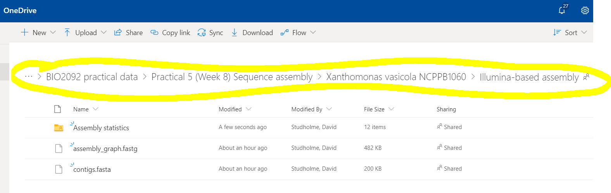
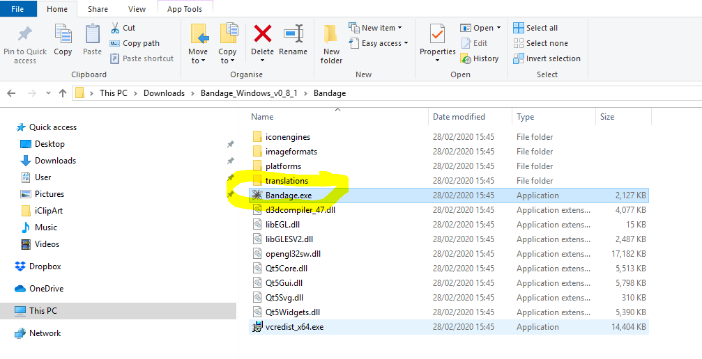
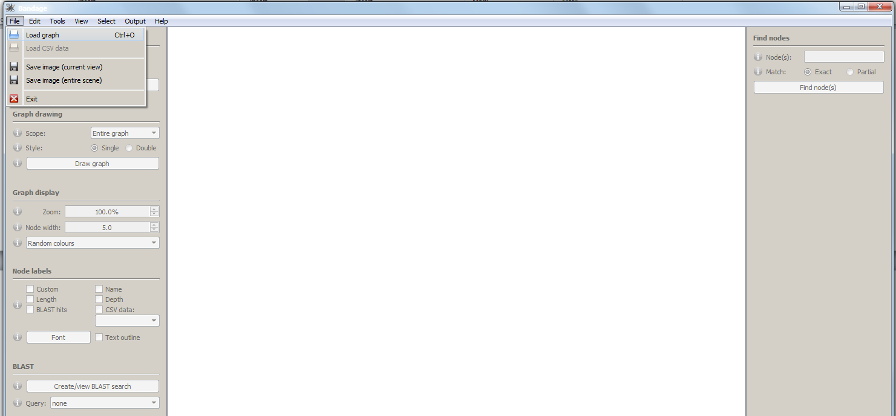

BIO2092 Practical 5. Sequence assembly

## Excercise 3. Exploring an assembly graph using Bandage software

In case you finish the main assembly tasks with lots of time to spare,
you may wish to explore some real genome assembly results using the
[Bandage software](https://doi.org/10.1093/bioinformatics/btv383).

During the lectures and outside reading, you have learned about the
k-mer (de Bruijn) graph approach to assembling a genome sequence from
short sequence reads generated by ‘next-generation’ sequencing methods
such as Illumina MiSeq. Now, we are going to take a look at the end
results of assembling a bacterial genome sequence. 
Originally, we sequenced the genome of this bacterial strain using Illumina HiSeq,
which generates pairs of short sequence reads. You have been provided with results of
assembling these short sequence reads (using an assembly [software called SPAdes](https://doi.org/10.1089/cmb.2013.0084)).


The Illumina-based data are available here:

https://universityofexeteruk-my.sharepoint.com/:f:/r/personal/d_j_studholme_exeter_ac_uk/Documents/Teaching/bio2092/practicals/BIO2092%20practical%20data/Practical%205%20(Week%208)%20Sequence%20assembly/Xanthomonas%20vasicola%20NCPPB1060/Illumina-based%20assembly?csf=1&e=TVFx3I

or, via ELE, here:

https://vle.exeter.ac.uk/mod/url/view.php?id=722134

Navigate to the OneDrive folder containing data for genome assembly, and download the files:



Once you have downloaded these files, first take a look at the contents
of the `contigs.fasta` and the `scaffolds.fasta` files using a text editor or word processor (e.g. NotePad or Microsoft Word).
These files contains the final results of the assembly process; that is the nucleotide sequences of the assembled
contigs and scaffolds. 

Next, take a look at the `Assembly statistics` folder. 


In particular,
download and open  the `report.html` file, which contains a summary of several measures
of assembly quality. Make sure that you download the file (e.g. to your Downloads folder
and open the downloaded file rather than just trying to open it within OneDrive).

Note the N<sub>50</sub> value. This is a measure of how contiguous the assembly is;
it measures how large the contigs are compared to the total size og the assembly.
What do you think the steepness of the curve indicates about the assembly? These statistics
were generated by running the [Quast software](https://doi.org/10.1093/bioinformatics/btt086)
on the contigs.fasta file.


Now, let’s use the Bandage software to examine the assembly graph. This
graph is derived from the k-mer graph but each node in the graph
corresponds to a contig. In other words where possible, adjacent k-mers
in the k-mer graph have been combined to yield contigs. However,
ambiguities in the assembly graph (forks, loops, branches, *etc*.)
remain.

Run the Bandage software, which should already be installed on your PC.
IF it is not installed or not working, you can download the latest version
from here: https://github.com/rrwick/Bandage/releases/. Click on appropriate
file for your computer. assuming that you are using a Windows PC, then this will
likely be [```Bandage_Windows_v0_8_1.zip```](https://github.com/rrwick/Bandage/releases/download/v0.8.1/Bandage_Windows_v0_8_1.zip). 


Once you have downloaded the .zip file, you need to unzip it (try right-clicking on the filename). Then find the executable
file called ```Bandage.exe```. Double click on that file and it will launch the Bandage software.



Use the File -&gt; Load graph menu item to load the graph file
`assembly\_graph.gfa`:



Now, use the `Draw graph` button to display the graph:


It is kind of fun to explore this assembly graph. Some things you can do:
* Use the controls to zoom-in, zoom-out and move around the graph.
* You can also label the nodes in the graph with their names, sequence depths, and lengths.
* You can select nodes (contigs) and perform BLAST searches with the selected contigs (using the `Output` menu item).

What genomic feature do you think is represented by this region of the graph (See image below)?
Can you draw a diagram of the genomic region that it represents? Clue: it involves
repeated sequences.


The sequences of the two contigs are:

`>2359056 (180bp) TAATCAATAAATTGATAACTGATAAGCGGAACGCCTGAGCTAAAGCTCATTGACGCAGTGGTTGACTGGTCATCCAATGGAGAATTGCCTGACCTAGTCAACTTTGCGGGGGAAATTCTAAGCAACCTAGATAAGGTTCGAGAATTTCTCCCTAAGAAACACTAATCAATAAATTGATAA`

and

`>2345186 (236 bp)
GGTTGCTTAGAATTTCCCCCGCAAAGTTGACTAGGTCAGGCAATTCTCCATTGGATGACCAGTCAACCACTGCGTCAATGAGCTTTAGCTCAGGCGTTCCGCTTATCAGTTATCAATTTATTGATTAGTGTTTCTTAGGGAGAAATTCTCGAACCTTATCTAGGTTGCTTAGAATTTCCCCCGCAAAGTTGACTAGGTCAGGCAATTCTCCATTGGATGACCAGTCAACCACTGCG`


### References

Gurevich, A., Saveliev, V., Vyahhi, N., and Tesler, G. (2013) QUAST:
quality assessment tool for genome assemblies. *Bioinformatics* **29**:
1072–5.

Wick, R.R., Schultz, M.B., Zobel, J., and Holt, K.E. (2015) Bandage:
interactive visualization of de novo genome assemblies: Fig. 1.
*Bioinformatics* **31**: 3350–3352.
