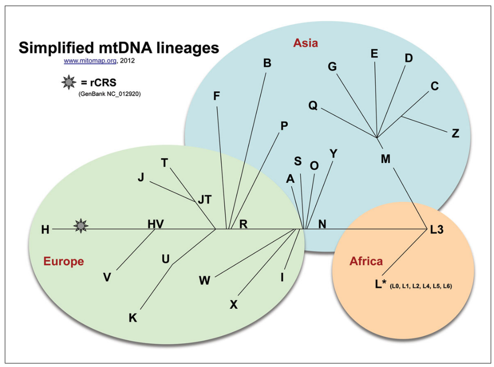
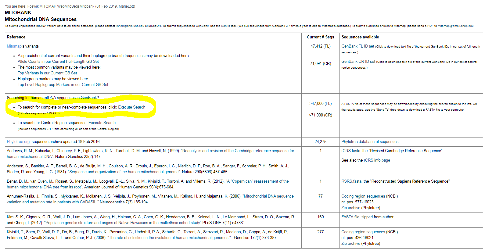
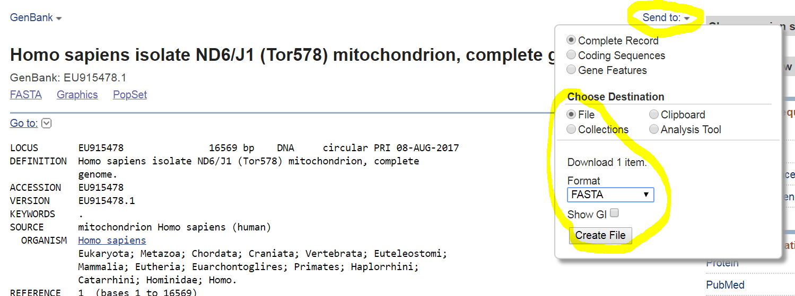
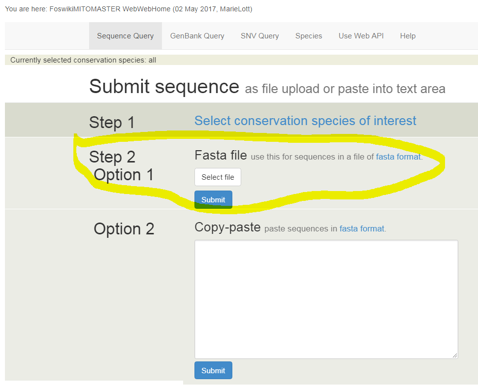
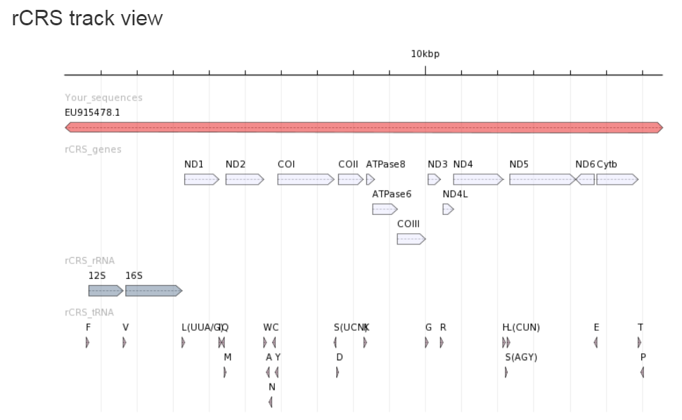
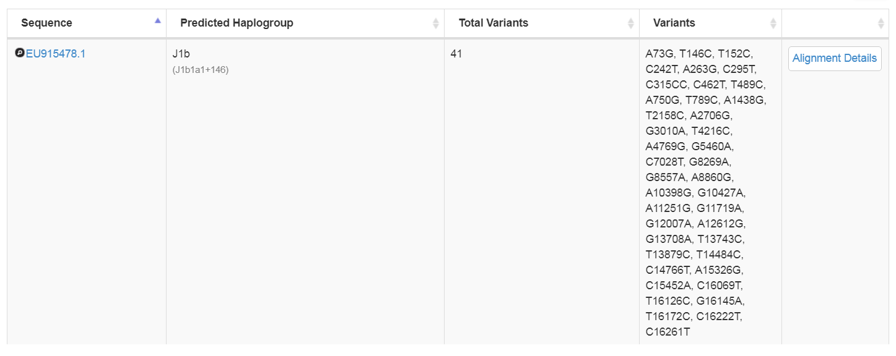
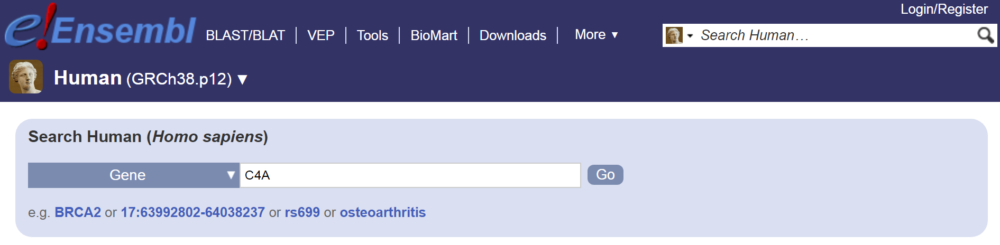
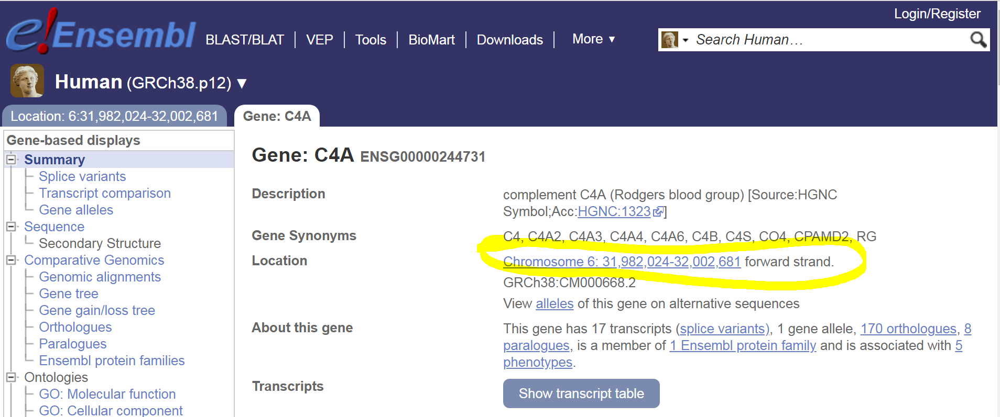
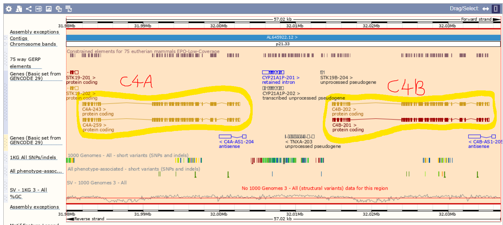

# Human mitochondrial variation and Mitomap/Mitomaster
During the lectures and in your outside reading, you will have come across human mitochondrial halpogroups. 

The major mitochondrial haplogroups are named with letters (A, B, C ...) and their relationships with each other can be represtented by a phylogenetic tree:

You will recall that mtDNA is inherited through the maternal line, it is haploid, and is not subject to recombination. That is why its evolution can be represented by a tree. 
The various mtDNA haplogroups are associated with geographical locations. Therefore, it is an excellent marker for tracing human migrations:

In this excercise, we are going to use the [Mitomap](https://www.mitomap.org/foswiki/bin/view/MITOMAP/WebHome) and
[Mitomaster](https://www.mitomap.org/foswiki/bin/view/MITOMASTER/WebHome) to explore and analyse human mtDNA sequences.

## What complete mitochondrial genomes are available in the public databases?
First, let's query the GenBank database for all complete or nearly-complete human mtDNA sequences.
First, navigate your browser to https://www.mitomap.org/foswiki/bin/view/MITOMAP/Mitobank. 
You can also read this via the `Mitobank` link on the Mitomap front page (https://www.mitomap.org/foswiki/bin/view/MITOMAP/WebHome).

Here, you should see a page something like this:

Now click on `To search for complete or near-complete sequences, click: Execute Search` and you 

Question                                                                                   | Answer
------------------------------------------------------------------------------------------ | -------
How many complete (or nearly complete) human mitochondrial genome sequences are available? |

## The mitochondrial genetic code
Now, take a look at the mitochondrial genetic code here: https://www.mitomap.org/foswiki/bin/view/MITOMAP/HumanMitoCode.
Uou can also reach this via a link on the front page (https://www.mitomap.org/foswiki/bin/view/MITOMAP/WebHome).
Can you find any differences between the mitochondrial genetic code and the standard genetic code?

Codon | Standard genetic code | Mitochcondrial genetic code
----- | --------------------- | ---------------------------
TGA   |                       |
___   |                       | 
AGA   |                       | Stop 
___   | Isoleucine            | Methionine

## Analysing a mitochondrial genome sequence using Mitomap
We are going to analyse the mitochondrial genome of an individual. The sequence data can be found here:
https://www.ncbi.nlm.nih.gov/nuccore/eu915478.

Download this genome sequence as a FastA-formatted file (`Using the Send to file` link):

This will result in a file called `sequence.fasta` being downloaded into your `Downloads` folder.
We are going to perform analyses on this downloaded file.

Navigate your web browser to https://www.mitomap.org/foswiki/bin/view/MITOMASTER/WebHome.

For now, we are going to skip Step 1. Please proceed to `Step 2, Option 1` and upload the `sequence.fasta` file that you downloaded.

The analysis results contain two main sections:
1. The rCRS track view and
2. The sequence alignment table.

The rCRS track simply tells us which part(s) of the reference mitochondrial genome sequence are covered by our query sequence.
In this case, we have complete coverage; that's expected because we are analysing a complete mitochondrial genome sequence.

The sequence alignment table tells us which haplogroup this sequence belongs (J1b in this case) and lists the variants detected.
In this case there are 41 variants detected. For example, one of them is A73G, which means that the A at position 73 in the reference genome has instead a G in our query genome. 

Clicking on `Alignment Details` will provide further information. You can see the basis on which the individual has been classified to this haplogroup.

You can find a full database of which variants are associated with which haplogroups here: https://www.mitomap.org/foswiki/bin/view/MITOMAP/HaplogroupMarkers

Try to solve this problem ([Weblem 9.1 from Lesk's Introduction to Genomics](https://global.oup.com/uk/orc/biosciences/evolution/leskgenomics3e/student/weblems/)):

Position         | 16147 | 16172 | 16189 | 16223 | 16248 | 16320 | 16355
---------------- | ----- | ----- | ----- | ----- | ----- | ----- | -----
Reference genome | C     | T     | T     | C     | C     | C     | C
Query genome     |A      | C     | C     | T     | T     | T     | T

### To what mitochondrial haplogroup does the sequence belong?

# Browsing the human genome
In previous practicals, you have downloaded small microbial genomes onto your local computer and browsed them using the IGV
software. We can, in principal, do the same thing with the human genome. However, it is usually more convenient to use one of the
freely available web-based human genome browsers.
The most popular human genome browswers on the web include:

1. Ensembl: https://www.ensembl.org/Homo_sapiens/Info/Index
2. UCSC: https://genome-euro.ucsc.edu/

Both of these browsers are rich with large amounts of data overlaid onto a human reference genome sequence. Let's use these to try to solve [Weblem 9.1 from Lesk's Introduction to Genomics](https://global.oup.com/uk/orc/biosciences/evolution/leskgenomics3e/student/weblems/).

### What gene appears between the genes for C4A and C4B in the human genome?
Both of these browsers are rich with large amounts of data overlaid onto a human reference genome sequence.

Let's use these to try to solve [Weblem 8.1 from Lesk's Introduction to Genomics](https://global.oup.com/uk/orc/biosciences/evolution/leskgenomics3e/student/weblems/).

In Ensembl (https://www.ensembl.org/Homo_sapiens/Info/Index), let's try searching for 'C4A':

This should lead you to an entry for the human C4A gene:

And this will include a link to the relevant location in the browser. Although there is a lot (too much?) of information
on the browser, navigation should be fairly self-explanatory. By zooming into the appropriate region and configuring the tracks,
you should be able to view the genomic region between genes C4A and C4B:

You might also wish to try the same task using the UCSC browser instead of Ensembl ...

Let's use these to try to solve [Weblem 8.4 from Lesk's Introduction to Genomics](https://global.oup.com/uk/orc/biosciences/evolution/leskgenomics3e/student/weblems/).

### Find three examples of mutations in the CFTR gene (associated with syctic fibrosis) that produce reduced but not entirely  absent chloride channel function. What are the clinical symptoms of these mutations?

We can see the sites of phenotype-associated short variants in the Ensembl browser 
[here](https://jan2019.archive.ensembl.org/Homo_sapiens/Share/42f814fd3e13a3bb1d081fdce9c375c7?redirect=no;mobileredirect=no):

