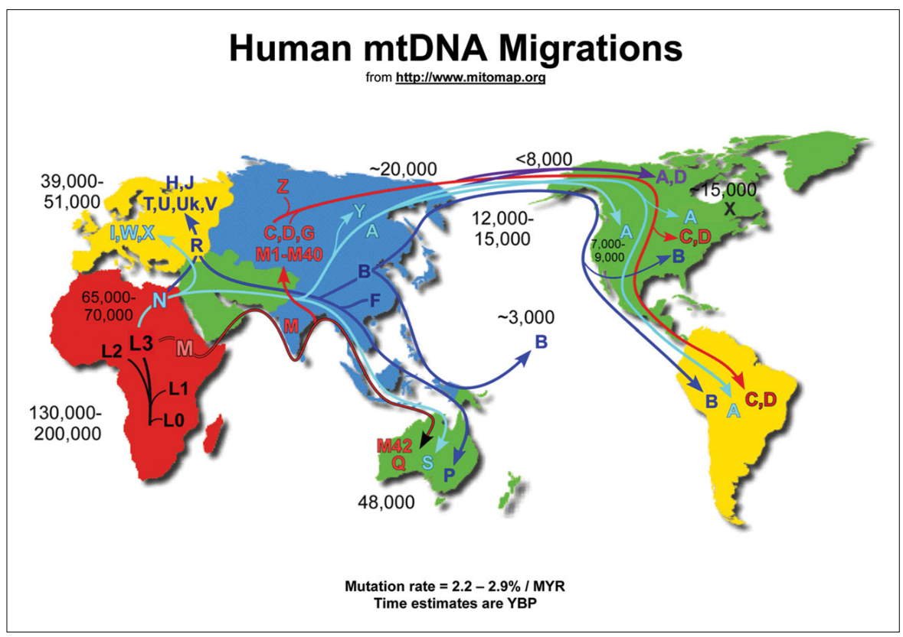

  
   
# BIO2092 Practical 6: Human genomics

In this computer practical, we will take a look at several web-based resources to support what we have learned in
lectures and outside reading about applying genomics to human health and anthropology. We will try solve some of the web-based problems
(Weblems) posed by the author of our primary course textbook; see: https://global.oup.com/uk/orc/biosciences/evolution/leskgenomics3e/student/weblems/.

If you have not done so already, you should complete the Labster virtual lab about sequencing ancient human DNA.
You can access this simulation via the link on the Labster section of the BIO2092 ELE page:
https://vle.exeter.ac.uk/mod/lti/view.php?id=684279.

Now is also a good opportunity to ask questions to the instructors and catch-up on any of the previous practicals.

## Human mitochondrial variation and Mitomap/Mitomaster
During the lectures and in your outside reading, you will have come across human mitochondrial halpogroups. 

The major mitochondrial haplogroups are named with letters (A, B, C ...) and their relationships with each other can be represtented by a phylogenetic tree:

You will recall that mtDNA is inherited through the maternal line, it is haploid, and is not subject to recombination. That is why its evolution can be represented by a tree. 
The various mtDNA haplogroups are associated with geographical locations. Therefore, it is an excellent marker for tracing human migrations:

In this excercise, we are going to use the [Mitomap](https://www.mitomap.org/foswiki/bin/view/MITOMAP/WebHome) and
[Mitomaster](https://www.mitomap.org/foswiki/bin/view/MITOMASTER/WebHome) to explore and analyse human mtDNA sequences.

## What complete mitochondrial genomes are available in the public databases?
First, let's query the GenBank database for all complete or nearly-complete human mtDNA sequences.
First, navigate your browser to https://www.mitomap.org/foswiki/bin/view/MITOMAP/Mitobank. 
You can also read this via the `Mitobank` link on the Mitomap front page (https://www.mitomap.org/foswiki/bin/view/MITOMAP/WebHome).

Here, you should see a page something like this:

Now click on `To search for complete or near-complete sequences, click: Execute Search` and you 

Question                                                                                   | Answer
------------------------------------------------------------------------------------------ | -------
How many complete (or nearly complete) human mitochondrial genome sequences are available? |

## The mitochondrial genetic code
Now, take a look at the mitochondrial genetic code here: https://www.mitomap.org/foswiki/bin/view/MITOMAP/HumanMitoCode.
Uou can also reach this via a link on the front page (https://www.mitomap.org/foswiki/bin/view/MITOMAP/WebHome).
Can you find any differences between the mitochondrial genetic code and the standard genetic code?

Codon | Standard genetic code | Mitochcondrial genetic code
----- | --------------------- | ---------------------------
`TGA`   |                       |
``   |                       | 
`AGA`   |                       | Stop 
``   | Isoleucine            | Methionine

## Analysing a mitochondrial genome sequence using Mitomap
We are going to analyse the mitochondrial genome of an individual. The sequence data can be found here:
https://www.ncbi.nlm.nih.gov/nuccore/eu915478.

Download this genome sequence as a FastA-formatted file (Using the `Send to file` link):

This will result in a file called `sequence.fasta` being downloaded into your `Downloads` folder.
We are going to perform analyses on this downloaded file.

Navigate your web browser to https://www.mitomap.org/foswiki/bin/view/MITOMASTER/WebHome.

For now, we are going to skip Step 1. Please proceed to `Step 2, Option 1` and upload the `sequence.fasta` file that you downloaded.

The analysis results contain two main sections:
1. The rCRS track view and
2. The sequence alignment table.

The rCRS track simply tells us which part(s) of the reference mitochondrial genome sequence are covered by our query sequence.
In this case, we have complete coverage; that's expected because we are analysing a complete mitochondrial genome sequence.

The sequence alignment table tells us which haplogroup this sequence belongs (J1b in this case; you can read about haplogroup J here: https://www.eupedia.com/europe/Haplogroup_J_mtDNA.shtml) and lists the variants detected.
In this case there are 41 variants detected. For example, one of them is A73G, which means that the A at position 73 in the reference genome has instead a G in our query genome. 

Clicking on `Alignment Details` will provide further information. You can see the basis on which the individual has been classified to this haplogroup.

You can find a full database of which variants are associated with which haplogroups here: https://www.mitomap.org/foswiki/bin/view/MITOMAP/HaplogroupMarkers

Try to solve this problem ([Weblem 9.1 from Lesk's Introduction to Genomics](https://global.oup.com/uk/orc/biosciences/evolution/leskgenomics3e/student/weblems/)):

Position         | 16147 | 16172 | 16189 | 16223 | 16248 | 16320 | 16355
---------------- | ----- | ----- | ----- | ----- | ----- | ----- | -----
Reference genome | `C`     | `T`     | `T`     | `C`     | `C`     | `C`     | `C`
Query genome     | `A`      | `C`     | `C`     | `T`     | `T`     | `T`     | `T`

### To what mitochondrial haplogroup does the sequence belong?

You can now take a look at an interative phylogenetic tree of all available human mitochondrial genome
sequences here: http://www.phylotree.org/tree/index.htm. You can click on the bottom row of the tree to find example sequences from
various haplogroups.

# Browsing the human genome
In previous practicals, you have downloaded small microbial genomes onto your local computer and browsed them using the IGV
software. We can, in principal, do the same thing with the human genome. However, it is usually more convenient to use one of the
freely available web-based human genome browsers.
The most popular human genome browswers on the web include:

1. Ensembl: https://www.ensembl.org/Homo_sapiens/Info/Index
2. UCSC: https://genome-euro.ucsc.edu/

Both of these browsers are rich with large amounts of data overlaid onto a human reference genome sequence. Let's use these to try to solve [Weblem 9.1 from Lesk's Introduction to Genomics](https://global.oup.com/uk/orc/biosciences/evolution/leskgenomics3e/student/weblems/).

### What gene appears between the genes for C4A and C4B in the human genome?
Both of these browsers are rich with large amounts of data overlaid onto a human reference genome sequence.

Let's use these to try to solve [Weblem 8.1 from Lesk's Introduction to Genomics](https://global.oup.com/uk/orc/biosciences/evolution/leskgenomics3e/student/weblems/).

In Ensembl (https://www.ensembl.org/Homo_sapiens/Info/Index), let's try searching for 'C4A':

This should lead you to an entry for the human C4A gene:

And this will include a link to the relevant location in the browser. Although there is a lot (too much?) of information
on the browser, navigation should be fairly self-explanatory. By zooming into the appropriate region and configuring the tracks,
you should be able to view the genomic region between genes C4A and C4B:

You might also wish to try the same task using the UCSC browser instead of Ensembl ...

Let's use these to try to solve [Weblem 8.4 from Lesk's Introduction to Genomics](https://global.oup.com/uk/orc/biosciences/evolution/leskgenomics3e/student/weblems/).

### Find three examples of mutations in the CFTR gene (associated with cystic fibrosis) that produce reduced but not entirely absent chloride channel function. What are the clinical symptoms of these mutations?

We can see the sites of phenotype-associated short variants in the Ensembl browser 
[here](https://jan2019.archive.ensembl.org/Homo_sapiens/Share/42f814fd3e13a3bb1d081fdce9c375c7?redirect=no;mobileredirect=no):

Notice that you can click on any of these variants and it will take you to the database entry for that variant, including some
information about the phenotype(s) associated with that variant.

What you are looking at above is still within the Ensembl database. However, (most of) these variants are drawn from a
database called SNPdb and we can follow the link to take us directly to that SNP in SNPdb:

From the SNPdb web page, we can follow a link to (yet another database) ClinVar, which will tell us what is known about
the clinical significance of this particular variant. However, the degree of detail recorded in this database does not
distinguish between reduced function versus completely absent function. I presume that what Lesk is getting at here is that some
mutations are nonsense mutations leading to premature stop codons whilst others are missense mutations leading to a
slightly altered amin-acid sequence but not complete loss of function.

## Online Mendelian Inheritance in Man
Recall that during the lectures, we briefly discussed the OMIM (Online Mendelian Inheritance in Man) database.
OMIM is a comprehensive, authoritative compendium of human genes and genetic phenotypes that is freely available
and updated daily. The full-text, referenced overviews in OMIM contain information on all known mendelian disorders
and over 15,000 genes. OMIM focuses on the relationship between phenotype and genotype. It is updated daily,
and the entries contain copious links to other genetics resources (https://www.omim.org/about).

Let's use OMIM to try to solve [Weblem 8.5 from Lesk's Introduction to Genomics](https://global.oup.com/uk/orc/biosciences/evolution/leskgenomics3e/student/weblems/).

Weblem 8.5 asks us to find (a) Autosomal dominant (b) Autosomal
recessive (other than cystic fibrosis) (c) X-linked dominant (d) X-linked recessive (e) Y-linked (f)
The result of abnormal mitochondrial DNA (g) the result of abnormal copy-number expansion (h)
the result of a deletion of a region longer than 1kb.

Your answers:

Disease characteristics                               | Example of disease with these characteristics
----------------------------------------------------- | ----------------------------------------------
Autosomal dominant                                    |
Autosomal recessive (other than cystic fibrosis)      |
X-linked dominant                                     |  
X-linked recessive                                    |
Y-linked                                              |  
The result of abnormal mitochondrial DNA              |
The result of abnormal copy-number expansion          |
The result of a deletion of a region longer than 1kb  |

Hint: the summary table at https://www.omim.org/statistics/entry is helpful for the first six categories.
The final two are going to require broader web searching.

## Genome-wide association studies (GWAS)
We are going to tackle [Weblem 8.8 from Lesk's Introduction to Genomics](https://global.oup.com/uk/orc/biosciences/evolution/leskgenomics3e/student/weblems/).

Find SNPs that are associated with foetal haemoglobin measurement.
Which SNP has the smallest p-value?
In what chromosome band does it appear?

To solve this, first navigate to the EBI-NHGRI GWAS catalogue (https://www.ebi.ac.uk/gwas/diagram). You have seen this previously
in a lecture. Select Haematological measurement:

## Cancer genomics
During the lectures, we learned that a large number of cancer genomes have been sequenced and compared against
matched healthy genomes from the same patients. This produces catalogues of genes implicated in cancer
and catalogues of driver mutations. Let's explore some freely available web-based databases that curate these
data. The go-to web portal is: https://cancer.sanger.ac.uk/cosmic.

Let's investigate a specific cancer-associated gene, IDH1. In which types of cancer (which tissues) is its
mutation most prevalent? See: https://cancer.sanger.ac.uk/cosmic/gene/analysis?ln=IDH1#tissue

Using the census of cancer genes at https://cancer.sanger.ac.uk/census, which of the hallmarks of cancer
are promoted by mutations in the genes VHL, PIK3CA, IDH1, RB1? How many genes are known to be implicated
in cancer?

You should be able to find a summary for each gene that looks something like this:

Take a look at the VHL gene in the Cosmic3D viewer (https://cancer.sanger.ac.uk/cosmic3d/protein/VHL?pdb=6BVB). Look
at the profile of cancer-associated somatic mutations found in this gene. Based on this profile, do you think it is
a tumour-suppressor? Or an oncogene?

And how about gene PIK3CA? Oncogene or tumour-suppressor gene?

How about genes IDH1 and RB1?

If you want to learn more about the Cosmic database, see: https://cancer.sanger.ac.uk/cosmic/help/tutorials

Well done! You reached the end! 
If you still have time left, you may wish to attempt any of the other Weblems(https://global.oup.com/uk/orc/biosciences/evolution/leskgenomics3e/student/weblems/) that pique your interest.
