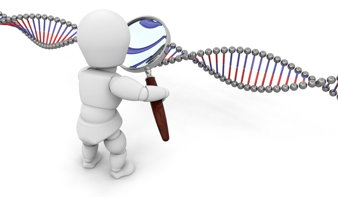
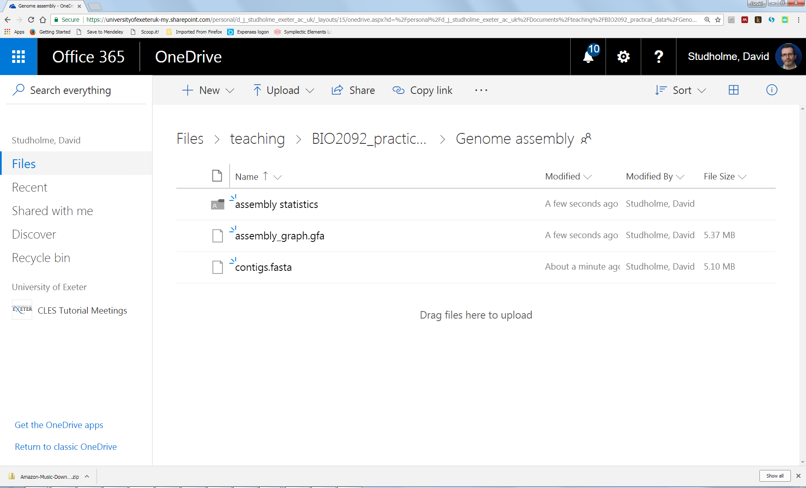
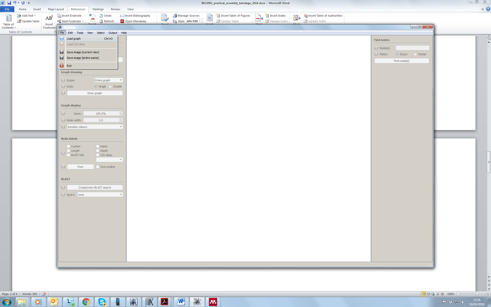
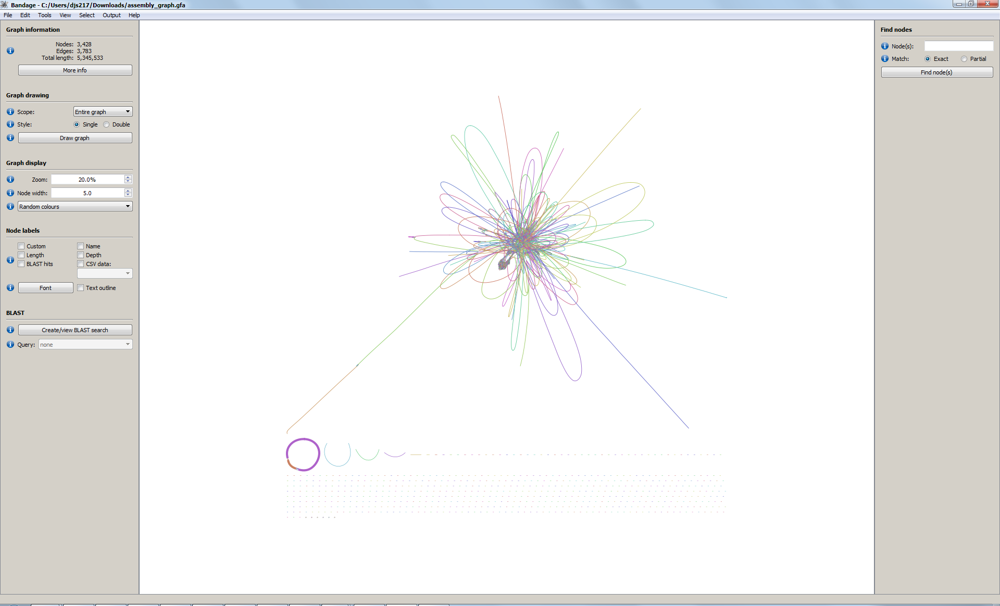
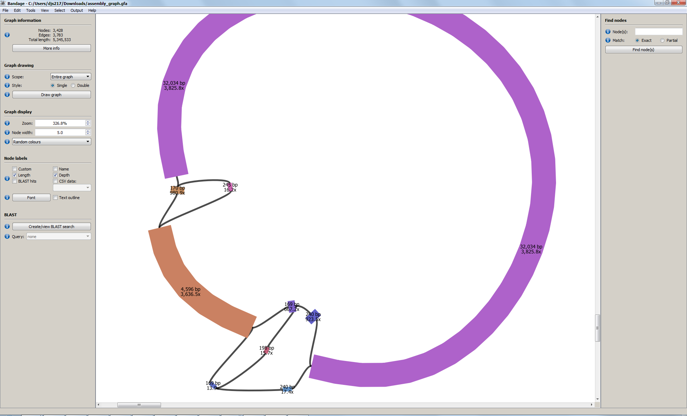
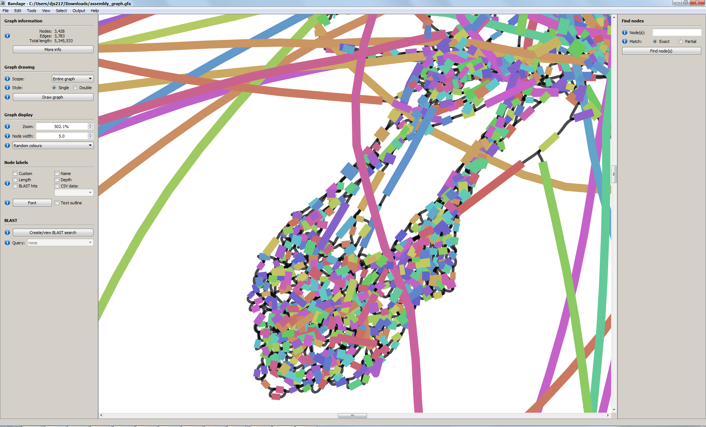
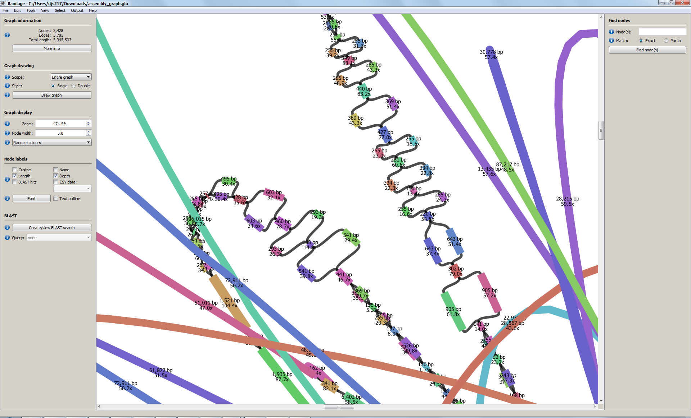
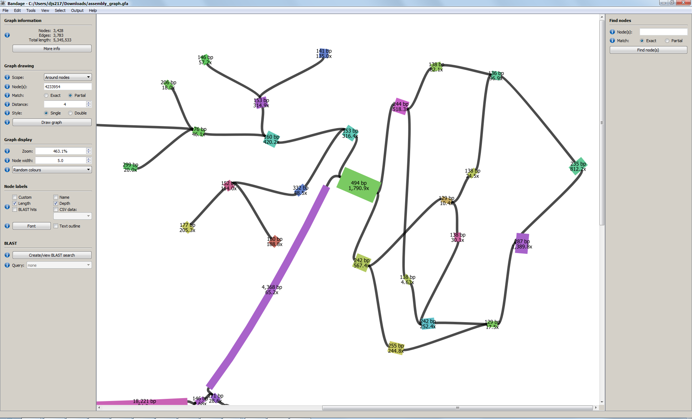

{width="2.25in"
height="0.8333333333333334in"}

BIO2092 Practical:

Sequence assembly

Tuesday 20^th^ February 2018

{width="2.2866666666666666in"
height="1.3333333333333333in"}

In case you finish the main assembly tasks with lots of time to spare,
you may wish to explore some real genome assembly results using the
Bandage software (Wick *et al.*, 2015).

### \

During the lectures and outside reading, you have learned about the
k-mer (de Bruijn) graph approach to assembling a genome sequence from
short sequence reads generated by ‘next-generation’ sequencing methods
such as Illumina MiSeq. Now, you are going to take a look at the end
results of assembling a bacterial genome sequence.

The data are available here:
<http://vle.exeter.ac.uk/mod/url/view.php?id=727724>

Navigate to the folder containing data for genome assembly:

{width="6.5in" height="3.9409722222222223in"}

Once you have downloaded these files, first take a look at the contents
of the contigs.fasta file. This file contains the ultimate results of
the assembly process; this is the nucleotide sequences of the assembled
contigs.

Next, take a look at the assembly statistics folder. In particular,
study the report.html file, which contains a summary of several measures
of assembly quality. Note the N~50~ value. What do you think the
steepness of the curve indicates about the assembly? These statistics
were generated by running the Quast software (Gurevich *et al.*, 2013)
on the contigs.fasta file.

Now, let’s use the Bandage software to examine the assembly graph. This
graph is derived from the k-mer graph but each node in the graph
corresponds to a contig. In other words where possible, adjacent k-mers
in the k-mer graph have been combined to yield contigs. However,
ambiguities in the assembly graph (forks, loops, branches, *etc*.)
remain.

Run the Bandage software, which should already be installed on your PC.
Use the File -&gt; Load graph menu item to load the graph file
(assembly\_graph.gfa):

{width="6.40882217847769in"
height="3.7188265529308837in"}

Now, use the “Draw graph” button to display the graph:

{width="6.5in" height="3.9409722222222223in"}

Use the controls to zoom and move around the graph. You can also label
the nodes in the graph with their names, sequence depths, and lengths.
You can select nodes (contigs) and perform BLAST searches with the
selected contigs (using the Output menu item).

Use BLAST to figure out what genomic element is represented by this
circular structure in the assembly graph:

{width="6.284191819772529in"
height="3.810126859142607in"}

What can infer about the number of copies of this genomic element
(compared with the rest of the genome)?

Can you explain what is happening in these parts of the assembly graph?

{width="6.5in" height="3.9409722222222223in"}

{width="6.253164916885389in"
height="3.7913145231846017in"}

{width="6.409457567804025in"
height="3.886075021872266in"}

### References

Gurevich, A., Saveliev, V., Vyahhi, N., and Tesler, G. (2013) QUAST:
quality assessment tool for genome assemblies. *Bioinformatics* **29**:
1072–5.

Wick, R.R., Schultz, M.B., Zobel, J., and Holt, K.E. (2015) Bandage:
interactive visualization of de novo genome assemblies: Fig. 1.
*Bioinformatics* **31**: 3350–3352.
