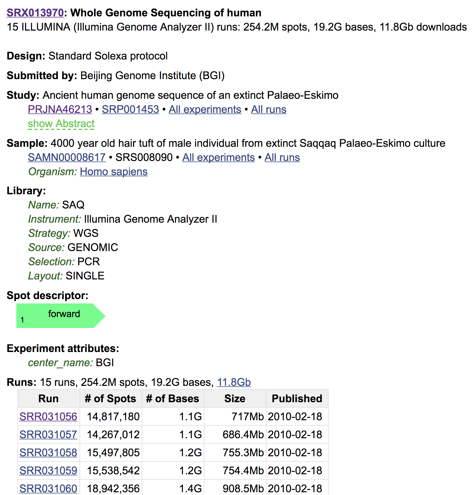

# BIO2092 Computer practical 1
## Accessing genomic sequence data on the WWW

### Introduction
During the first few lectures on this course, you have heard a lot about so-called “next-generation” sequencing (NGS)
methods such as Illumina. These methods have been available since around 2006 and in the last decade or so have hugely
expanded the limits of what is achievable in all kinds of fields of biological and biomedical research. You have also
heard about the Sanger method, which has been available since the 1970s.
In this practical session, you will consolidate your understanding of the data generated by these methods and some
of the approaches to analysing such data. We will continue to discuss this in the next lectures.

### Laboratory simulation of NGS 
* If you have not done so already, please work through this Labster simulation. This will take approximately 35 minutes. 
* It is based on a real published research study involving the sequencing of ancient DNA from remains of a man who lived about 4000 years ago (Rasmussen et al., 2010). 
* You can access this simulation via the link on the Labster section of the BIO2092 ELE page: http://vle.exeter.ac.uk/course/view.php?id=4041#section-7

      
### Accessing the sequence data from study of a 4000-year-old man
All the sequencing data from this study are available through the public repositories. Specifically, the raw sequence reads are available from either the Sequence Read Archive (SRA) in the USA or the European Sequence Archive (ENA) in Europe (Leinonen, Akhtar, et al., 2011; Leinonen, Sugawara, et al., 2011; Kodama et al., 2012; Silvester et al., 2018).

Navigate to the research paper at https://www.ncbi.nlm.nih.gov/pubmed/?term=20148029 and try to find a hyperlink to the sequence data. Alternatively, if you look at the text of the paper in *Nature*, you will read that “Sequences have been deposited to the short read archive with accession number SRA010102”: 

If you follow the hyperlink or search the NCBI portal for this accession number, you will arrive a page like this, describing the data from this study that is held in the SRA:

This is telling us that there are 59 datasets associated with this project. Click on the link to the Run Selector to explore these in a bit more detail:

* Note that sequence data are organised into BioProjects and each sequence dataset is linked to a BioSample.
* In this case the project contains only one sample.
* Click on the links to find out more about the BioProject and the BioSample and answer the questions below.

Question    |     Please write your answer in this column
---------------------| -----------------------------------------------------------
How many base-pairs of data, in total, were generated in this research project?     |
Which DNA sequencing method(s) did the researcher use? |
What information can you find about the geographic location of the sample?    |	
From which tissue was the DNA extracted? |

Now we are going to take a look at the actual sequence data. Within a sequencing project, the sequencing data are organised into “experiments” and “runs”. One study can contain multiple experiments and one experiment can contain multiple runs.
A “run” essentially means one set of data, generated by running the sequencing machine once.
However, in practice, we often sequence several different samples simultaneously (to keep costs down).
For example, we could run 8 separate samples on a single Illumina HiSeq flowcell, such that each sample
occupies only one of the 8 available lanes.

This diagram might be helpful for understanding how BioProjects, BioSamples, experiments and runs are related to each other. It comes from the DDBJ Sequence Read Archive Handbook (http://trace.ddbj.nig.ac.jp/book/sra_e.html):

Click on one of the links to an “experiment” and then click on a link to a “run”:

Experiments | Experiment | Run
------------ | ----------------- | --------------------------
 |  | 

Now, if you click on the “Reads” tab within the run, you can start browsing the actual sequence reads:

Note that each base in the sequence read is given a quality score. This score is usually between 0 and 40 and denotes how confident we are in that particular base having been called correctly. The scores use the Phred system (Ewing and Green, 1998; Ewing et al., 1998):

Phred score | Probability that the base is wrong | Accuracy
--- | --------- | -----
10 | 1 in 10 | 90 %
20 | 1 in 100 | 99 %
30 | 1 in 1000 | 99.9 %
40 | 1 in 10000 | 99.99 %

Question    |     Please write your answer in this column
---------------------| -----------------------------------------------------------
What do you think about the quality/accuracy of the DNA sequencing in this research study? | 
What factors do you think might have contributed to this? | 

